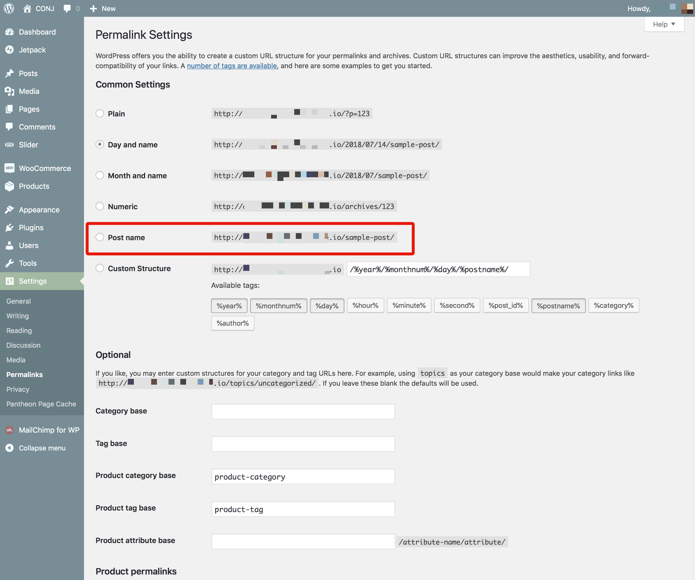

# Activate & Save Permalinks

By default, WordPress uses web URLs which have day and name in them; however, WordPress offers you the ability to create a custom URL structure for your permalinks and archives. This can improve the aesthetics, usability, and forward-compatibility of your links.

After installing and activating the required/recommended plugins navigate to **Settings** » **Permalinks** in your WordPress dashboard, and make your selection from the settings screen:

!> As search engines do prefer your site to use friendlier URLs we would highly recommend using the **Post name** structure.

?> The **Post name** permalink structure requires the [mod_rewrite](https://httpd.apache.org/docs/current/mod/mod_rewrite.html) module to be installed on your hosting.

## Additional Links

* [Using Permalinks](https://codex.wordpress.org/Using_Permalinks)
* [Settings Permalinks Screen](https://codex.wordpress.org/Settings_Permalinks_Screen)
