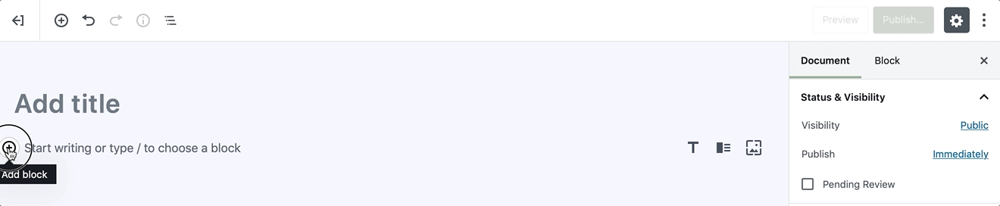
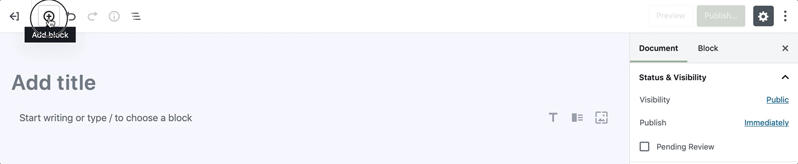
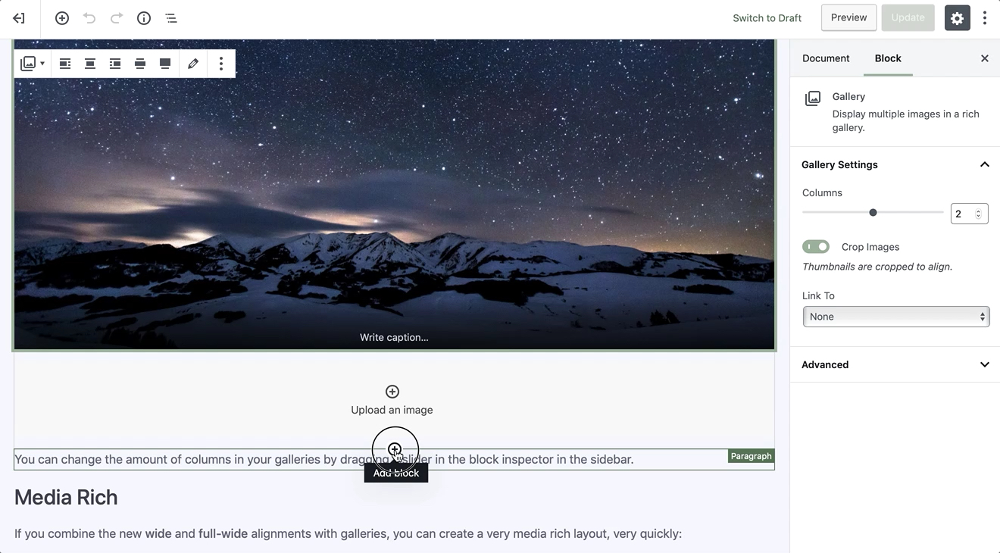
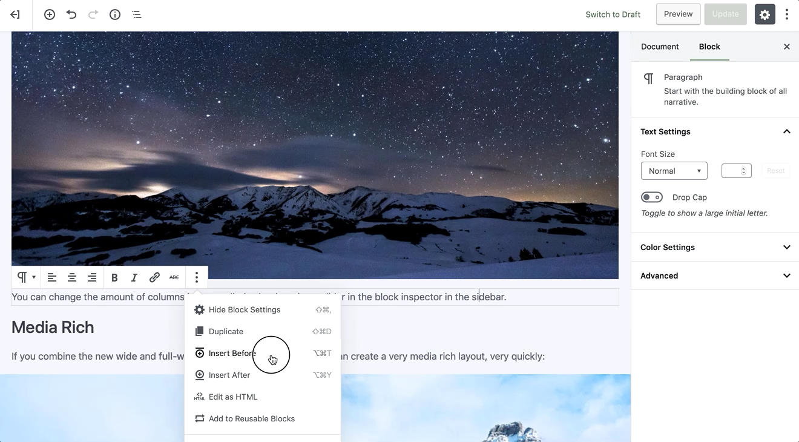

# Adding A Block

Generally speaking, with having the [Conj - eCommerce WordPress Theme](https://themeforest.net/item/conj-ecommerce-wordpress-theme/21935639?ref=mypreview) installed on your WordPress setup there are many [block types](https://mypreview.github.io/Conj/#/?id=gutenberg-blocks) for you to choose from, which you’ll see organized by category and by most recent use. 

Since each of any block has its own wrapper you are free to edit or move each block independently of other blocks, and individual blocks usually come with their own formatting or styling settings for even greater control over layout and function.

The following steps will show the several available ways to add a block and choose the block type you need.

1. Click on the **plus** icon at the left of any empty block.

2. Click on the **plus** icon at the top left corner of the editor toolbar.

3. Hit the **Enter** or **Return** key from a selected block to create a new block below it.

4. Click on the **plus** icon at the top or bottom center of an existing block to add a block above or bottom it.

5. Click on the three dots just above a selected block and choose to add a block above or below the current block.

