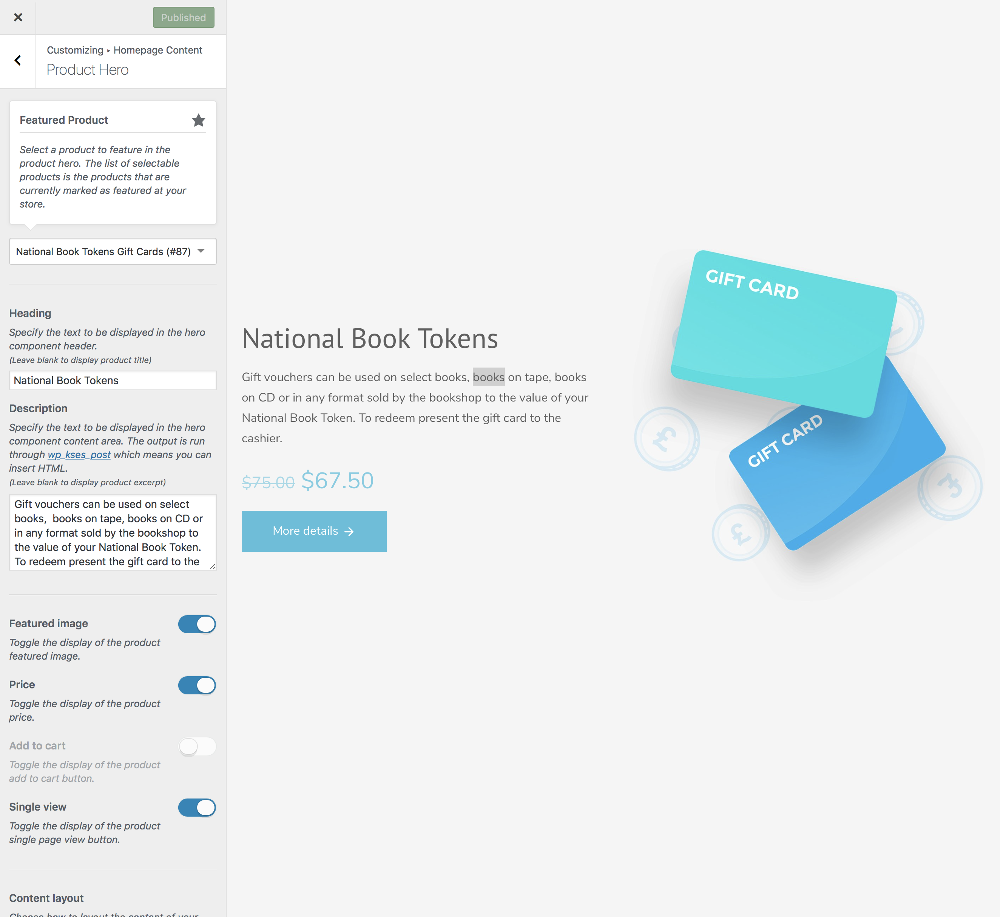

# Adding A Product Hero

This feature allows you to add a [hero component](https://www.conj.ws/gift-cards/) to the [homepage template](create-and-set-static-homepage?id=create-homepage-template) of your site. With a clever combination of imagery you can easily create a powerful conversion tool for your chosen product.

1. On the frontend, in the **Admin bar**, click **Customize**.
2. On the backend, click **Appearance » Customize**.
3. Navigate to **Homepage Content » Product Hero** section.
4. Locate the **Featured Product** callout.
5. Select the product for which you want to activate the hero component.
 *The list of selectable products is the products that are currently [marked as featured](managing-products?id=mark-a-product-as-featured) at your shop. This is to avoid loading your entire product list in the Customizer. Be sure that the product you want to display in your hero component is marked as featured or it won’t be selectable here. Likewise, if you don’t have any featured products, then the setting won’t appear at all.* 
6. Specify the text to be displayed in the hero component **header**.
 *You can leave this field blank to display the product title instead.* 
7. Specify the text to be displayed in the hero component **content** area.
 *You can leave this field blank to display product excerpt instead.* 
8. Optionally, toggle the display of the product **featured image**.
9. Optionally, toggle the display of the product **price**.
10. Optionally, toggle the display of the product **add to cart button**.
11. Optionally, toggle the display of the product **details/description button**.
12. Choose how to **layout** the content of your product hero.
 *You can place content/image adjacently then flip them so that the content is on the left and the image on the right, and vice versa.* 
13. Optionally, Upload a **custom image** to display in hero component.
 *You can leave this control blank to display the product featured image instead.* 
14. Tweak the **component spacing** by entering different integer numbers.
 *Margins are used to create space around elements, outside of any defined borders and paddings, on the other hand, are used to generate space around an element's content, inside of any defined borders.*
