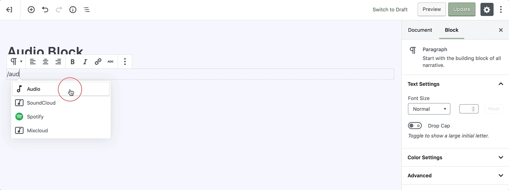
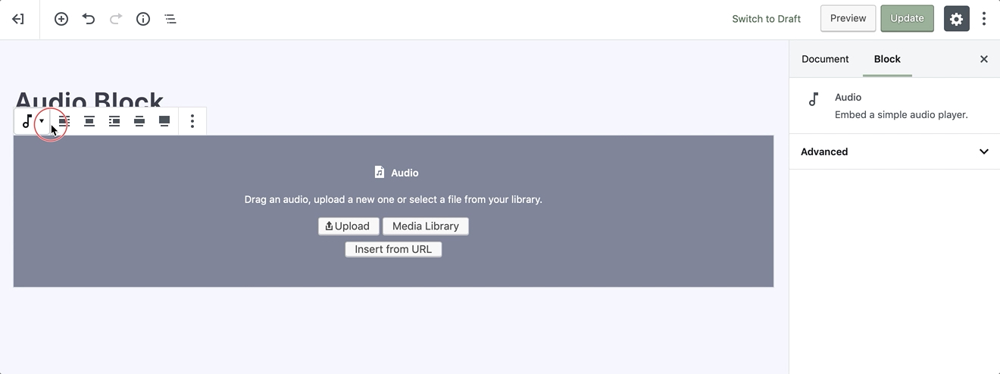

# Audio Block

Creating an audio block will enable you to embed a piece of music, podcast, or any other sound file right into your page or post.

To add an audio, click on the [Add Block](adding-block) button and select the **Audio** block. Alternatively, you can start typing `/audio` in a new paragraph block, then press enter.

!> Detailed instructions on adding blocks can be found [here](adding-block).

## Block Interface

Every block comes with unique and block-specific controls that allow you to manipulate the block directly right in the editor. 

### Adding Files

Upon adding an audio block, you will get three options to chose from: **Upload**, **Media Library**, and **Insert from URL**.
