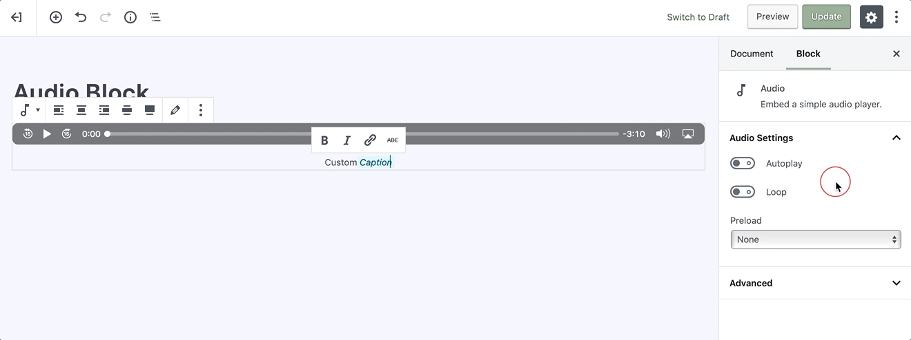

# Audio Block

Creating an audio block will enable you to embed a piece of music, podcast, or any other sound file right into your page or post.

To add an audio, click on the [Add Block](adding-block) button and select the **Audio** block. Alternatively, you can start typing `/audio` in a new paragraph block, then press enter.

!> Detailed instructions on adding blocks can be found [here](adding-block).

## Block Interface

Every block comes with unique and block-specific controls that allow you to manipulate the block directly right in the editor. 

### Adding Files

Upon adding an audio block, you will get three options to chose from: **Upload**, **Media Library**, and **Insert from URL**.

* The **Upload** button will allow you to upload a new audio file from your computer. 
* The **Media Library** button lets you select a file that’s already uploaded to your site’s Media Library. 
* **Insert from URL** button lets you input a URL where the file has already been uploaded, on a streaming service or elsewhere on the web.

Right after you’ve selected the audio file to insert, you can add an optional text **caption** just underneath the player and start configuring your audio block.

### Alignment

A block-specific toolbar will appear whenever you select the audio block. Three of the options are for the block’s alignment, right, center, and left. Choosing the **right** or **left** will allow you to place another block alongside the audio block moreover picking **center** will return the block to its default, taking up the full width of the post or page content.

### Edit Audio

Choosing this option will allow you to select a new audio file for the block. This option can be used to replace the current audio file in the block.

## Sidebar Settings

In addition to the options found in the block’s toolbar, you may locate the block specific settings in the **editor sidebar panel**. Clicking on the **cog** icon next to the publish button will toggle the visibility of this panel.

## Autoplay & Loop

The following options let you set your audio file to autoplay when a user visits the page or post, and the looping allows you to choose if the audio track needs to be repeated after it’s finished.

## Preload

This feature allows you to select how much of the audio file is downloaded when the page or post is loaded.

!> Enabling this option might slow your page’s load speed down.

#### The following are the settings:

* **None** – Nothing about the regarding the audio file is downloaded automatically. The download of the audio file only begins when your visitor clicks on the **Play** button. *This can be the fastest setting.*

* **Metadata** – Only basic info about the file will be downloaded automatically. Like the **None** option, the download of the audio file only begins when a user clicks on the **Play** button. This setting is also very fast, as the only thing downloaded is text or basic info regarding the file. 

* **Auto** – The entire audio file is downloaded, despite whether the visitor clicks the **Play** button or not. This might make the most significant impact on your page or post’s load speed, especially with larger audio files.

?> On a theoretical base, there’s not a big difference between **None** and **Metadata**.

## Advanced

The advanced tab lets you add a CSS class to your block, allowing you to write custom CSS and apply styles to the block as you see fit.
