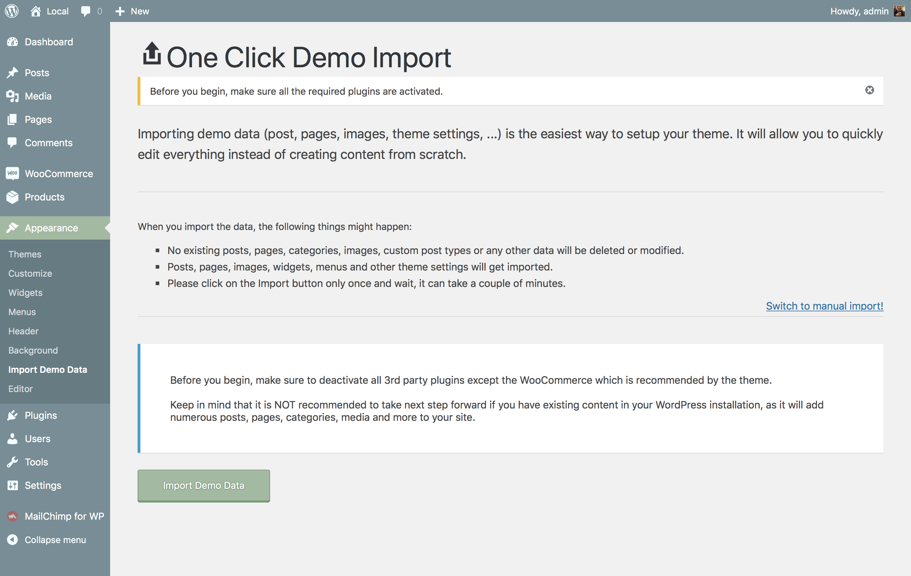

# Built-in demo importer

Importing the demo data is the easiest way to setup your theme. It will allow you to edit everything instead of creating content from scratch super quickly and with ease.

?> In case you have decided to do the demo import on a vanilla WordPress site *(not customized from the original form)*, be sure to skip WooCommerce setup wizard by clicking on **Not Right Now** hyperlink inside of the setup process screen.  All WooCommerce pages like **Shop**, **Cart**, **Checkout**, etc. will be imported and assigned automatically with demo import.

!> Before you begin, make sure to deactivate all 3rd party plugins except the WooCommerce which is required by the theme.

* Install [One Click Demo Import](https://wordpress.org/plugins/one-click-demo-import) plugin.
* Navigate to **Plugins** » **Import Demo Data**.
* Click the **Import** button and the plugin will now load all dummy content from the imported files.
