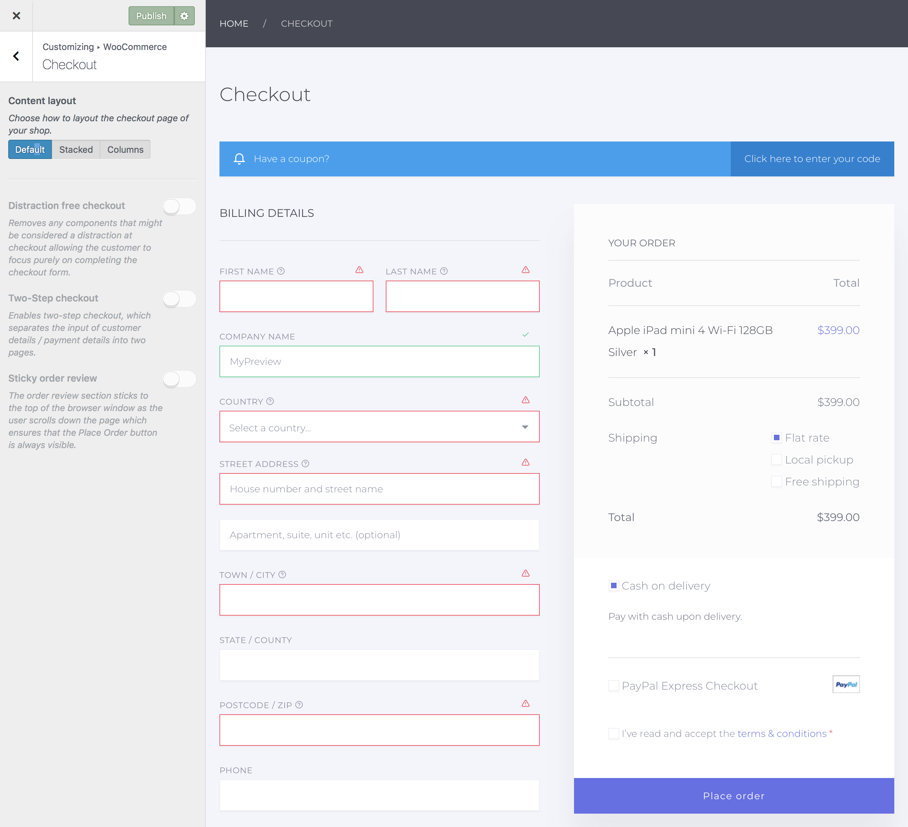
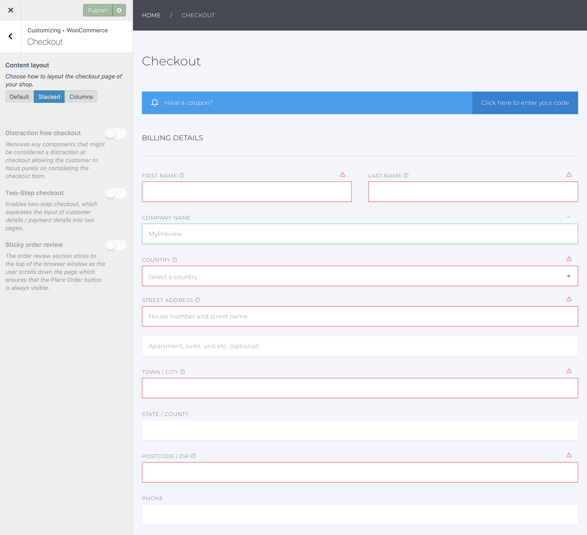
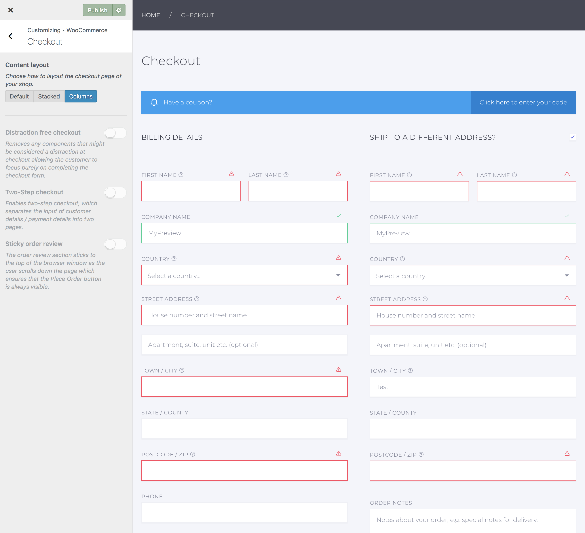
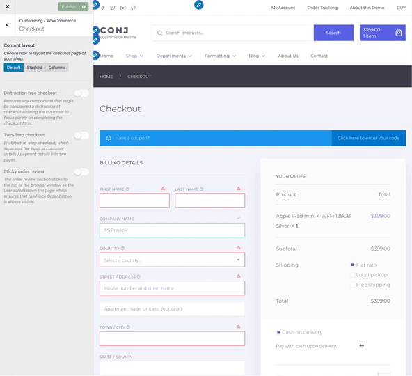
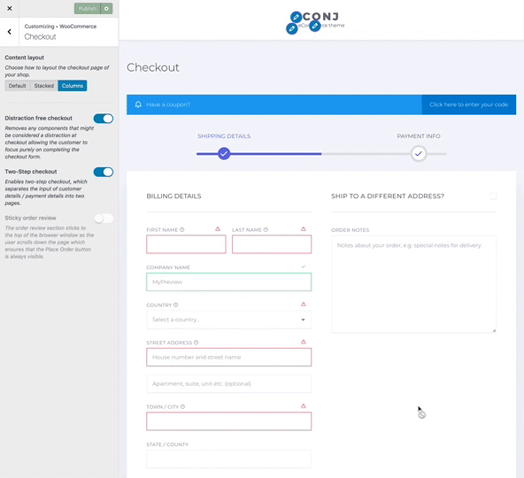
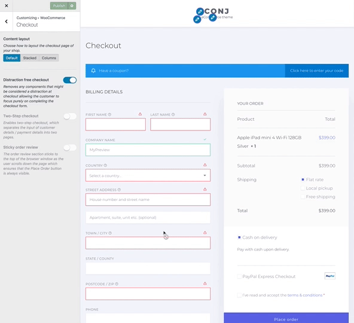

# Checkout

This section gives you full control of tweaking and layout customization for WooCommerce checkout page.

## Content layout

Here you can choose or update the layout of the checkout page with a few clicks.

The following options are available to select:

* **Default** — Billing and shipping fieldsets is on left, order review is on right. ⤵  
  
* **Stacked** — Billing and shipping fieldsets is above and order review table is below. ⤵  
  
* **Columns** — Billing and shipping fieldsets and order review table, each divided into two columns. ⤵  
  

?> By combining all three checkout content layout types with default (with sidebar) and fluid width template, you would be able to create in total **six** different checkout designs.

## Distraction free checkout

Removes any components that might be considered a distraction at checkout allowing the customer to focus purely on completing the checkout form. ⤵

## Two-Step checkout

Enables two-step checkout, which separates the input of customer details / payment details into two pages. ⤵

## Sticky order review

The order review section sticks to the top of the browser window as the user scrolls down the page which ensures that the **Place Order** button is always visible. ⤵

