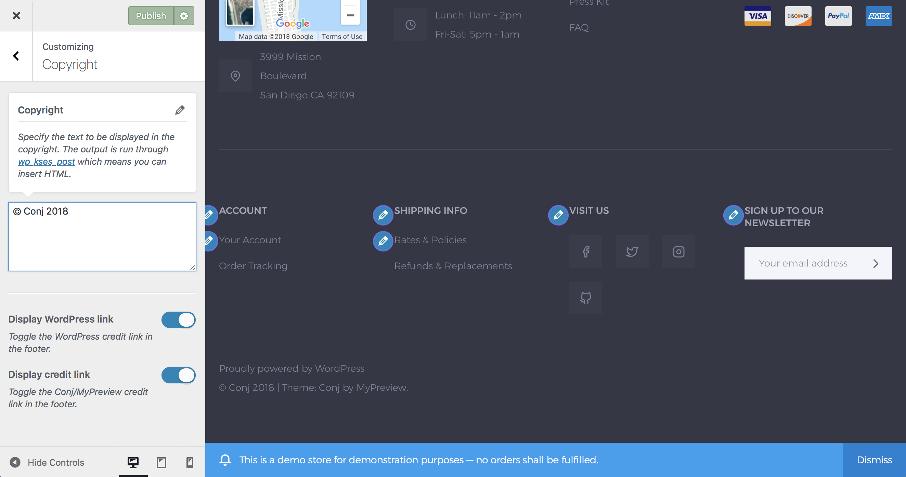

# Update or remove copyright

Copyright section provides a few options to customize the copyright content as well as disable the WordPress and/or theme credit links.

Copyright section can be adjusted with a few clicks via the WordPress Customizer. Log into your website and then:

2. On the frontend, in the Admin bar, click **Customize**.
3. On the backend, click **Appearance » Customize**.
4. Navigate to **Copyright** section.
5. Add your own custom copyright message. 
*The output is run through [wp_kses_post](https://codex.wordpress.org/Function_Reference/wp_kses_post) which means you can insert HTML.*
7. Optionally, toggle the WordPress credit link in the footer.
8. Optionally, toggle the Conj/MyPreview credit link in the footer.
9. Click the **Publish** button at the top right of the Customizer to display the updated copyright content on your site.
