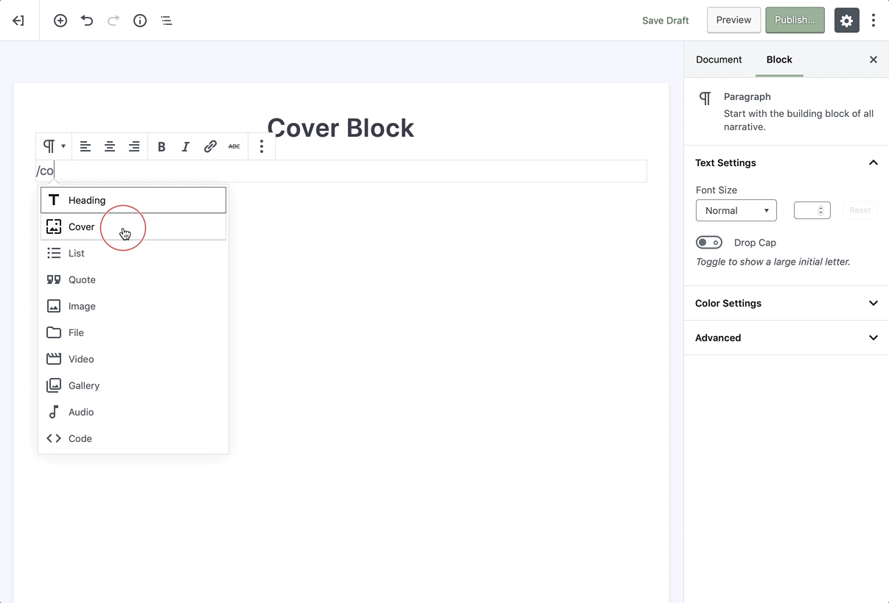
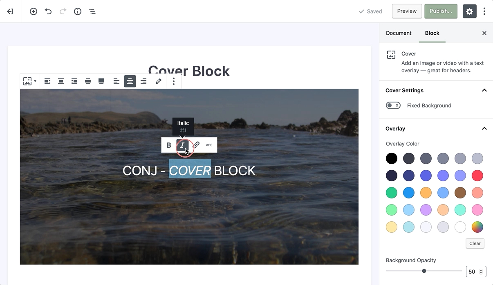
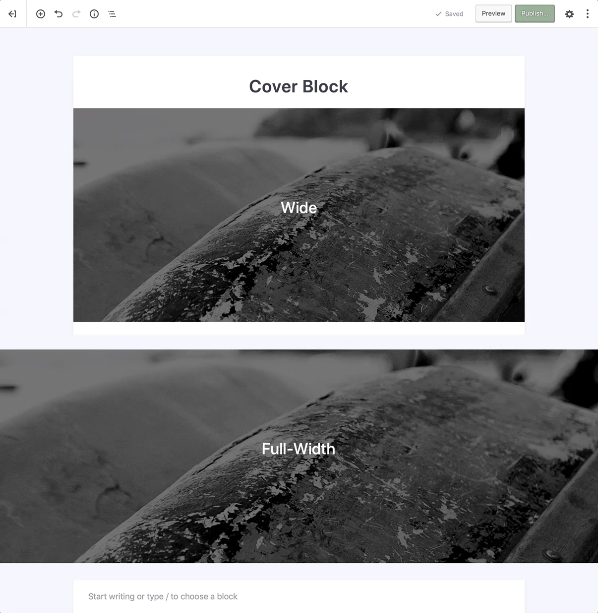
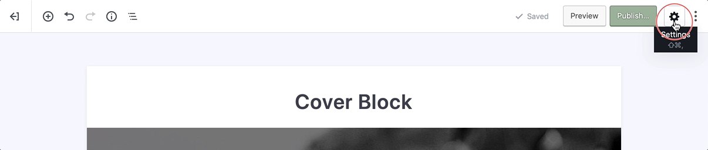

# Cover Block

Adding a cover image to your post or page will positively transform any regular content into a sleek, professional looking article.

To add a cover block into your content start typing `/cover` in a new paragraph block, then press enter.

?> Detailed instructions on adding blocks can be found [here](adding-block).

## Block Interface

Each block comes with unique toolbar icons and specific user controls that allow you to manipulate the block right in the editor.

### Adding Images

Upon adding the cover block, you have two options to chose from, Upload and Media Library. The Upload button allows you to upload a new image from your device and Media Library allows you to select an image you’ve already uploaded to your site’s Media Library.

### Edit Image

This is the secondary option in the cover block’s toolbar. Choosing this will enable you to select a new image file for your block. You may use this if you need to replace the already existing image file in your cover block.

### Alignment

Similar to most of the blocks, you can align the cover block itself to the **left**, **right**, and **center** from the toolbar. Also, using the left or right alignment enables you to place another block beside the cover block.

In addition to what mentioned above, some of the blocks have a **wide** and **full-width** alignment that is useful for creating unique headers and widescreen effects. These two options are mostly available if the specific block supports this kind of alignments. 

## Sidebar Settings

In addition to the options found in the block’s toolbar, you may locate the block specific settings in the editor sidebar panel. Clicking on the **cog** icon next to the publish button will toggle the visibility of this panel.

## Fixed Background

Within the block settings panel on the sidebar, you have several other options to modify this block, the first of which is a toggle for a **Fixed Background**. 
Enabling this toggle field allows the cover block to fix the position of the image while user scrolls along with your page, nevertheless leaving this toggle off embeds the image in block’s wrapper, so the image doesn’t scroll.

