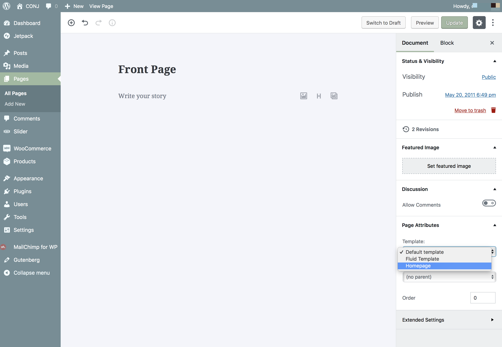
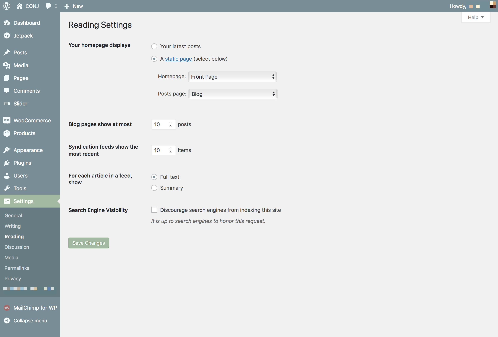

# Create And Set a Static Homepage

By default after fresh installation of the [Conj - eCommerce WordPress Theme](https://themeforest.net/item/conj-ecommerce-wordpress-theme/21935639?ref=mypreview), the homepage will look like a blog, and this is how WordPress is intended to work. This is the same page template used on the main theme [demos](https://www.conj.ws).

The [Conj - eCommerce WordPress Theme](https://themeforest.net/item/conj-ecommerce-wordpress-theme/21935639?ref=mypreview) theme comes with a unique Homepage template which is perfect for e-commerce websites and shop owners, as it displays a lot of products and product categories to visitors as soon as they land on your website.

Assuming you added some products to your shop, after following the steps below you would be able to see links to them and links to the top level product categories when visiting the front page of your shop.

## Create Homepage Template

Follow the steps below to create a homepage template:

1. Create a new page, by visiting **Pages » Add New**.
2. Set the **page title**.
3. From the template drop-down in the **Page Attributes** meta box select **Homepage template**.
4. **Publish** the page.

## Set Up Homepage Template

Follow the steps below to set up the created homepage template:

1. Navigate to **Settings » Reading**.
2. Locate the **Front page displays** section.
3. Set the newly created static page as a **Front page**.
4. **Save** the settings.

## Create And Set Up a Blog Page

In addition to the steps outlined above in case you want to have a page to display your blog posts, you will have to create another page (you can leave the content blank) and set that as the **Posts Page** in the same settings section.

## Additional Links

* [Creating a Static Front Page](https://codex.wordpress.org/Creating_a_Static_Front_Page)
* [Setting a Static Page as Your Homepage](https://make.wordpress.org/training/handbook/user-lessons/setting-a-static-page-as-your-homepage/)
