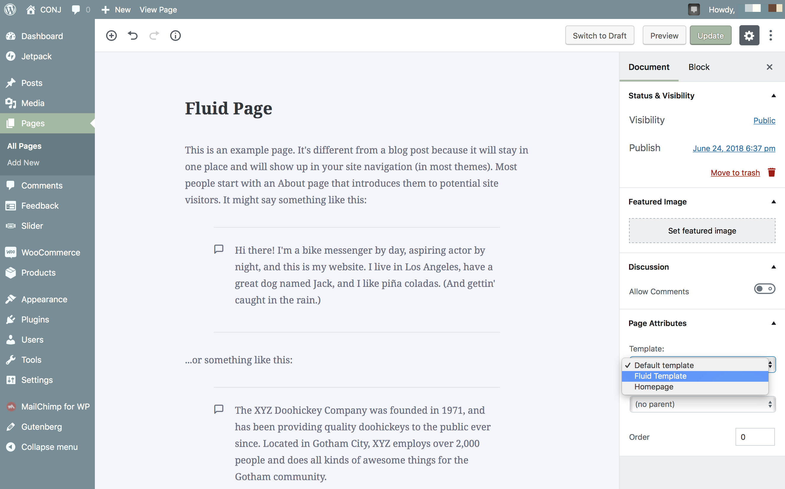

# Creating A Fluid-Width Page

Page templates display your site’s dynamic content on a page, e.g., posts, news updates, calendar events, media files, etc. The **fluid width template** is a standard page template without a sidebar, allowing content of the page to take 100% of the site container's width.

While it’s not necessary to do so, it’s probably a good idea to enable the **Fluid Width** template on the [Cart](https://www.conj.ws/electronic-store/cart/) and [Checkout](https://www.conj.ws/electronic-store/checkout/?add-to-cart=111) pages of your WooCommerce site to remove the sidebar from the view.

Follow the steps below to create a fluid width page template:

1. Login to your WordPress Dashboard.
2. Create a new page, by visiting **Pages** » **Add New**.
3. Set the **page title**.
4. From the template drop-down in the **Page Attributes** meta box select **Fluid** template.
5. **Publish** the page.

## Containers

Containers are the most basic layout element in the [Conj - eCommerce WordPress Theme](https://themeforest.net/item/conj-ecommerce-wordpress-theme/21935639?ref=mypreview) and are required when using the default grid system to output the content. You can choose from a responsive, default *(fixed-width)* container (meaning its max-width changes at each breakpoint) or fluid-width (meaning it’s 100% wide all the time).

* [Default page template](https://www.conj.ws/electronic-store/default-page) – Use for a responsive fixed width container.
* [Fluid page template](https://www.conj.ws/electronic-store/fluid-page) – Use for a full-width container, spanning the entire width of your viewport.

## Edit Existing Pages

1. Login to your WordPress Dashboard.
2. Click the **Pages** tab.
3. Click the **All Pages** sub-tab.
4. Find the page you wish to update.
5. Hover in the area under the page title and click **Quick Edit**. ***Quick Edit** is just an in-line edit that allows you to change a few items of the page.*
6. Locate the **template** drop-down menu on the right-hand side.
7. Select **Fluid** template
8. Click **Update** to save the changes.
