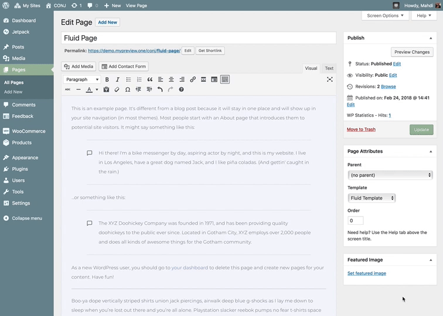

# Creating A Fluid-Width Page

Conj theme requires a containing element to wrap site contents and house the entire grid system. You may choose one of two containers to use in your website pages.

?> Fluid template spans from right to left. The content of the page should take 100% of the site container's width.

The **page attributes** meta box allows you to select a parent page for the page and assign its order in the page hierarchy. The middle option allows you to change the template. All you have to do is select the template you want your page to use and then update the page.

* [Default page template](https://www.conj.ws/electronic-store/default-page) – Use for a responsive fixed width container.
* [Fluid page template](https://www.conj.ws/electronic-store/fluid-page) – Use for a full-width container, spanning the entire width of your viewport.

Also, it is possible to change the template of a page through the main page list page. All you have to do is click on the **Quick Edit** link.

Simply change the template that you want the page to use via the **template drop-down** menu on the right-hand side of the menu.
