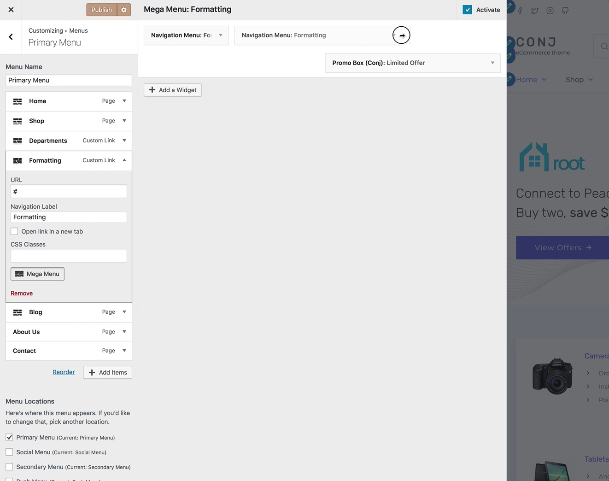
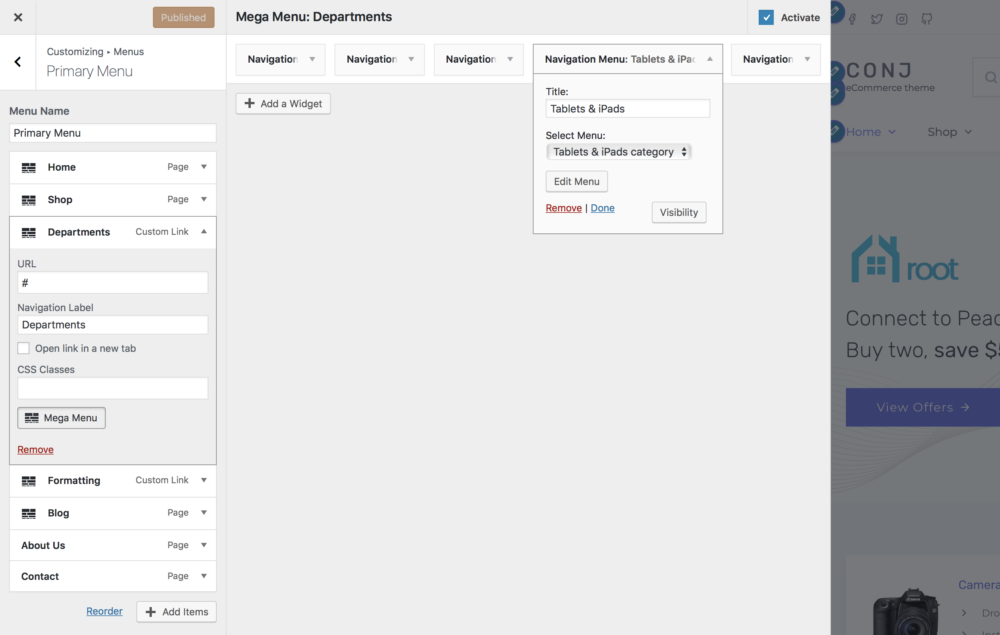
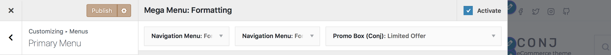

# Creating Mega Menus

This feature allows you to transform any top-level primary menu item into a full-width dropdown mega-menu.

The easy to use drag & drop interface enables you to add any content you wish **up to 6 per row** using Widgets that can be rearranged and resized to display in your site navigation area.

?> Currently, Mega Menus only works in the **Primary Menu** [location](menu-user-guide?id=assigning-your-menu-to-a-location), which is the main navigation under your logo.

## Configuring a Mega Menu

Follow the steps below to create an example mega-menu:

1. On the frontend, in the **Admin bar**, click **Customize**.
2. On the backend, click **Appearance** » **Customize**.
3. Navigate to Export/Import section.
4. Select the menu which is currently set to **Primary Menu**.
5. Click on the **arrow** icon in the top right-hand corner of the menu item to expand it.
6. Click the **Mega Menu** button to open a new side panel where you can manage the selected menu item(s).
7. Click the **Add a Widget** button to search and select a new widget from the list to add.

?> [Text Widget](https://codex.wordpress.org/WordPress_Widgets#Adding_Code_to_the_Text_Widget) plugin enables you to embed any standard WooCommerce shortcodes to the menu item and display them as a result.

## Changing The Order of Widgets

You can easily use your mouse to quickly rearrange widgets and move them to a different column or row.

## Resizing a Widget

With your mouse, hover over the corner/borders, then click and drag to resize the widget.

## Deleting a Widget

1. Click on the **arrow** icon in the top right-hand corner of the widget to expand it.
2. At the bottom select **Delete** to remove the widget from the view.

## Enable And Live Preview

When the **Activate** checkbox is checked, the mega menus are shown on your site and live preview is available.

## Additional Links

* [Menu User Guide](menu-user-guide)
* [Using Text Widgets](https://codex.wordpress.org/WordPress_Widgets#Adding_Code_to_the_Text_Widget)
