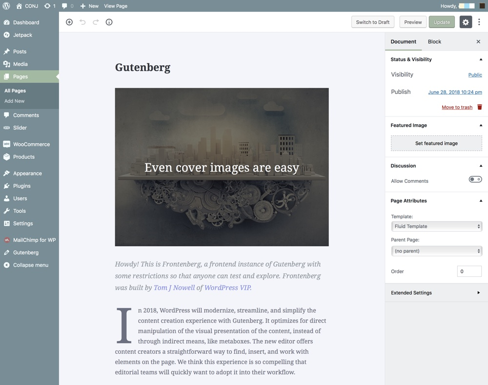

# Creating A Page

In WordPress, you can publish any content on your site as either a **post** or a **page**. When you’re writing a regular blog entry, you write a post. Posts, in a default setup, appear in reverse chronological order on your blog’s archive page.

In contrast, pages aren’t meant for blog post content at all and generally are for non-chronological, hierarchical content which mostly created for the content that isn’t specifically time-dependent.

?> Pages like **About** or **Contact** would be common examples.

Follow the steps below to create a sample static page:

1. Login to the your WordPress Dashboard.
2. Click the **Pages** tab.
3. Click the **Add New** sub-tab.
4. Start filling in the blanks: enter your **page title** in the upper field, and enter your **page body content** in the main page editing box below it.
5. In the right menu, click the **Page Parent** drop-down menu. The drop-down menu contains a list of all the Pages already created for your site.
6. Optionally, select the appropriate parent page from the drop-down menu to make the current page a child page.
5. Optionally, upload a **featured image** for your page.
6. When you are ready, click **Publish**.

?> When all your pages are listed, the child page will be nested under the parent page. The permalinks of your pages will also reflect this page hierarchy.

## Organizing Pages

As you can have subcategories within your Categories, you can also have subpages within your Pages, creating a hierarchy of pages.

## Additional Links

* [What Pages Are](https://codex.wordpress.org/Pages#What_Pages_Are)
* [What Pages Are Not](https://codex.wordpress.org/Pages#What_Pages_Are_Not)
* [Creating Pages](https://codex.wordpress.org/Pages#Creating_Pages)
