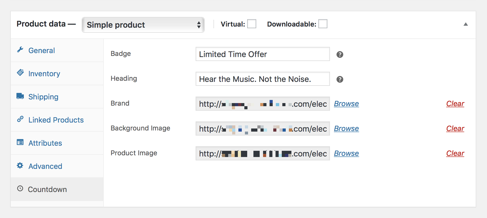

# Creating Sale Countdown

## Scheduling A Sale

Follow the steps below to schedule a sale in your existing WooCommerce product:

1. Login to your WordPress Dashboard.
2. Click the **Products** tab.
3. Click the **All Products** sub-tab.
4. Find the product you wish to edit.
5. **Hover** in the area under the product name and click **Edit**.
6. Scroll down to the **Product Data** tab.
7. Locate the **Sale Price** field and enter item’s discounted price in number.
8. Right next to the **Sale Price** field click on the **Schedule** link.
9. Enter the **start** and **end date** using the interactive datepicker. *The sale date is based on the time you have set for your site and is going to expire at `11:59pm` of the specified end date.*
10. Click **Update** button once you've made your changes.

?> You can check the time zone set for your site under **Settings** » **General** » **Timezone**.

## Configuring Countdown Details

1. Login to your WordPress Dashboard.
2. Click the **Products** tab.
3. Click the **All Products** sub-tab.
4. Find the **on-sale product** you wish to edit.
5. **Hover** in the area under the product name and click **Edit**.
6. Scroll down to the **Product Data** tab.
7. Navigate to the **Countdown** tab.
8. Start filling in the blanks: 
   * *Badge — The text to be displayed above the countdown heading content.*
   * *Heading — The text to be displayed in the countdown component header.*
   * *Brand — Suggested image dimensions: 161 by 45 pixels.*
   * *Background Image — Suggested image dimensions: 3440 by 1376 pixels.*
   * *Product Image — Suggested image dimensions: 954 by 464 pixels.*
9. Click **Update** button once you've made your changes.

## Display On-Sale Product With Countdown

Follow the steps below to display the on-sale product on the front-end of your shop:

1. On the frontend, in the **Admin bar**, click **Customize**.
2. On the backend, click **Appearance** » **Customize**.
3. Navigate to **Homepage Content** » **Sale Countdown** section.
4. Locate the **On-Sale Product** call-out.
5. Select the product for which you want to activate the **sale countdown**.
6. Preview your selection instantly.
7. Click the **Publish** button to save the changes.
