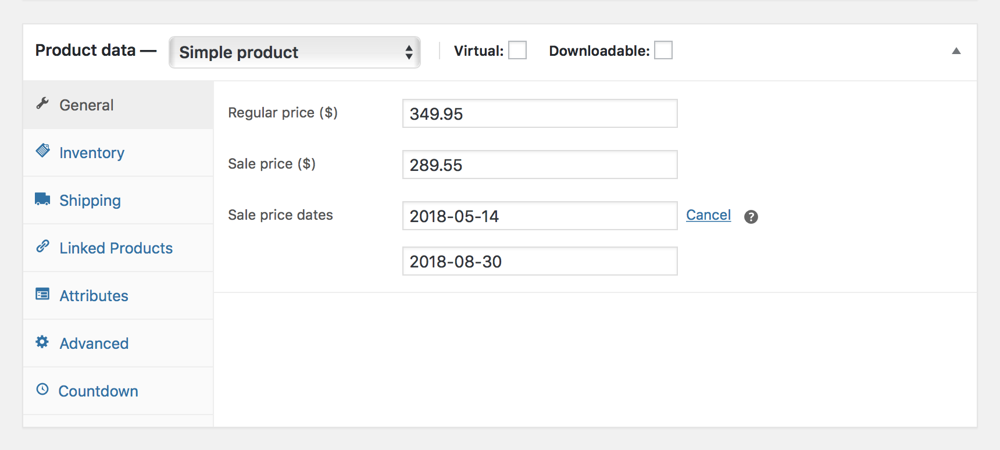

# Creating Sale Countdown

## Scheduling A Sale

Follow the steps below to schedule a sale in your existing WooCommerce product:

1. Login to your WordPress Dashboard.
2. Click the **Products** tab.
3. Click the **All Products** sub-tab.
4. Find the product you wish to edit.
5. **Hover** in the area under the product name and click **Edit**.
6. Scroll down to the **Product Data** tab.
7. Locate the **Sale Price** field and enter item’s discounted price in number.
8. Right next to the **Sale Price** field click on the **Schedule** link.
9. Enter the **start** and **end date**. *The sale date is based on the time you have set for your site and is going to expire at `11:59pm` of the specified end date.*
10. Click **Update** button once you've made your changes.

?> You can check the time zone set for your site under **Settings** » **General** » **Timezone**.
