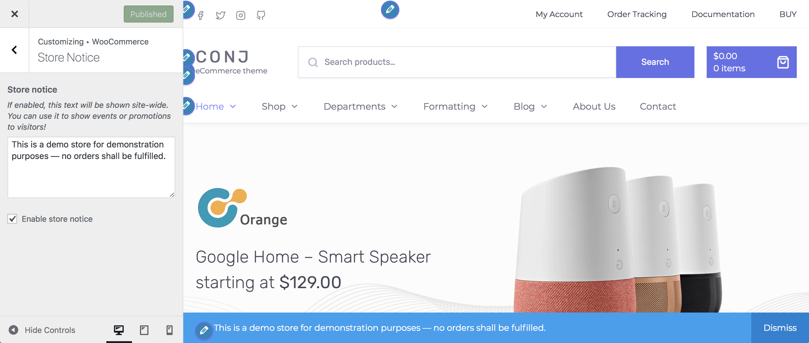
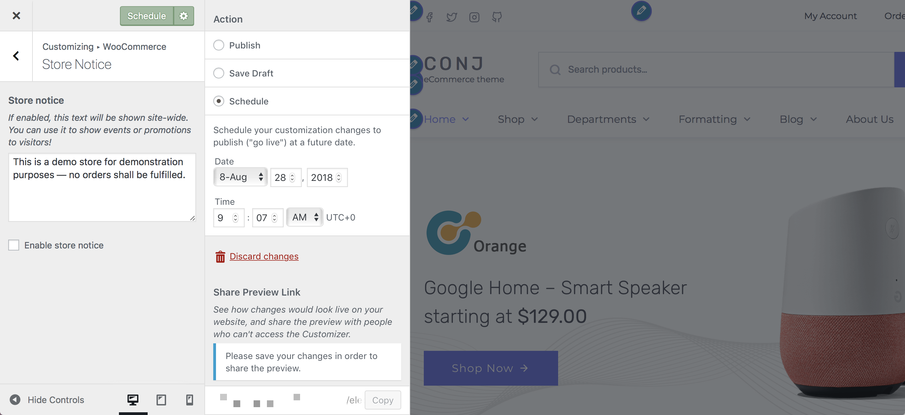

# Creating A Site-Wide Notice

**Store Notice** allows you to enter a site-wide message shown to everyone visiting your store. The message can be:

* **Informational** – A note that notifies customers of shipping delays due to weather conditions or an away notice if you are on vacation.
* **Promotional** – A note advertising an event, a holiday special, a bundle, a sale on all/some items or free shipping.

1. On the frontend, in the **Admin bar**, **Customize**.
2. On the backend, click **Appearance** » **Customize**.
3. Navigate to **WooCommerce » Store Notice** section.
4. Locate the notice content textarea.
5. Specify the text to be displayed as a site-wide message at the very bottom of the site.
6. **Check or uncheck** the checkbox to enable/disable the site-wide message.
7. Click the **Publish** button to save the changes and display the site-wide message on your site publicly.

?> Visitors can choose to **Dismiss** the notice after seeing it once.

## Schedule a Store Notice

Using the **Schedule** option for **Store Notice** can be helpful when running a promotion for a limited time or ending a sale/discount at midnight on a specific date.

In the following example, we want to discontinue the *Free Shipping* offer when it expires end of day on **August 28**.

1. On the frontend, in the **Admin bar**, **Customize**.
2. On the backend, click **Appearance** » **Customize**.
3. Navigate to **WooCommerce » Store Notice** section.
4. **Uncheck** the checkbox to disable the site-wide message.
5. Select the **gear wheel** to open the schedule window.
6. Select **Schedule** on the right menu, then enter the **Date and Time** you want the change to take effect.
7. Click the **Schedule** button to make changes you entered on the future Date and Time indicated.
