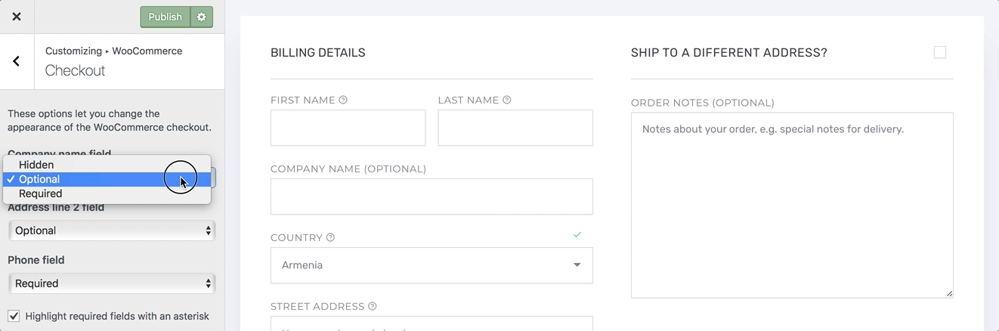
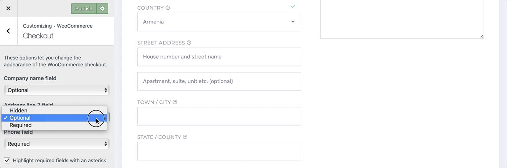
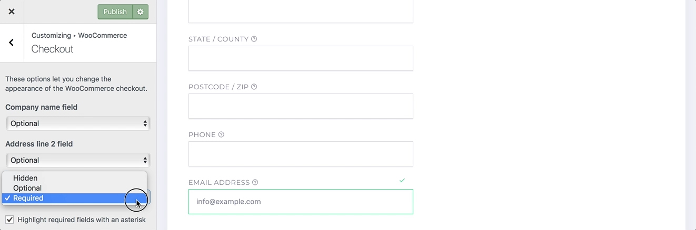
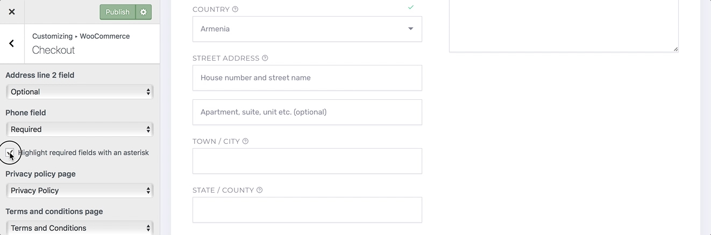
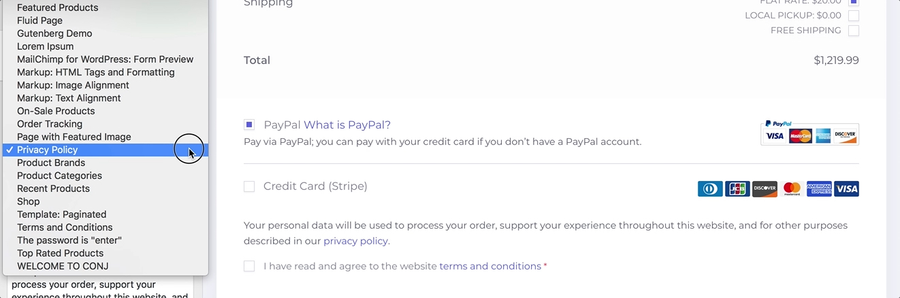

# Customizing Checkout Layout

This section gives you full control of tweaking and layout customization for WooCommerce checkout page.

You can now set whether certain fields are required or optional depending on the data you wish to collect. You can also choose to highlight the required fields with an asterisk, which is the default.

## Modify Company Name Field

1. On the frontend, in the **Admin bar**, **Customize**.
2. On the backend, click **Appearance** » **Customize**.
3. Navigate to **WooCommerce** » **Checkout** section.
4. Locate the **Company name field** and select one of the following options from the drop-down menu: 
   * *Hidden*
   * *Optional*
   * *Required*
5. Preview your selection instantly.
6. Click the **Publish** button to save the changes.

## Modify Address Line 2 Field

1. On the frontend, in the **Admin bar**, **Customize**.
2. On the backend, click **Appearance** » **Customize**.
3. Navigate to **WooCommerce** » **Checkout** section.
4. Locate the **Address line 2 field** and select one of the following options from the drop-down menu: 
   * *Hidden*
   * *Optional*
   * *Required*
5. Preview your selection instantly.
6. Click the **Publish** button to save the changes.

## Modify Phone Field

1. On the frontend, in the **Admin bar**, **Customize**.
2. On the backend, click **Appearance** » **Customize**.
3. Navigate to **WooCommerce** » **Checkout** section.
4. Locate the **Phone field** and select one of the following options from the drop-down menu: 
   * *Hidden*
   * *Optional*
   * *Required*
5. Preview your selection instantly.
6. Click the **Publish** button to save the changes.

## Append An Asterisk To Required Fields

1. On the frontend, in the **Admin bar**, **Customize**.
2. On the backend, click **Appearance** » **Customize**.
3. Navigate to **WooCommerce** » **Checkout** section.
4. Locate the **Highlight required fields with an asterisk** checkbox.
5. **Check** the checkbox to append an **asterisk** to all required fields.
6. Preview your selection instantly.
7. Click the **Publish** button to save the changes.

## Set Up Privacy Policy Page

1. On the frontend, in the **Admin bar**, **Customize**.
2. On the backend, click **Appearance** » **Customize**.
3. Navigate to **WooCommerce** » **Checkout** section.
4. [Create a new page](creating-page) for your privacy policy.
5. Locate the **Privacy policy page** field and select the newly created page in the drop-down menu.
6. Preview your selection instantly.
7. Click the **Publish** button to save the changes.
