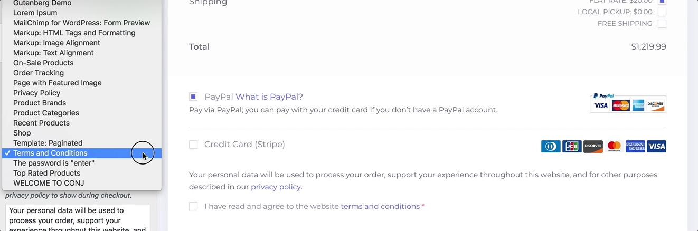
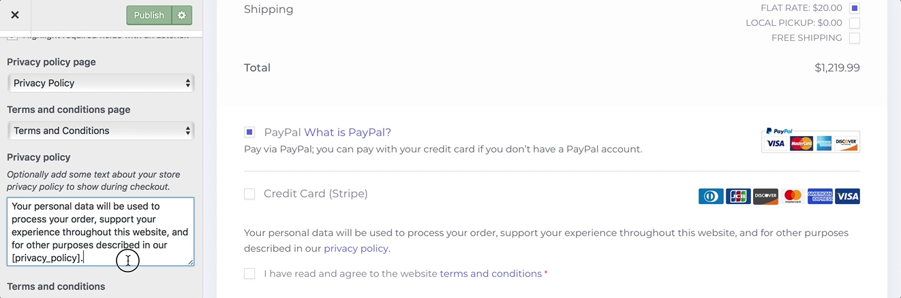
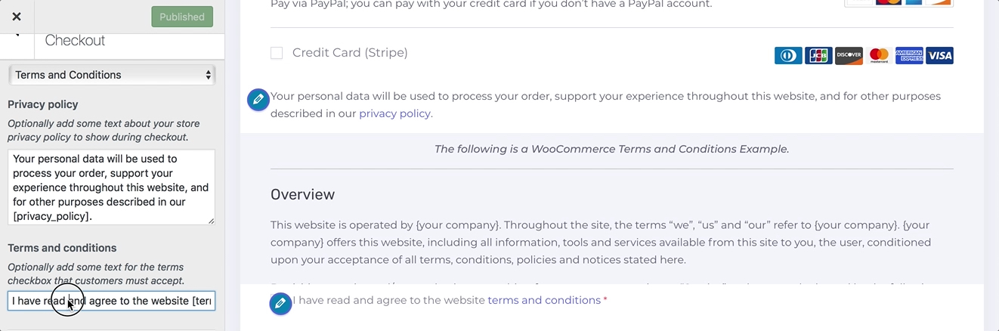
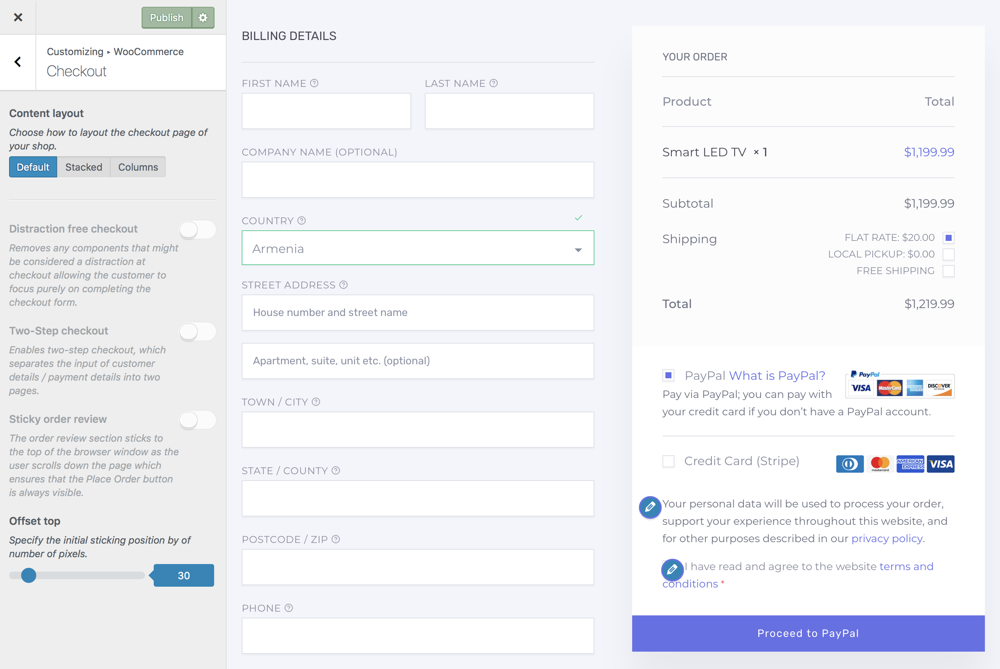
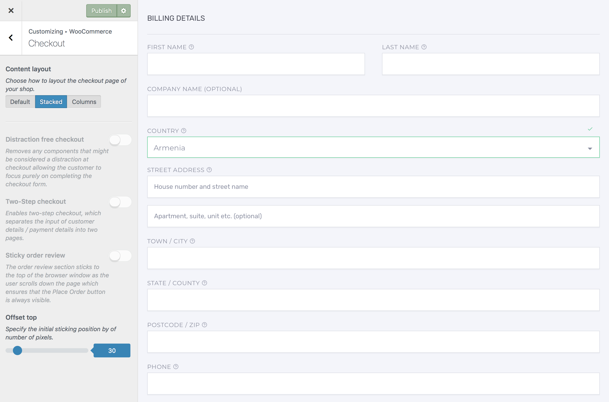
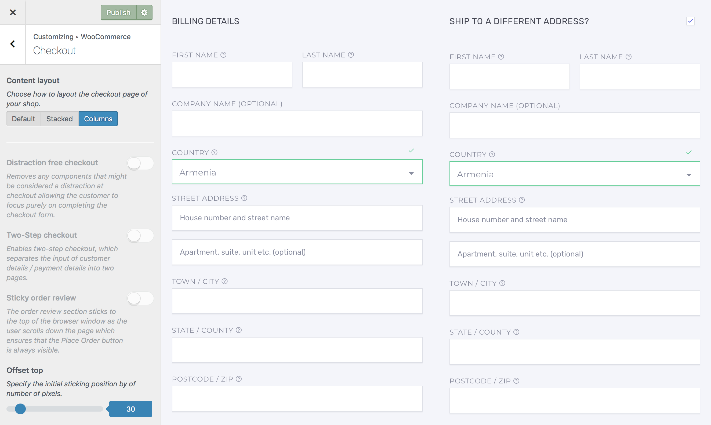
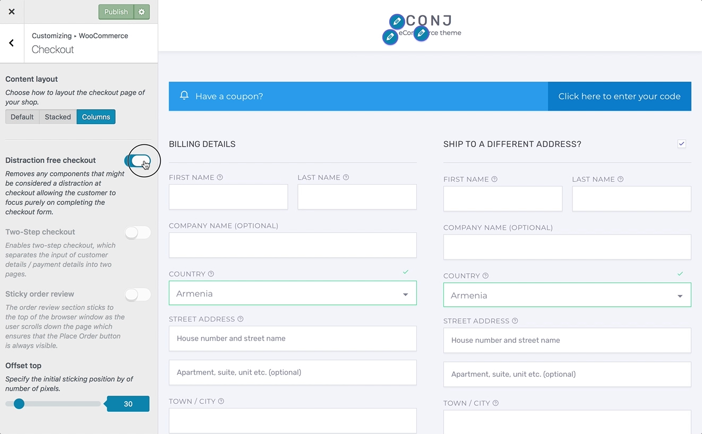
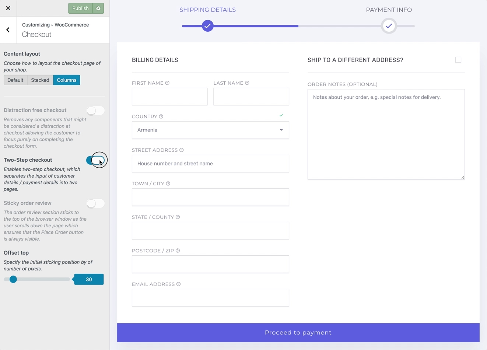
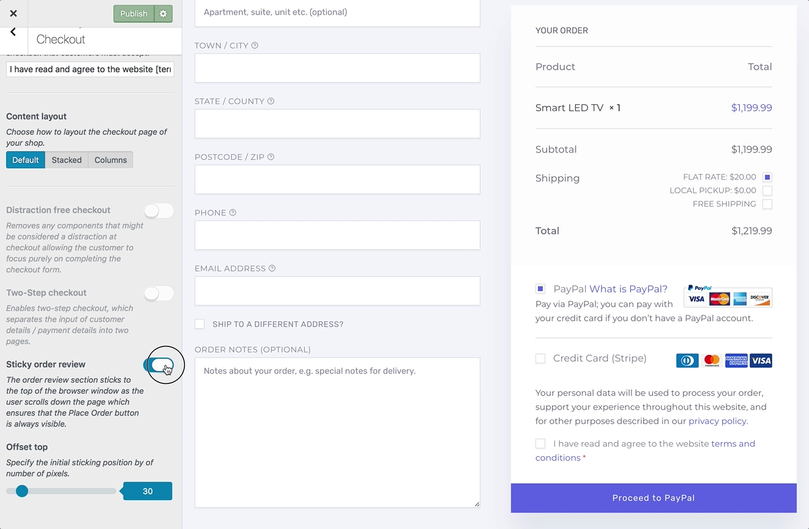

# Customizing Checkout Layout

This section gives you full control of tweaking and layout customization for WooCommerce checkout page.

You can now set whether certain fields are required or optional depending on the data you wish to collect. You can also choose to highlight the required fields with an asterisk, which is the default.

## Modify Company Name Field

1. On the frontend, in the **Admin bar**, **Customize**.
2. On the backend, click **Appearance** » **Customize**.
3. Navigate to **WooCommerce** » **Checkout** section.
4. Locate the **Company name field** and select one of the following options from the drop-down menu: 
   * *Hidden*
   * *Optional*
   * *Required*
5. Preview your selection instantly.
6. Click the **Publish** button to save the changes.

## Modify Address Line 2 Field

1. On the frontend, in the **Admin bar**, **Customize**.
2. On the backend, click **Appearance** » **Customize**.
3. Navigate to **WooCommerce** » **Checkout** section.
4. Locate the **Address line 2 field** and select one of the following options from the drop-down menu: 
   * *Hidden*
   * *Optional*
   * *Required*
5. Preview your selection instantly.
6. Click the **Publish** button to save the changes.

## Modify Phone Field

1. On the frontend, in the **Admin bar**, **Customize**.
2. On the backend, click **Appearance** » **Customize**.
3. Navigate to **WooCommerce** » **Checkout** section.
4. Locate the **Phone field** and select one of the following options from the drop-down menu: 
   * *Hidden*
   * *Optional*
   * *Required*
5. Preview your selection instantly.
6. Click the **Publish** button to save the changes.

## Append An Asterisk To Required Fields

1. On the frontend, in the **Admin bar**, **Customize**.
2. On the backend, click **Appearance** » **Customize**.
3. Navigate to **WooCommerce** » **Checkout** section.
4. Locate the **Highlight required fields with an asterisk** checkbox.
5. **Check** the checkbox to append an **asterisk** to all required fields.
6. Preview your selection instantly.
7. Click the **Publish** button to save the changes.

## Set Up Privacy Policy Page

1. On the frontend, in the **Admin bar**, **Customize**.
2. On the backend, click **Appearance** » **Customize**.
3. Navigate to **WooCommerce** » **Checkout** section.
4. To use a privacy policy page, [create a new page](creating-page) for it.
5. Locate the **Privacy policy page** field and select the newly created page to act as your privacy policy.
6. Preview your selection instantly.
7. Click the **Publish** button to save the changes.

## Set Up Terms And Conditions Page

1. On the frontend, in the **Admin bar**, **Customize**.
2. On the backend, click **Appearance** » **Customize**.
3. Navigate to **WooCommerce** » **Checkout** section.
4. To use a terms and conditions page, [create a new page](creating-page) for it.
5. Locate the **Terms and conditions page** field and select the newly created page to act as your terms and conditions.
6. Preview your selection instantly.
7. Click the **Publish** button to save the changes.

## Privacy Policy Notice

1. On the frontend, in the **Admin bar**, **Customize**.
2. On the backend, click **Appearance** » **Customize**.
3. Navigate to **WooCommerce** » **Checkout** section.
4. Locate the **Privacy policy** textarea.
5. Add some text about your store privacy policy to show during checkout. *Using `[privacy_policy]` shortcode will link to this page.*
6. Preview your selection instantly.
7. Click the **Publish** button to save the changes.

## Terms And Conditions Notice

1. On the frontend, in the **Admin bar**, **Customize**.
2. On the backend, click **Appearance** » **Customize**.
3. Navigate to **WooCommerce** » **Checkout** section.
4. Locate the **Terms and conditions** textarea.
5. Add some text for the terms checkbox that customers **must accept**. *Using `[terms]` shortcode will link to this page.*
6. Preview your selection instantly.
7. Click the **Publish** button to save the changes.

## Content Layout

1. On the frontend, in the **Admin bar**, **Customize**.
2. On the backend, click **Appearance** » **Customize**.
3. Navigate to **WooCommerce** » **Checkout** section.
4. Locate the **Content layout** swtich field.
5. Here you can select or change the layout for checkout. Options are:
   * [Default](https://www.conj.ws/camping/checkout/?add-to-cart=677) — Customer input is on left, order is on right.
   * [Stacked](https://www.conj.ws/gift-cards/checkout/?add-to-cart=379) – Customer input is above and order is below.
   * [Columns](https://www.conj.ws/electronic-store/checkout/?add-to-cart=111) – Customer input and order, each divided into two columns.
6. Preview your selection instantly.
7. Click the Publish button to save the changes.

?> Combined with the [fluid width template](creating-fluid-width-page?id=containers) already in the [Conj - eCommerce WordPress Theme](https://themeforest.net/item/conj-ecommerce-wordpress-theme/21935639?ref=mypreview), this allows you to create **six** different checkout designs.

## Distraction Free Checkout

1. On the frontend, in the **Admin bar**, **Customize**.
2. On the backend, click **Appearance** » **Customize**.
3. Navigate to **WooCommerce** » **Checkout** section.
4. Locate the **Distraction free checkout** toggle.
5. Enable this option to allow your customers to focus purely on completing the checkout form.  *This feature removes most header elements, widgets, breadcrumbs and footer content from the view.*
6. Preview your selection instantly.
7. Click the **Publish** button to save the changes.

## Two-Step Checkout

1. On the frontend, in the **Admin bar**, **Customize**.
2. On the backend, click **Appearance** » **Customize**.
3. Navigate to **WooCommerce** » **Checkout** section.
4. Locate the **Two-Step checkout** toggle.
5. Enable this option to separate the input of customer **billing** and **payment** details into two pages.
6. Preview your selection instantly.
7. Click the **Publish** button to save the changes.

## Sticky Order Review

1. On the frontend, in the **Admin bar**, **Customize**.
2. On the backend, click **Appearance** » **Customize**.
3. Navigate to **WooCommerce** » **Checkout** section.
4. Locate the **Sticky order review** control and toggle to enable or disable it. *The order review section sticks to the top of the browser window as the user scrolls down the page which ensures that the **Place Order** button is always visible.*
5. Locate the **Offset top** control to specify the initial sticking top offset by number of pixels.
6. Preview your selection instantly.
7. Click the **Publish** button to save the changes.
