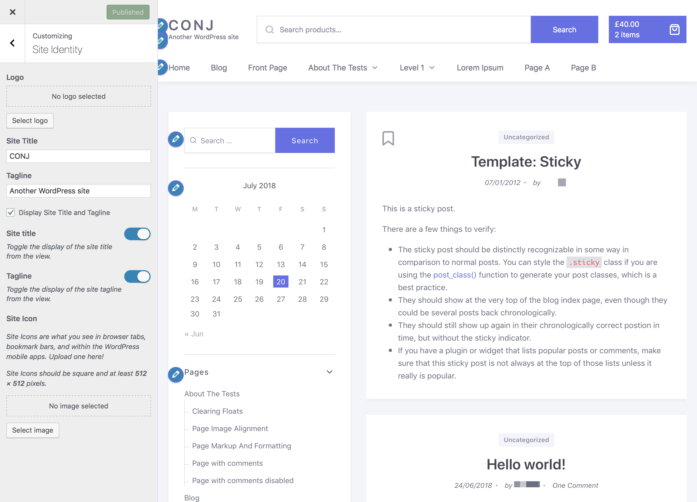

# Customizing The Logo

The [Conj - eCommerce WordPress Child Theme](https://themeforest.net/item/conj-ecommerce-wordpress-theme/21935639?ref=mypreview) includes a few built-in options to alter the default look of the site logo.

Follow the steps below to upload your site logo:

1. On the frontend, in the **Admin bar**, **Customize**.
2. On the backend, click **Appearance** » **Customize**.
3. Navigate to **Site Identity** section.
4. Click the **Select Logo** button to open the WordPress media library.
5. To upload the logo file, click the **Upload Files** tab in the upper left corner of the **Select logo** dialog box.
6. You can drag and drop any image file from your local computer or machine’s file manager, or you can click **Select Files** to upload the logo file.
7. In the **File Upload** dialog box, navigate to the location of the image you want to use, and then double-click the image to upload it.
8. Once the file uploaded, the **Media Library** tab appears with the uploaded file selected.
9. At the right side of the **Medial Library**, complete the **Title**, **Caption**, **Alt Text**, and **Description** text boxes, and then click **Select** button.
10. The **Crop Image** dialog box appears.
11. Use the sizing handles to select any portion of the uploaded image you wish to be displayed as the site logo area, and then click **Crop Image** button. *Suggested image dimensions: **400 by 140 pixels**.*
12. Click the **Publish** button to view the logo on your site.

## Removing The Logo

Once a logo has been set, you can change or remove it using the **Remove Logo** and **Change Logo** buttons.

## Hiding The Site Title & Description *(Tagline)*

Right below the Logo selection tools in the Customizer, you will see a checkbox labeled Display Site Title and Tagline. By clearing this checkbox site title and tagline will be removed both.

In addition to that, you can toggle the display of the site title or tagline individually from the view.
