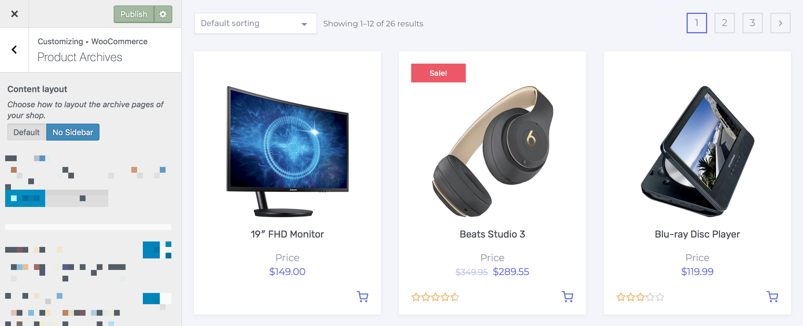
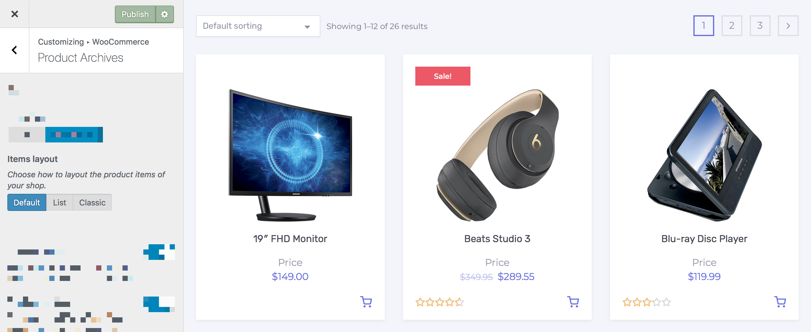
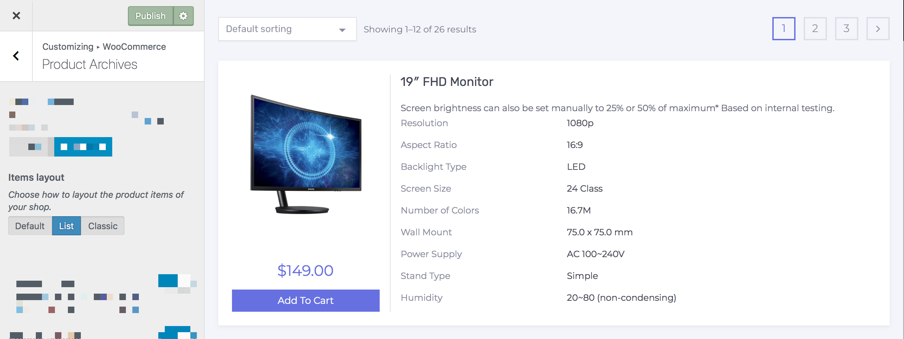
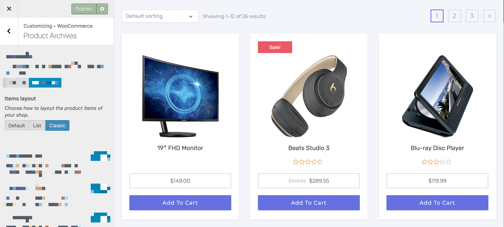

# Customizing Product Archives

Settings included in this section allow you to change the layout and customize every element of the WooCommerce shop and category *(archive)* page.

## Content Layout

1. On the frontend, in the **Admin bar**, **Customize**.
2. On the backend, click **Appearance** » **Customize**.
3. Navigate to **WooCommerce** » **Product Archives** section.
4. Locate the **Content layout** swtich field.
5. Choose how to layout the archive pages of your shop from the available options below:
   * *Default*
   * *No Sidebar*
6. Preview your selection instantly.
7. Click the **Publish** button to save the changes.

## Items Layout

1. On the frontend, in the **Admin bar**, **Customize**.
2. On the backend, click **Appearance** » **Customize**.
3. Navigate to **WooCommerce** » **Product Archives** section.
4. Locate the **Items layout** swtich field.
5. Choose how to layout the product items of your shop from the available options below:
   * *Default*
   * *List*
   * *Classic*
6. Preview your selection instantly.
7. Click the **Publish** button to save the changes.

## Product Count

1. On the frontend, in the **Admin bar**, **Customize**.
2. On the backend, click **Appearance** » **Customize**.
3. Navigate to **WooCommerce** » **Product Archives** section.
4. Locate the **Product count** toggle field.
5. Toggle the visibility of the result count - Showing `x - x of x` results.
6. Preview your selection instantly.
7. Click the **Publish** button to save the changes.

## Product Sorting

1. On the frontend, in the **Admin bar**, **Customize**.
2. On the backend, click **Appearance** » **Customize**.
3. Navigate to **WooCommerce** » **Product Archives** section.
4. Locate the **Product sorting** toggle field.
5. Toggle the visibility of the drop-down select field for ordering.
6. Preview your selection instantly.
7. Click the **Publish** button to save the changes.

## Sale Badge

1. On the frontend, in the **Admin bar**, **Customize**.
2. On the backend, click **Appearance** » **Customize**.
3. Navigate to **WooCommerce** » **Product Archives** section.
4. Locate the **Sale badge** toggle field.
5. Toggle the visibility of the **Sale** flash from items that are on sale.
6. Preview your selection instantly.
7. Click the **Publish** button to save the changes.

## Sale % Discount

1. On the frontend, in the **Admin bar**, **Customize**.
2. On the backend, click **Appearance** » **Customize**.
3. Navigate to **WooCommerce** » **Product Archives** section.
4. Locate the **Sale % discount** toggle field.
5. Toggle to display the discount as a percentage.
6. Preview your selection instantly.
7. Click the **Publish** button to save the changes.

## Sold Out Badge

1. On the frontend, in the **Admin bar**, **Customize**.
2. On the backend, click **Appearance** » **Customize**.
3. Navigate to **WooCommerce** » **Product Archives** section.
4. Locate the **Sold out badge** toggle field.
5. Toggle the visibility of the **Sold Out** flash from items that are out of stock.
6. Preview your selection instantly.
7. Click the **Publish** button to save the changes.

## Popular Badge

1. On the frontend, in the **Admin bar**, **Customize**.
2. On the backend, click **Appearance** » **Customize**.
3. Navigate to **WooCommerce** » **Product Archives** section.
4. Locate the **Popular badge** toggle field.
5. Toggle the visibility of the **Popular** flash from items that are best selling.
6. Preview your selection instantly.
7. Click the **Publish** button to save the changes.
