# Customizing Product Archives

Settings included in this section allow you to change the layout and customize every element of the WooCommerce shop and category *(archive)* page.

## Content Layout

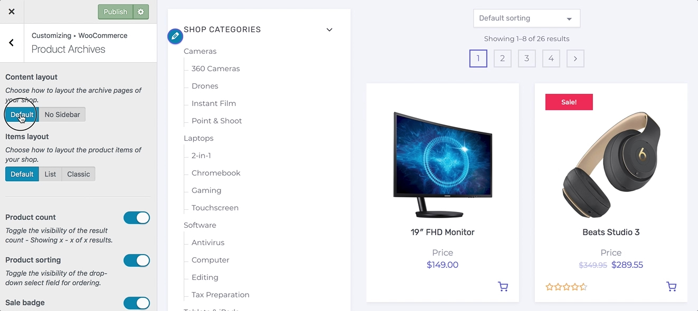

1. On the frontend, in the **Admin bar**, **Customize**.
2. On the backend, click **Appearance** » **Customize**.
3. Navigate to **WooCommerce** » **Product Archives** section.
4. Locate the **Content layout** swtich field.
5. Choose how to layout the archive pages of your shop from the available options below:
   * [Default](https://www.conj.ws/electronic-store/shop/)
   * [No Sidebar](https://www.conj.ws/camping/shop/)
6. Preview your selection instantly.
7. Click the **Publish** button to save the changes.

## Items Layout

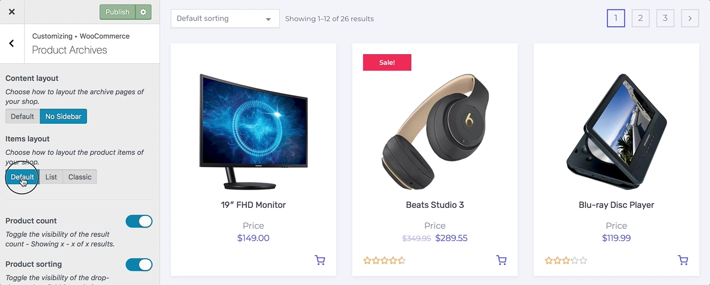
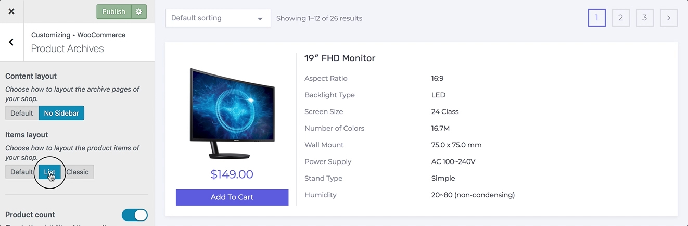
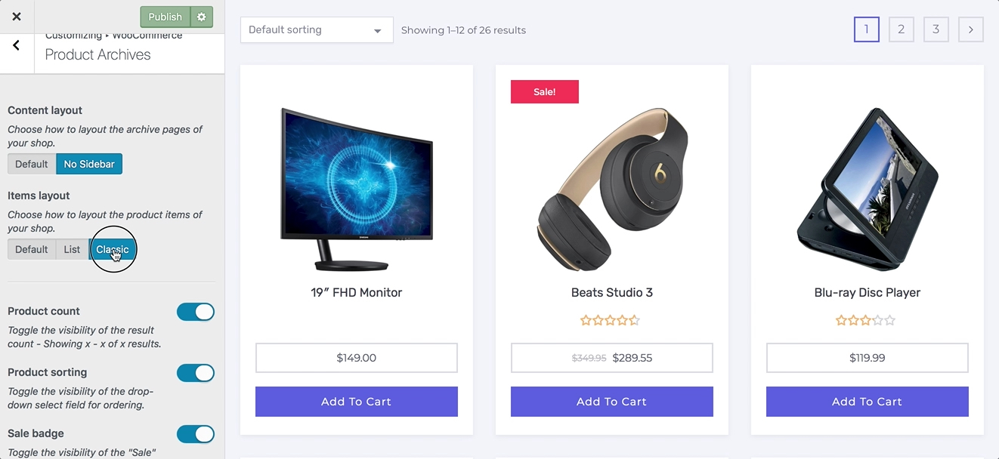

1. On the frontend, in the **Admin bar**, **Customize**.
2. On the backend, click **Appearance** » **Customize**.
3. Navigate to **WooCommerce** » **Product Archives** section.
4. Locate the **Items layout** swtich field.
5. Choose how to layout the product items of your shop from the available options below:
   * [Default](http://staging-conj.kinsta.com/electronic-store/shop/)
   * [List](http://staging-conj.kinsta.com/gift-cards/shop/)
   * [Classic](http://staging-conj.kinsta.com/camping/shop/)
6. Preview your selection instantly.
7. Click the **Publish** button to save the changes.

## Product Count

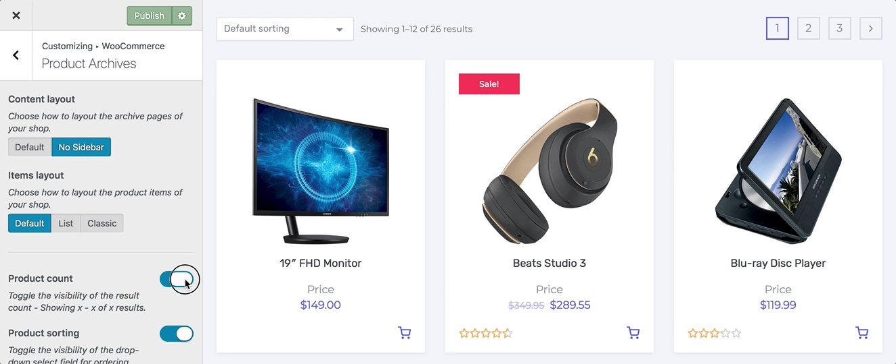

1. On the frontend, in the **Admin bar**, **Customize**.
2. On the backend, click **Appearance** » **Customize**.
3. Navigate to **WooCommerce** » **Product Archives** section.
4. Locate the **Product count** toggle field.
5. Toggle the visibility of the result count - Showing `x - x of x` results.
6. Preview your selection instantly.
7. Click the **Publish** button to save the changes.

## Product Sorting

1. On the frontend, in the **Admin bar**, **Customize**.
2. On the backend, click **Appearance** » **Customize**.
3. Navigate to **WooCommerce** » **Product Archives** section.
4. Locate the **Product sorting** toggle field.
5. Toggle the visibility of the drop-down select field for ordering.
6. Preview your selection instantly.
7. Click the **Publish** button to save the changes.

## Sale Badge

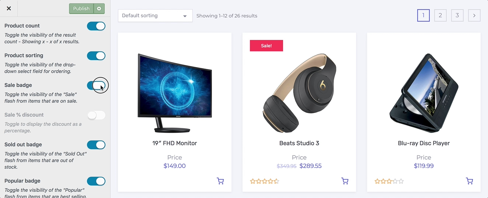

1. On the frontend, in the **Admin bar**, **Customize**.
2. On the backend, click **Appearance** » **Customize**.
3. Navigate to **WooCommerce** » **Product Archives** section.
4. Locate the **Sale badge** toggle field.
5. Toggle the visibility of the **Sale** flash from items that are on sale.
6. Preview your selection instantly.
7. Click the **Publish** button to save the changes.

## Sale % Discount

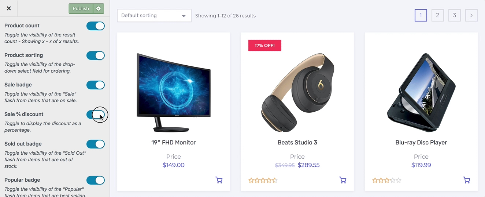

1. On the frontend, in the **Admin bar**, **Customize**.
2. On the backend, click **Appearance** » **Customize**.
3. Navigate to **WooCommerce** » **Product Archives** section.
4. Locate the **Sale % discount** toggle field.
5. Toggle to display the discount as a percentage.
6. Preview your selection instantly.
7. Click the **Publish** button to save the changes.

## Sold Out Badge

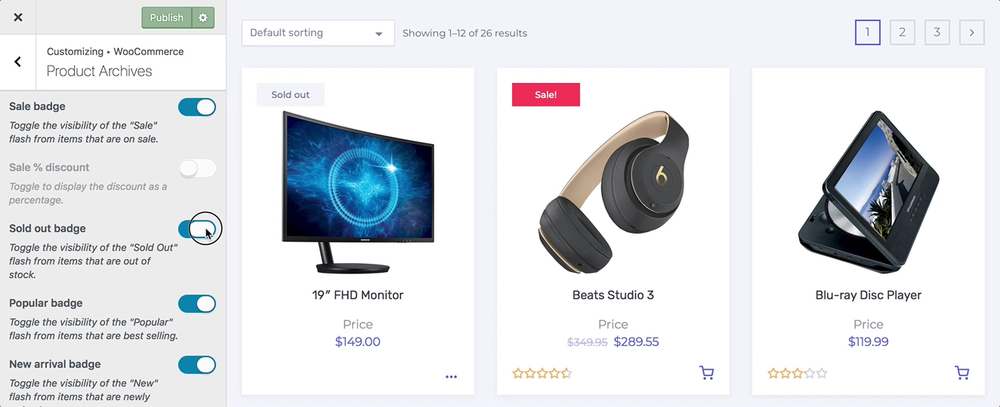

1. On the frontend, in the **Admin bar**, **Customize**.
2. On the backend, click **Appearance** » **Customize**.
3. Navigate to **WooCommerce** » **Product Archives** section.
4. Locate the **Sold out badge** toggle field.
5. Toggle the visibility of the **Sold Out** flash from items that are out of stock.
6. Preview your selection instantly.
7. Click the **Publish** button to save the changes.

## Popular Badge

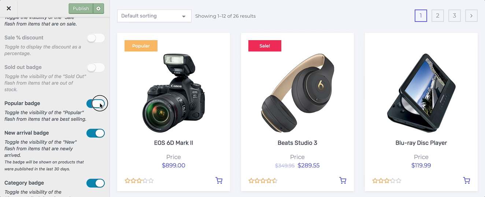

1. On the frontend, in the **Admin bar**, **Customize**.
2. On the backend, click **Appearance** » **Customize**.
3. Navigate to **WooCommerce** » **Product Archives** section.
4. Locate the **Popular badge** toggle field.
5. Toggle the visibility of the **Popular** flash from items that are best selling.
6. Preview your selection instantly.
7. Click the **Publish** button to save the changes.

## New Badge

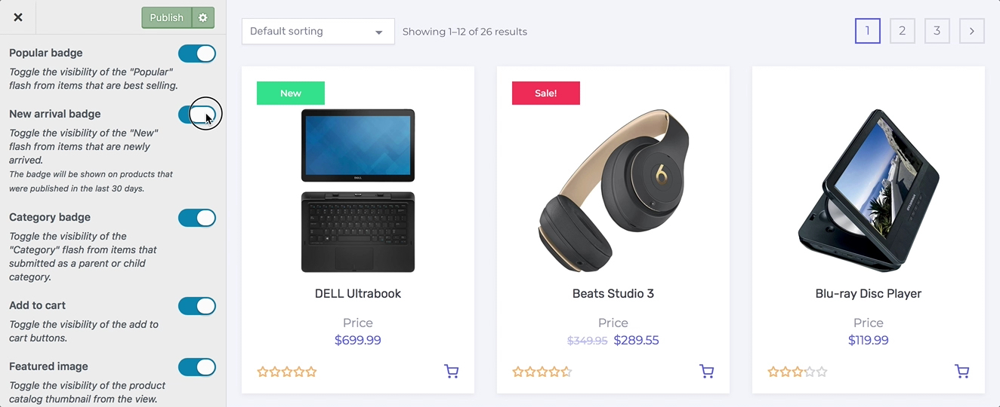

1. On the frontend, in the **Admin bar**, **Customize**.
2. On the backend, click **Appearance** » **Customize**.
3. Navigate to **WooCommerce** » **Product Archives** section.
4. Locate the **New badge** toggle field.
5. Toggle the visibility of the **New** flash from items that are newly arrived. *The badge will be shown on products that were published in the last **30 days**.*
6. Preview your selection instantly.
7. Click the **Publish** button to save the changes.

## Category Badge

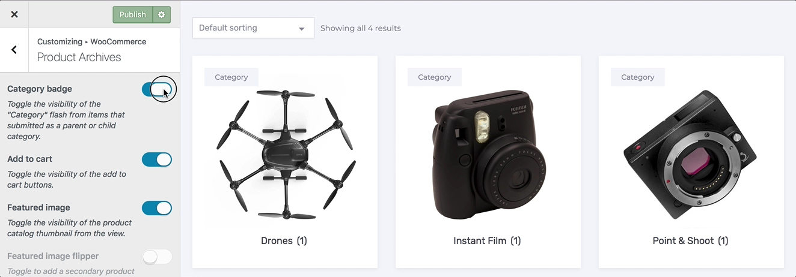

1. On the frontend, in the **Admin bar**, **Customize**.
2. On the backend, click **Appearance** » **Customize**.
3. Navigate to **WooCommerce** » **Product Archives** section.
4. Locate the **Category badge** toggle field.
5. Toggle the visibility of the **Category** flash from items that submitted as a parent or child category.
6. Preview your selection instantly.
7. Click the **Publish** button to save the changes.

## Add to Cart

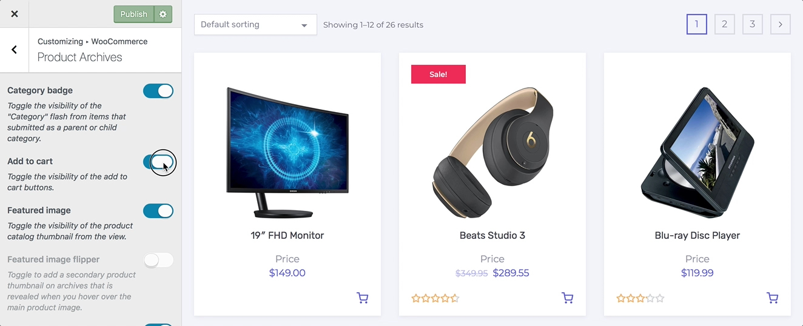

1. On the frontend, in the **Admin bar**, **Customize**.
2. On the backend, click **Appearance** » **Customize**.
3. Navigate to **WooCommerce** » **Product Archives** section.
4. Locate the **Add to cart** toggle field.
5. Toggle the visibility of the add to cart buttons.
6. Preview your selection instantly.
7. Click the **Publish** button to save the changes.

## Featured Image

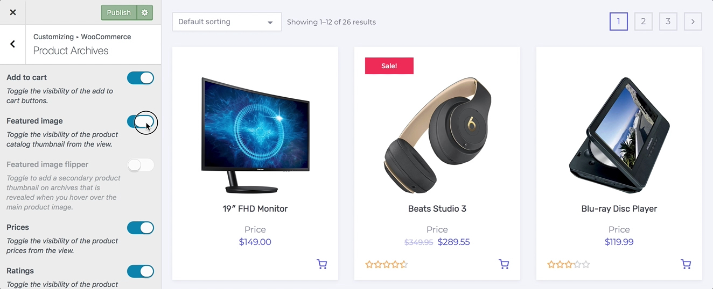

1. On the frontend, in the **Admin bar**, **Customize**.
2. On the backend, click **Appearance** » **Customize**.
3. Navigate to **WooCommerce** » **Product Archives** section.
4. Locate the **Featured image** toggle field.
5. Toggle the visibility of the product catalog thumbnail from the view.
6. Preview your selection instantly.
7. Click the **Publish** button to save the changes.

## Featured Image Flipper

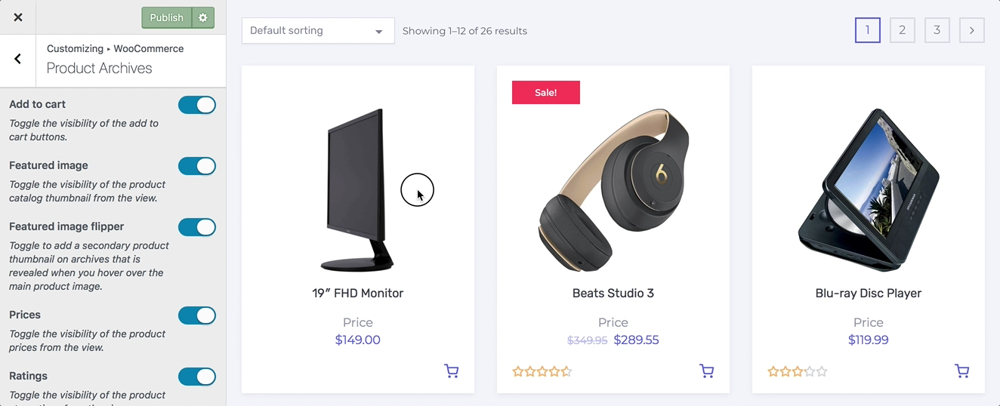

1. On the frontend, in the **Admin bar**, **Customize**.
2. On the backend, click **Appearance** » **Customize**.
3. Navigate to **WooCommerce** » **Product Archives** section.
4. Locate the **Featured image flipper** toggle field.
5. Toggle to add a secondary product thumbnail on archives that is revealed when you hover over the main product image.
6. Preview your selection instantly.
7. Click the **Publish** button to save the changes.

## Prices

1. On the frontend, in the **Admin bar**, **Customize**.
2. On the backend, click **Appearance** » **Customize**.
3. Navigate to **WooCommerce** » **Product Archives** section.
4. Locate the **Prices** toggle field.
5. Toggle the visibility of the product prices from the view.
6. Preview your selection instantly.
7. Click the **Publish** button to save the changes.

## Star Ratings

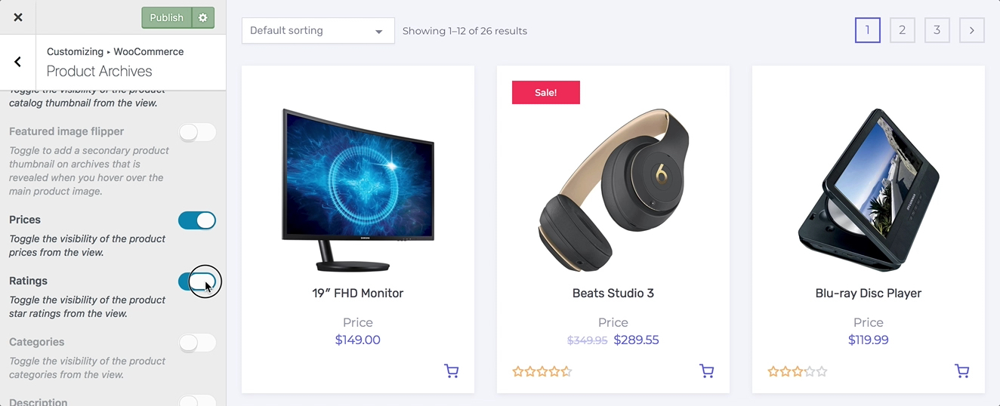

1. On the frontend, in the **Admin bar**, **Customize**.
2. On the backend, click **Appearance** » **Customize**.
3. Navigate to **WooCommerce** » **Product Archives** section.
4. Locate the **Ratings** toggle field.
5. Toggle the visibility of the product star ratings from the view.
6. Preview your selection instantly.
7. Click the **Publish** button to save the changes.

## Categories

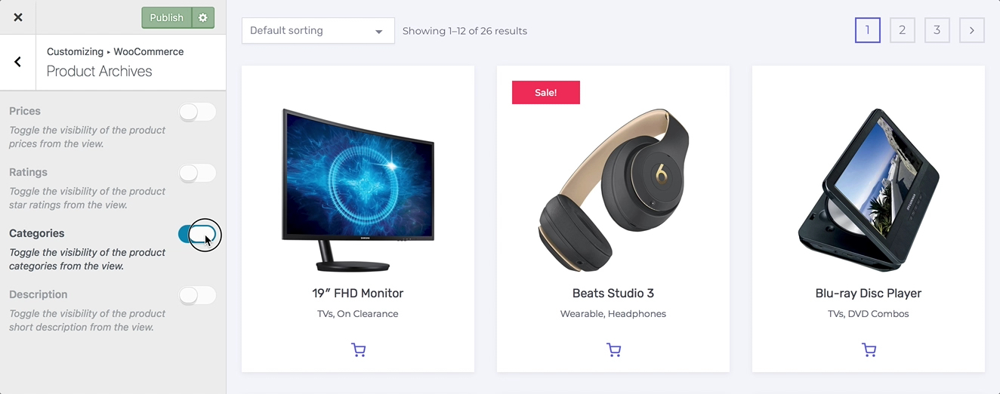

1. On the frontend, in the **Admin bar**, **Customize**.
2. On the backend, click **Appearance** » **Customize**.
3. Navigate to **WooCommerce** » **Product Archives** section.
4. Locate the **Categories** toggle field.
5. Toggle the visibility of the product categories from the view.
6. Preview your selection instantly.
7. Click the **Publish** button to save the changes.

## Description

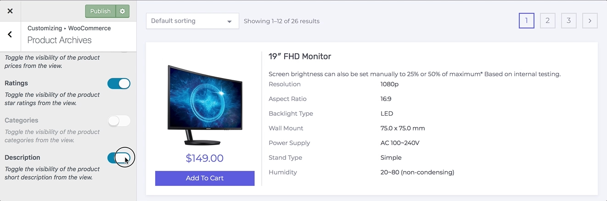

1. On the frontend, in the **Admin bar**, **Customize**.
2. On the backend, click **Appearance** » **Customize**.
3. Navigate to **WooCommerce** » **Product Archives** section.
4. Locate the **Description** toggle field.
5. Toggle the visibility of the product short description from the view.
6. Preview your selection instantly.
7. Click the **Publish** button to save the changes.
