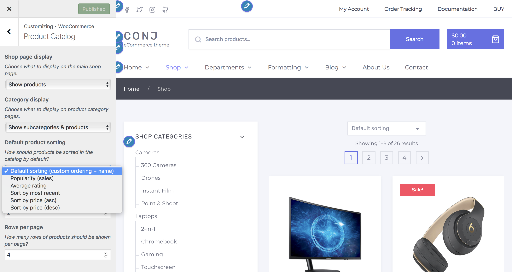

# Customizing Product Catalog

The **Product Catalog** options allows you to customize:

* What to display on the **Shop page**?
* What to display on **Category pages**?
* **How to sort products** in a Category?
* **How many products** to show in a single row?
* **How many rows** of products to display on a page?

## Shop Page Display

The **WooCommerce Shop Page** can display *Products*, *Categories*, or both. However, it is recommended to select only one to have a clean look.

1. On the frontend, in the **Admin bar**, **Customize**.
2. On the backend, click **Appearance** » **Customize**.
3. Navigate to **WooCommerce** » **Product Catalog** section.
4. Locate the **Shop page display** drop-down menu.
5. Select **Products** or **Categories** from the drop-down.
6. Preview your selection instantly.
7. Click the **Publish** button to save the changes.

## Category Display

The **WooCommerce Shop Page** can display *Products*, *Categories*, or both. However, it is recommended to select only one to have a clean look.

1. On the frontend, in the **Admin bar**, **Customize**.
2. On the backend, click **Appearance** » **Customize**.
3. Navigate to **WooCommerce** » **Product Catalog** section.
4. Locate the **Category display** drop-down menu.
5. Select **Show products** or **Show subcategories** from the drop-down.
6. Preview your selection instantly.
7. Click the **Publish** button to save the changes.

## Default Product Sorting

This option allows you to control the order in which products are viewed on **Shop** and **Category** pages. Visitors still have the option to sort a different way, if desired.

1. On the frontend, in the **Admin bar**, **Customize**.
2. On the backend, click **Appearance** » **Customize**.
3. Navigate to **WooCommerce** » **Product Catalog** section.
4. Locate the **Default product sorting** and select one of the following options from the drop-down menu:
   * *Default sorting (custom ordering + name)*
   * *Popularity (sales)*
   * *Average rating*
   * *Sort by most recent*
   * *Sort by price (asc)*
   * *Sort by price (desc)*
5. Preview your selection instantly.
6. Click the **Publish** button to save the changes.
