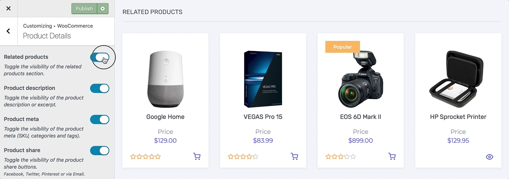

# Customizing Product Details

Settings included in this section allow you to change the layout and customize every element of the individual product page.

## Content Layout

1. On the frontend, in the **Admin bar**, **Customize**.
2. On the backend, click **Appearance** » **Customize**.
3. Navigate to **WooCommerce** » **Product Details** section.
4. Locate the **Content layout** swtich field.
5. Choose how to layout the single product page of your shop from the available options below:
   * [Default](https://www.conj.ws/camping/product/the-county-knife/)
   * [No Sidebar](https://www.conj.ws/electronic-store/product/google-home)
6. Preview your selection instantly.
7. Click the **Publish** button to save the changes.

## Gallery Layout

1. On the frontend, in the **Admin bar**, **Customize**.
2. On the backend, click **Appearance** » **Customize**.
3. Navigate to **WooCommerce** » **Product Details** section.
4. Locate the **Gallery layout** swtich field.
5. Choose how to layout the gallery of your single product pages from the available options below:
   * [Default](https://www.conj.ws/electronic-store/product/beats-studio-3-wireless)
   * [Stacked](https://www.conj.ws/camping/product/pulaski-axe)
   * [Hidden](https://www.conj.ws/gift-cards/product/blackwells-egift-card)
6. Preview your selection instantly.
7. Click the **Publish** button to save the changes.

## Product Tabs

1. On the frontend, in the **Admin bar**, **Customize**.
2. On the backend, click **Appearance** » **Customize**.
3. Navigate to **WooCommerce** » **Product Details** section.
4. Locate the **Product tabs** toggle field.
5. Toggle the visibility of the product tabs *(description and reviews)* section.
6. Preview your selection instantly.
7. Click the **Publish** button to save the changes.

## Related Products

1. On the frontend, in the **Admin bar**, **Customize**.
2. On the backend, click **Appearance** » **Customize**.
3. Navigate to **WooCommerce** » **Product Details** section.
4. Locate the **Related products** toggle field.
5. Toggle the visibility of the related products section.
6. Preview your selection instantly.
7. Click the **Publish** button to save the changes.

## Product Description

1. On the frontend, in the **Admin bar**, **Customize**.
2. On the backend, click **Appearance** » **Customize**.
3. Navigate to **WooCommerce** » **Product Details** section.
4. Locate the **Product description** toggle field.
5. Toggle the visibility of the product **description** or **excerpt**.
6. Preview your selection instantly.
7. Click the **Publish** button to save the changes.

## Product Meta

1. On the frontend, in the **Admin bar**, **Customize**.
2. On the backend, click **Appearance** » **Customize**.
3. Navigate to **WooCommerce** » **Product Details** section.
4. Locate the **Product meta** toggle field.
5. Toggle the visibility of the product meta *(SKU, categories and tags)*.
6. Preview your selection instantly.
7. Click the **Publish** button to save the changes.
