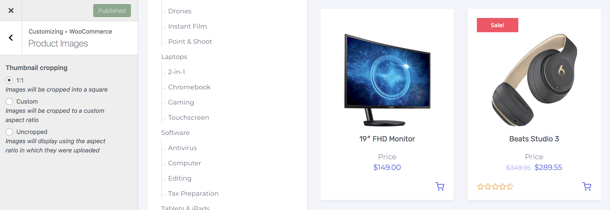

# Customizing Product Images

Using WooCommerce’s built-in settings, users can now control the width and height of their main images, as well as the cropping with visual cues as to what the photos might look like on the frontend.

## Image Types

* **Catalog images** are medium-sized images that appear on the **Shop** page, **Category** pages, and for **Related products**, **Up-sells** and **Cross-sells**.
* **Product thumbnails** are the smallest images used in the **Cart**, **Widgets** and (optional) **Gallery images** underneath the single product image on individual product details pages.
* **Single product image** is the largest image and refers to the main/featured image.

?> Product image settings in Customizer window do **NOT** apply to the single product image dimensions.

## Resize And Crop Thumbnail Images

1. On the frontend, in the **Admin bar**, **Customize**.
2. On the backend, click **Appearance** » **Customize**.
3. Navigate to **WooCommerce** » **Product Images** section.
  - **1:1** — Images will be cropped into a square.
  - **Custom** — Images will be cropped to a custom aspect ratio.
  - **Uncropped** — Images will display using the aspect ratio in which they were uploaded which can result in all being different unless you used photos that are uniform in size and resolution.
  
Since WooCommerce 3.3.X product thumbnails are now automatically regenerated on-the-fly. **No need for a particular plugin to regenerate thumbnails!** This feature uses a new event queue that processes in the background. 

The on-the-fly resizing also plays an important part in ensuring that you have a great experience when visually editing your site through the customizer and since [Conj - eCommerce WordPress Theme](https://themeforest.net/item/conj-ecommerce-wordpress-theme/21935639?ref=mypreview) adds support for it you can play around with different image sizes and cropping settings from within the customizer and see the results instantly.

## Fixing Blurry Product Images

When your product images are blurry two things could be happening:

* **One**, your image size settings, may not be adequate (too small) for theme. This can cause problems as the theme wants an image at `418 x 418 pixels`, but you are giving it one at `200 x 200 pixels`.
* **Two**, the original images you uploaded are not high-resolution enough. Even if your image settings are right, the original image source is too small. The only thing you can do in this case is re-upload appropriately sized images, to begin with.

## Retina Support

HiDPI displays commonly known as retina displays contain twice as many pixels, or more, than older displays. For pixel perfect imagery on retina displays, set your thumbnails to be double the size rendered by the theme. As an example, [Conj - eCommerce WordPress Theme](https://themeforest.net/item/conj-ecommerce-wordpress-theme/21935639?ref=mypreview) renders thumbnail images at `418 x 418 pixels` you want them to be `836 x 836 pixels`.

?> Keep in mind that doing this can impact performance, as larger images take longer to load. This is a personal preference, and you should consult your analytics before deciding. 
