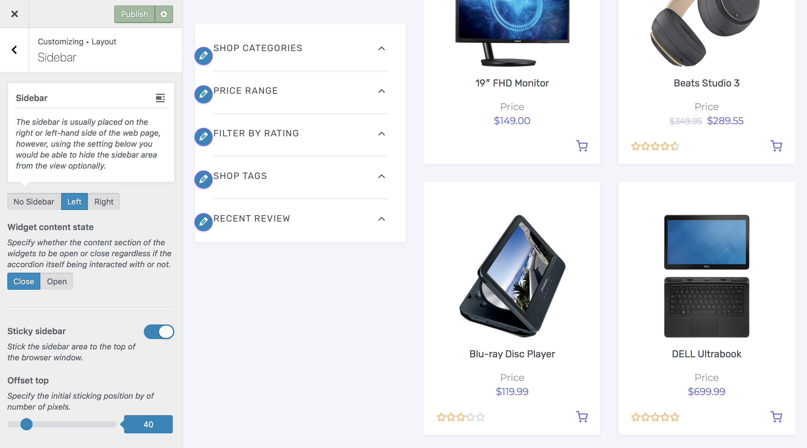

# Customizing The Sidebar

## Sidebar Layout

The sidebar is usually placed on the right or left-hand side of the web page, however, using the setting below you would be able to hide the sidebar area from the view optionally.

1. On the frontend, in the **Admin bar**, **Customize**.
2. On the backend, click **Appearance** » **Customize**.
3. Navigate to **Layout** » **Sidebar** section.
4. Locate the **Sidebar** callout to update the current position/visibility of the sidebar area.
5. Click the **Publish** button at the top right of the Customizer to save the changes.

### Possible Choices

* No Sidebar
* Left
* Right

## Widget Content State

Specify whether the content section of the widgets to be open or close regardless if the accordion itself being interacted with or not.

1. On the frontend, in the **Admin bar**, **Customize**.
2. On the backend, click **Appearance** » **Customize**.
3. Navigate to **Layout** » **Sidebar** section.
4. Locate the **Widget content state** control to update the default state of the widgets to be **Open** or **Close**.
5. Click the **Publish** button at the top right of the Customizer to save the changes.

## Sticky Sidebar

This option lets you to stick the sidebar area to the top of the browser window while you are scrolling down.

1. On the frontend, in the **Admin bar**, **Customize**.
2. On the backend, click **Appearance** » **Customize**.
3. Navigate to **Layout** » **Sidebar** section.
4. Locate the **Sticky sidebar** control and toggle to enable or disable it.
5. Locate the **Offset top** to specify the initial sticking top offset by number of pixels.
6. Click the **Publish** button at the top right of the Customizer to save the changes.
