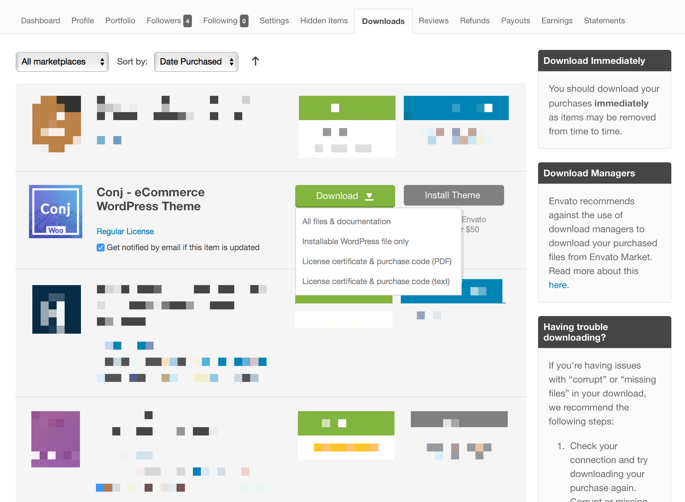

# Download Your WordPress Theme

After purchasing the [Conj - eCommerce WordPress Theme](https://themeforest.net/item/conj-ecommerce-wordpress-theme/21935639?ref=mypreview) from [ThemeForest](http://themeforest.net/?ref=mypreview), the first step is download and install it on your website.

To download the installable theme file, first, log into your [Envato account](https://account.envato.com/sign_in?to=envatomarket).

Navigate to the **Downloads** section of your profile and locate the [Conj - eCommerce WordPress Theme](https://themeforest.net/item/conj-ecommerce-wordpress-theme/21935639?ref=mypreview). 
Click on the **Download (green) button** which will trigger a dropdown list for you to choose which files you want to download.

?> Selecting **Installable WordPress file only** will only download the **zip** file of the theme.

## Additional Links

* [Download Limit Reached](https://help.market.envato.com/hc/en-us/articles/202821300-Download-Limit-Reached)
* [How To Download Your Items](https://help.market.envato.com/hc/en-us/articles/202501014-How-To-Download-Your-Items)
* [Problems Downloading A File](https://help.market.envato.com/hc/en-us/articles/202821520-Problems-Downloading-A-File)
