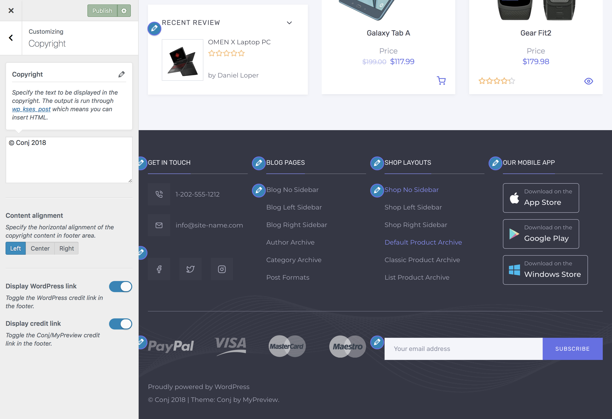

# Editing Copyright Info

Copyright section provides a few options to customize the copyright content as well as disable the WordPress and/or theme credit links.

1. On the frontend, in the **Admin bar**, **Customize**.
2. On the backend, click **Appearance** » **Customize**.
3. Navigate to **Copyright** section.
4. Locate the copyright content textarea.
5. Specify the text to be displayed in the copyright section at the very bottom of the site. *The output is run through `wp_kses_post` which means you can insert HTML.*
6. Specify the **horizontal alignment** of the copyright content in its parent block element.
7. Optionally, toggle the **WordPress credit** link in the footer.
8. Optionally, toggle the **author credit** link in the footer.

?> We don’t require you to have a backlink to our product page on [Themeforest](https://themeforest.net/item/conj-ecommerce-wordpress-theme/21935639?ref=mypreview) although we do appreciate it if you do.
