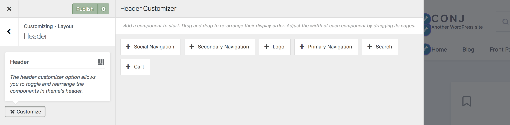
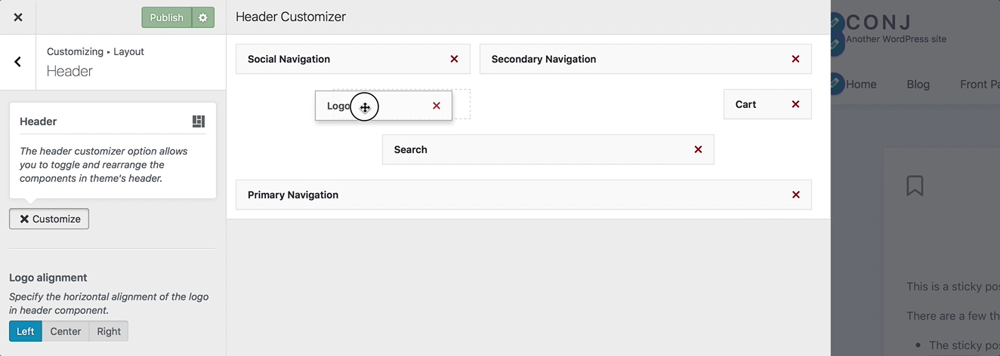

# Header Layout Configurator

This feature enables you to easily add or remove header components such as the logo, mini-cart, social menu, and primary navigation. You can start by adding a component to start and use drag and drop to re-arrange header components to adjust their display order. Also, you would be able to update the width of each element in the header by dragging its edges.

## Adjusting Header Layout

Follow the steps below to toggle and rearrange components on your site’s header:

1. On the frontend, in the **Admin bar**, **Customize**.
2. On the backend, click **Appearance** » **Customize**.
3. Navigate to **Layout** » **Header** section.
4. Click the **+ Customize** button. *A new window opens to display five components: Social Navigation, Secondary Navigation, Logo, Primary Navigation, and Cart.*
5. **Add** components you want to use and adjust them by selecting the **+ icon** next to each.
6. Click the **x Customize** button to close the customizer window.
7. Click the **Publish** button at the top right of the Customizer to display the updated components with customized order on your site header.

## Changing The Order of Components

You can easily use your mouse to quickly rearrange header components and move them to a different column or row.

## Resizing a Component

With your mouse, hover over the corner/borders, then click and drag to resize the component.

## Removing a Component

Click on the **X** icon in the right-hand corner of the component to remove it from the view.
