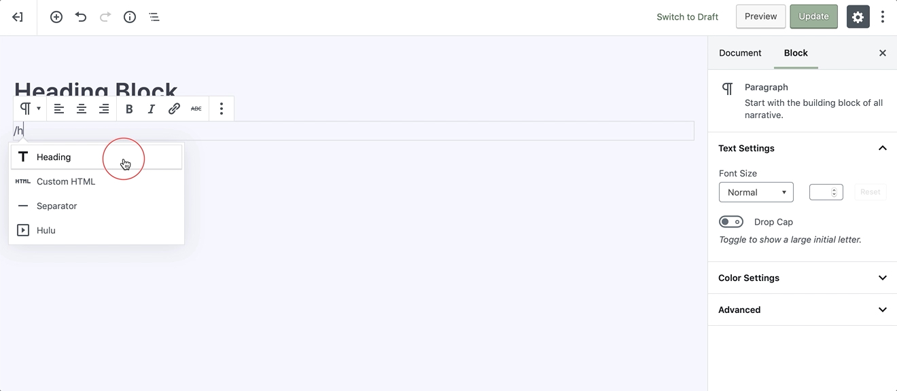
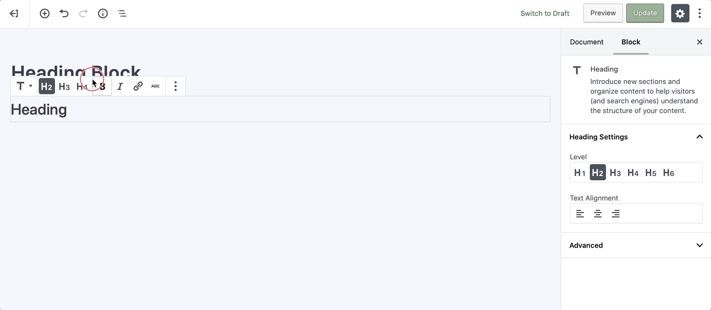
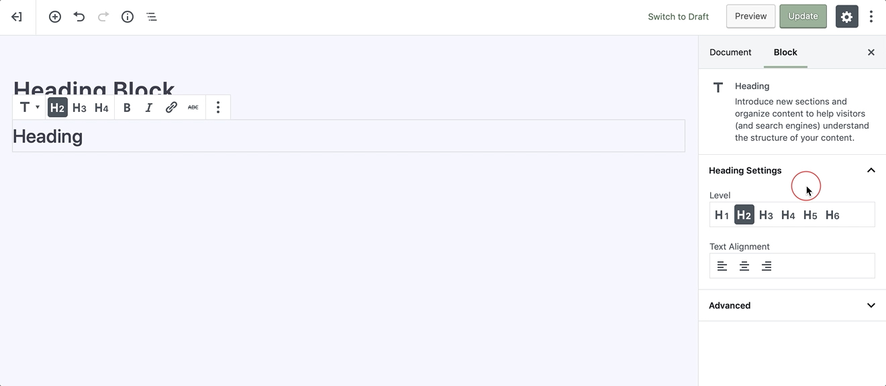
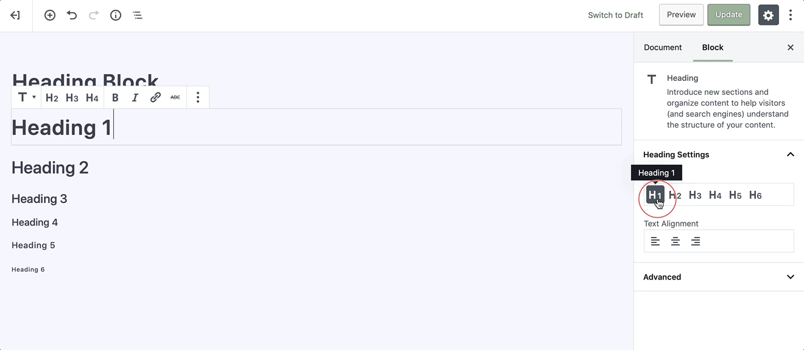

# Heading Block

Headings can help structure your page and make your content more readable by humans as well as search engines.

To add an heading, click on the [Add Block](adding-block) button and select the **Heading** block. Alternatively, you can start typing `/heading` in a new paragraph block, then press enter.

!> Detailed instructions on adding blocks can be found [here](adding-block).

The editor automates a search engine optimized layout by considering the page title is the `<h1>` tag, so subsequent heading blocks begin at `<h2>` and so on, but you can choose your heading level according to your style in the toolbar, or the block settings panel.

## Block Toolbar

Every block comes with unique and block-specific controls that allow you to manipulate the block directly right in the editor. 

Also, the heading block offers the following options in its toolbar:

* H2, H3 and H4 heading tags
* Bold
* Italics
* Hyperlink
* Strikethrough
* More Options

## Sidebar Settings

In addition to the options found in the block’s toolbar, you may locate the block specific settings in the **editor sidebar panel**. Clicking on the **cog** icon next to the publish button will toggle the visibility of this panel.

## Heading Settings

Once you locate the block settings in the sidebar, you’ll notice that **h1**, **h5**, and **h6** are included along with text alignment options.

?> The heading block suggests a hierarchy based on proper SEO practices

## Advanced

The advanced tab lets you add a CSS class to your block, allowing you to write custom CSS and apply styles to the block as you see fit.

## HTML Anchor

The **HTML Anchor** is a useful tool for creating *page jumps*. If you toggle the block to its HTML view, you’ll see that the HTML Anchor input is added as an ID to the heading tag.

?> Page jumping is where you click a link and instantly get moved somewhere further up or down a long page.
