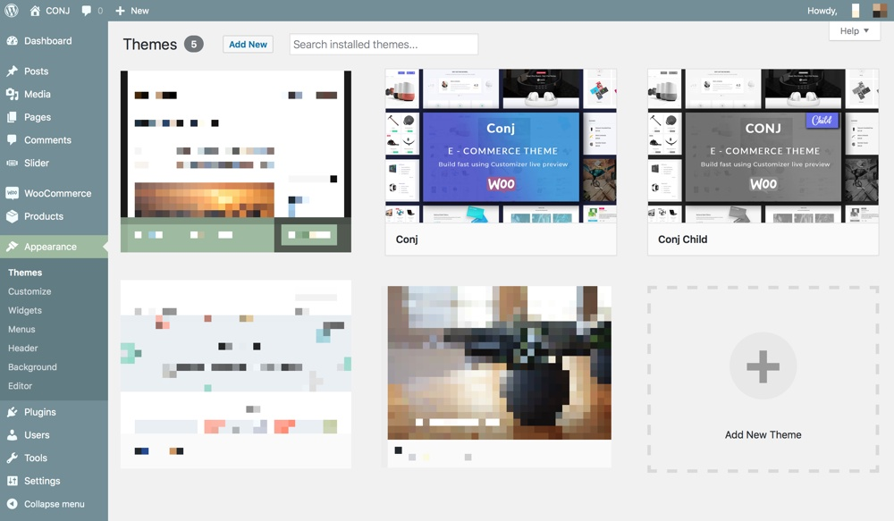

# How to Install and Activate Your Theme

Follow the steps below to install your copy of the [Conj - eCommerce WordPress Theme](https://themeforest.net/item/conj-ecommerce-wordpress-theme/21935639?ref=mypreview):

!> When uploading your theme with the installer, please ensure you are uploading the theme ```.zip``` file, not the entire package you downloaded. In this case, you will be uploading ```conj.zip```.



## Install Via WordPress

1. Log into your WordPress website and navigate to **Appearance** » **Themes**.
2. Once you are on the themes page, click on the **Add New** button at the top.
3. Click **Upload Theme**.
4. Choose ```conj.zip``` from your local computer or machine and hit **Install Now** button.<br/>
*If you downloaded the whole package **All files & documentation** be sure to extract it and locate the theme file which is named `conj.zip`).*
5. Once WordPress has unpacked and installed the theme, just click **Activate** to activate the WordPress theme.

## Install Via FTP<br/>*(File Transfer Protocol)*

To manually upload the [Conj - eCommerce WordPress Theme](https://themeforest.net/item/conj-ecommerce-wordpress-theme/21935639?ref=mypreview), login to your hosting (server) file manager with using FTP client credentials.

?> The theme files will be stored on your server in the ```wp-content/themes``` location.

1. Unzip **All files and documentation** (buyer files) you downloaded from [Envato](https://themeforest.net/) which will include the theme, child theme, documentation access, demo data and the licensing information.
2. Upload only the extracted folder `conj` to your server.
3. Log into your WordPress website and navigate to **Appearance** » **Themes**.
4. Locate the **Conj** theme and click **Activate** to activate the WordPress theme.


## Additional links

* [Item Installation Guide & Help Documentation](https://help.market.envato.com/hc/en-us/articles/203686084-Item-Installation-Guide-Help-Documentation)
* [Theme is missing the style.css stylesheet error](https://help.market.envato.com/hc/en-us/articles/202821510-Theme-is-missing-the-style-css-stylesheet-error)
