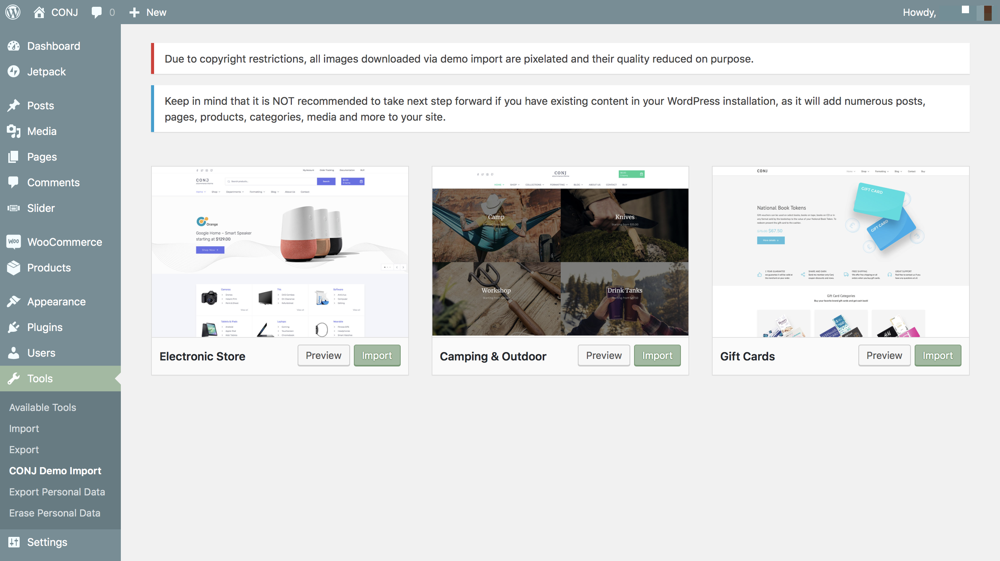

# Importing A Theme Demo

Right after installing a fresh copy of the [Conj - eCommerce WordPress Theme](https://themeforest.net/item/conj-ecommerce-wordpress-theme/21935639?ref=mypreview) and [required/recommended plugins](installing-recommended-plugins) you may find you have an empty store. 

There are no posts, pages, products, orders, reviews, and more by default. This is because you can get started right away creating your own products and pages along with setting up the WooCommerce settings for the needs of your store.

Importing the demo data is the easiest way to setup the [Conj - eCommerce WordPress Theme](https://themeforest.net/item/conj-ecommerce-wordpress-theme/21935639?ref=mypreview). It will allow you to edit everything instead of creating content from scratch super quickly and with ease.

## Demo Importer Method

Follow the steps below to import any of the Conj - eCommerce WordPress Theme](https://themeforest.net/item/conj-ecommerce-wordpress-theme/21935639?ref=mypreview) demo files:

* Make sure the [One Click Demo Import](https://wordpress.org/plugins/one-click-demo-import/) plugin is already installed and activated.
* Navigate to **Tools** » **CONJ Demo Import** to choose and import the demo of your choice.
* Click the **Import** button and the plugin will now load all sample data from the selected demo site.

## Manual Method

In some cases, the automatic demo import doesn’t work correctly, and most likely this happens when the website is on a local server without an internet connection. In this case, you have to import demo content manually by following the steps below:

### Demo Content Import

* Navigate to **Tools** » **Import**.
* If you don’t have the [WordPress Importer](https://wordpress.org/plugins/wordpress-importer/) plugin installed on your website, first install it by selecting **Install Now**.
* Once it’s installed select **Run Importer**.
* Choose **WordPress** from the list.
* Click the **Browse** button to select the `XML` sample data file you would like to upload. 
`dummy-data/content-{demo-name}.xml`
* Click **Upload file and import** button.
* Check or uncheck the **Download and import file attachments** checkbox. 
*If checked, this will import all the sample post, page and product images to your site.*
* Click **Submit** and the plugin will now load demo content from the imported file.
* Once complete you should see a successful import message.

!> If you faced with a **502 bad gateway error** while importing the demo data please contact your service provider company since this is a server side issue.

### Demo Widgets Import

* Install and activate [Widget Importer & Exporter](https://wordpress.org/plugins/widget-importer-exporter) plugin.
* Navigate to **Tools** » **Widgets Importer & Exporter**.
* Click the **Choose File** button to select the `WIE` sample data file you would like to upload. 
`dummy-data/widgets-{demo-name}.wie`
* The plugin will now load widgets data from the imported file and will show you the list of imported widgets.
