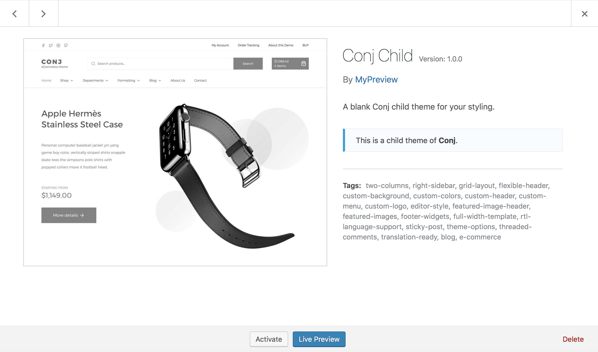

# Install and activate child theme 

If you want to customize the theme at coding level, not just CSS, we would strongly suggest using a child theme for that. A child theme allows you to override the parent theme's functions, template files and CSS so you will be able to adjust them as you want.



!> Here is the thing that causes the most confusion: **You don't always need a child theme**.

* Edit the theme's CSS stylesheet.
* Edit any of the theme's PHP templates.
* Edit the theme's ```functions.php``` file. Even just to add a single line of code.
* Modify any of the theme's assets stored in the theme folder — including javascript files and images.

If you answered **Yes** to any of these questions, you need a child theme.

<hr/>

## What is a child theme?

A Child Theme is a theme that inherits the same functionality and styling of another theme, called the parent theme. By creating and working on a child theme, you can add, modify or disable parts of your site without changing the original files of the parent theme.

You do not have to worry anymore about updates to the parent theme since there is no need to exclude your modified files from the updating process or to re-add your changes to fit the new version. After the creation of a Child Theme, you end up significantly speeding up your development time.

<hr/>

## Overriding template files

If you want to edit the code in the theme's template files like ```header.php```, ```index.php```, etc, you can just copy the file from the parent theme and put it into your child theme folder then edit it from there.

<hr/>

## Overriding functions

If you want to edit the functions of the parent theme, for example, the ```mypreview_conj_posted_on()``` function, you can do that by copying only the function from the parent theme and put it into the ```functions.php``` file of your child theme.

!> Note that, you must copy only the ```function() {...}``` part, NOT including the ```function_exists()``` wrapper.

<hr/>

## Overriding theme's CSS

You can do this by either using the [Additional CSS](custom-css.md) field under the Customizer window or adding your custom CSS code into the style.css file of your child theme.

<hr/>

## Remember!

Whenever you finished updating the parent theme, make sure to check all the code you use in your child theme and update them as necessary to reflect any changes in the parent theme. You might back up your custom code first, update the files with the latest version, then apply your custom code back.

By doing this, it ensures that the files and code in your child theme are always up-to-date and to prevent any problem that might occur.

<hr/>

## WordPress upload

* Go to **Appearance** » **Themes**.
* Once you are on the themes page, click on the **Add New** button at the top.
* Click **Upload Theme**.
* Choose ```conj-child.zip``` from your local computer or machine and hit **Install Now** button.
* Click **Activate** to activate the Conj child theme.

!> The child theme files will be stored on your server in the ```wp-content/themes``` location.

When uploading your child theme with the installer, please ensure you are uploading the child theme ```.zip``` file, not the entire package you downloaded. In this case, you will be uploading ```conj-child.zip```.

<hr/>

## FTP upload

To manually upload your child theme, login with your credentials to your website and locate the ```wp-content``` folder in your WordPress install files.

* Login to your hosting (server) file manager with using FTP client credentials.
* Browse to your folder located at ```wp-content/themes```.
* Unzip all files & documentation (buyer files) you downloaded from [mypreview.one](https://www.mypreview.one/conj.html) which will include the theme, child theme, documentation access, dummy data and the licensing information.
* Upload only the extracted folder ```conj-child``` to your server.
* Next log into your WordPress site admin area.
* Navigate to **Appearance** » **Themes**.
* Click **Activate** to activate the Conj child theme.
