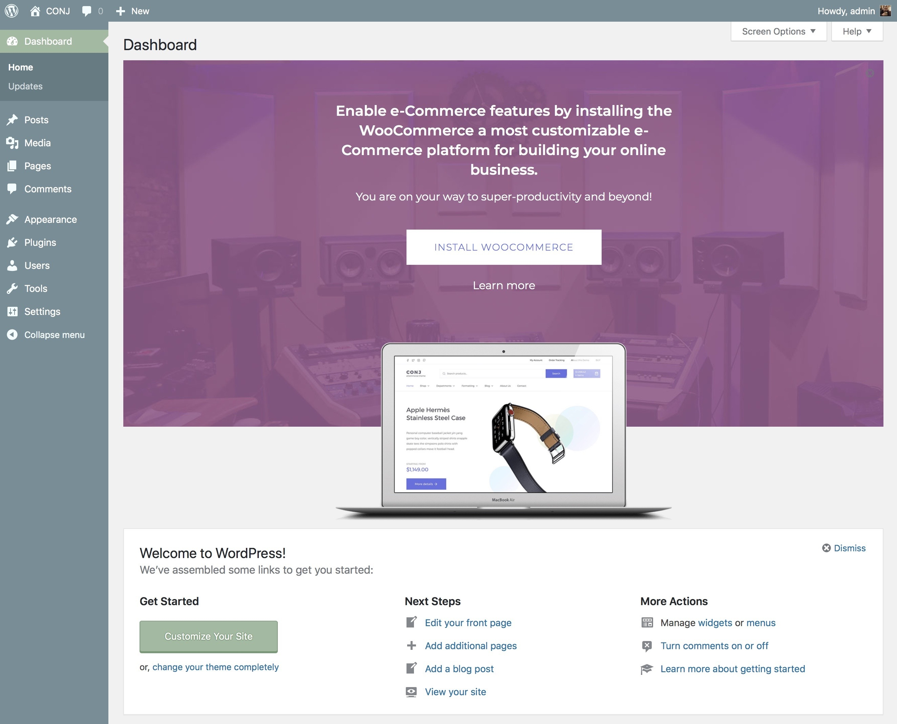

# Install and activate WooCommerce 

[WooCommerce installation](https://player.vimeo.com/video/161223432 ':include :type=iframe width=665px height=376px')

If you have an existing site and want to install WooCommerce, using the WordPress Admin is the most straightforward option as it handles everything for you.

* After activating Conj theme, you’ll see a notice about installing WooCommerce plugin, to proceed click **Install WooCommerce** button.
* Click **Activate** button and you're ready for the WooCommerce Wizard!

!> When WooCommerce is activated for the first time, the [WooCommerce Setup Wizard](http://docs.woocommerce.com/document/woocommerce-setup-wizard/) helps you set up your shop.

Select **Let's go!** to get started. Or select **Not Right Now** if you prefer to manually set up your WooCommerce shop.

?> In case you have decided to do the [demo import](built-in-demo-importer.md) on a vanilla WordPress site *(not customized from the original form)*, be sure to skip WooCommerce setup wizard by clicking on **Not Right Now** hyperlink inside of the setup process screen.

## Multisite installation

On a multisite install, WooCommerce acts like most any other plugin. Each site in the network, although sharing a database, stores its information in separate tables. Thus, each store is a separate setup.

While you can network-activate plugins, such as WooCommerce and its extensions, you would be unable to share product databases, checkout, and user accounts across sites in the network.
