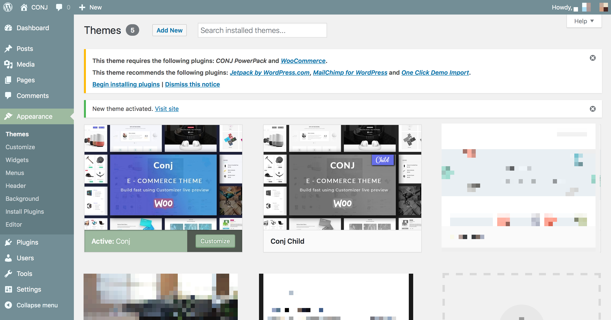

# Installing Recommended/Bundled Plugins

Once you have installed and activated the [Conj - eCommerce WordPress Theme](https://themeforest.net/item/conj-ecommerce-wordpress-theme/21935639?ref=mypreview) you will be prompted to install required and recommended plugins.

Next, check all the boxes to select all the plugins you want to install, select the bulk action of install from the dropdown menu and then click the button to apply.

1. Click the link to **begin installing plugins**.
2. Check all the boxes to select all the plugins you want to install.
3. Select the bulk action of install from the dropdown menu and then click the button to **apply**. 
*Installation may take a few minutes depending upon your service provider and internet connection.*
4. After you have installed all the plugins, **return to the plugin installer** page.
5. Select the plugins you installed, and apply the bulk action to **activate**.
6. You should then see a confirmation notice that your **plugins were activated successfully**.

## Required Plugins

* CONJ PowerPack
* [WooCommerce](https://wordpress.org/plugins/woocommerce/)

## Recommended Plugins

* [Jetpack by WordPress.com](https://wordpress.org/plugins/jetpack/)
* [MailChimp for WordPress](https://wordpress.org/plugins/mailchimp-for-wp/)
* [One Click Demo Import](https://wordpress.org/plugins/one-click-demo-import/)

## Additional Links

* [Bundled Plugins](https://help.market.envato.com/hc/en-us/articles/213762463-Bundled-Plugins)
