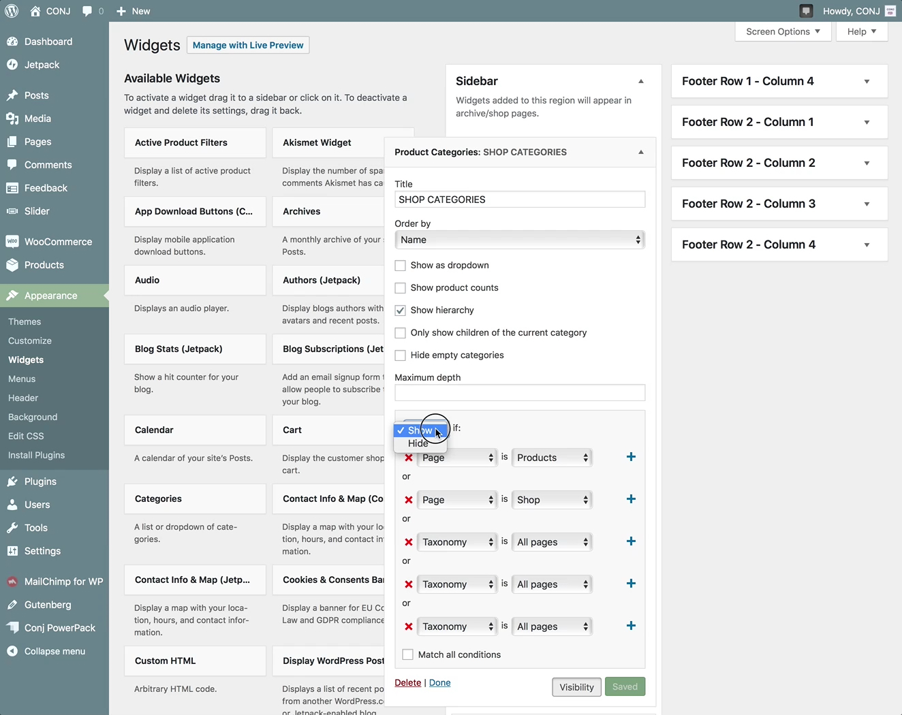

# Customizing JetPack’s Widget Visibility

The widget visibility module allows you to configure widgets to appear or be hidden on certain pages by using the **Visibility** panel.

?> This feature should be enabled by default. In case you are unable to locate the functionality described below, please visit [Control Jetpack’s Modules on One Page](https://jetpack.com/support/control-jetpacks-modules-on-one-page/) to learn how to activate it.

## Visibility Rules

Visibility is controlled by the following five aspects: 

1. Page Type
2. Category
3. Tag
4. Date
5. Author

As an example, if you wanted the **Product Categories** widget to only appear on shop archives and a custom page, choose **Show** from the first dropdown and then add the following rules: **Page** *is* **Products** and **Page** *is* **Shop**.

You can also hide widgets based on the current page. For example, if you don’t want the **Product Categories** widget to appear on shop archives, choose **Hide** and **Page** *is* **Shop**.
