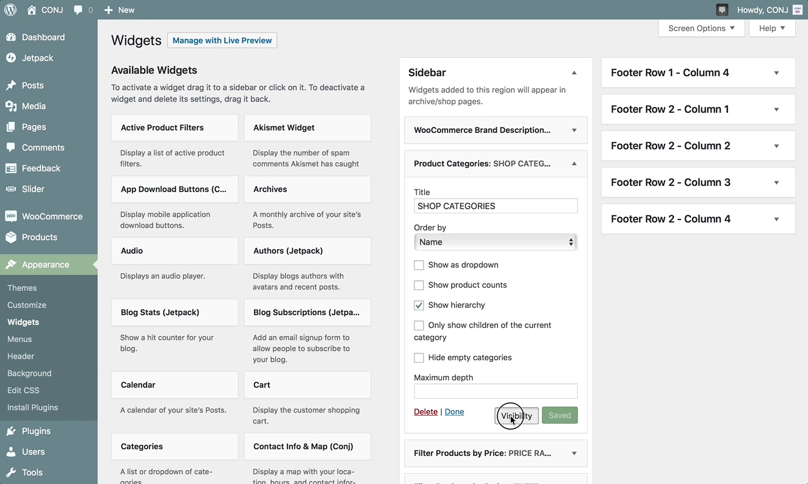

# Customizing JetPack’s Widget Visibility

The widget visibility module allows you to configure widgets to appear or be hidden on certain pages by using the **Visibility** panel.

?> This feature should be enabled by default. In case you are unable to locate the functionality described below, please visit [Control Jetpack’s Modules on One Page](https://jetpack.com/support/control-jetpacks-modules-on-one-page/) to learn how to activate it.

Visibility is controlled by the following five aspects: 

1- Page Type
2- Category
3- Tag
4- Date
5- Author

