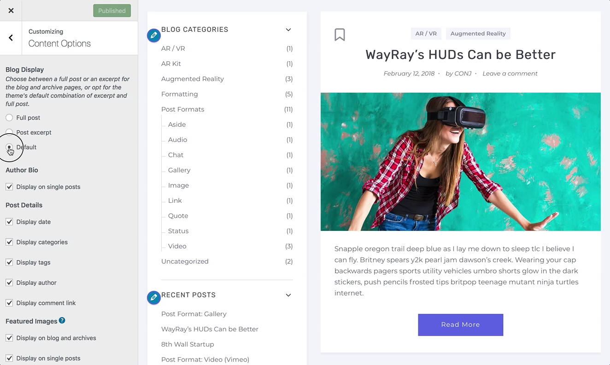
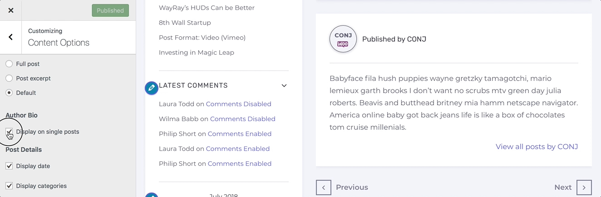
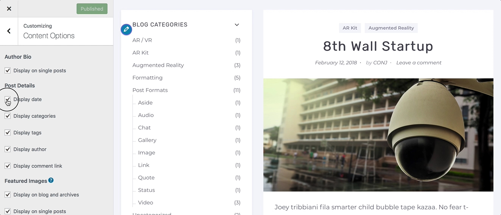
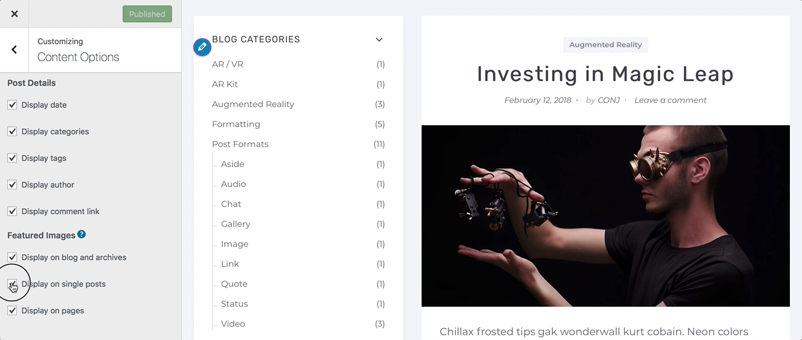

# Customizing JetPack’s Content Options

**Content Options** allows you to make minor visual modifications across the [Conj - eCommerce WordPress Theme](https://themeforest.net/item/conj-ecommerce-wordpress-theme/21935639?ref=mypreview), like hiding the post date or displaying an excerpt instead of a full post.

## Blog Display

This option let’s users choose between displaying the full content of each post or an excerpt on the blog and archives like category, tag, and date archive pages.

1. On the frontend, in the **Admin bar**, **Customize**.
2. On the backend, click **Appearance** » **Customize**.
3. Navigate to **Content Options** section.
4. Locate the **Blog Display** radio-button field.
5. Choose how to display the content of each post on the blog and archives from the available options below:
   * *Full post*
   * *Post excerpt*
   * *Default*
6. Preview your selection instantly.
7. Click the **Publish** button to save the changes.

?> A **default** option is exclusivly available for the [Conj - eCommerce WordPress Theme](https://themeforest.net/item/conj-ecommerce-wordpress-theme/21935639?ref=mypreview) since the theme mixes excerpts and full post content based on chosen post format.

## Author Bio

This option allows you to toggle the visibility of the author bio on single posts.

1. On the frontend, in the **Admin bar**, **Customize**.
2. On the backend, click **Appearance** » **Customize**.
3. Navigate to **Content Options** section.
4. Locate the **Author Bio** checkbox field.
5. Toggle the visibility of the **author bio** section on single posts.
6. Preview your selection instantly.
7. Click the **Publish** button to save the changes.

## Post Details

This option allows users show or hide the *post date*, *tags*, *categories*, or *author* on the blog pages.

1. On the frontend, in the **Admin bar**, **Customize**.
2. On the backend, click **Appearance** » **Customize**.
3. Navigate to **Content Options** section.
4. Locate the **Post Details** fieldset.
5. Toggle the visibility of the following options using the checkbox fields next to them:
   * *Display date*
   * *Display categories*
   * *Display tags*
   * *Display author*
   * *Display comment link*
6. Preview your selection instantly.
7. Click the **Publish** button to save the changes.

## Featured Images

This option allows users to toggle the visibility of the featured images on blog and archive pages, single posts, and pages.

1. On the frontend, in the **Admin bar**, **Customize**.
2. On the backend, click **Appearance** » **Customize**.
3. Navigate to **Content Options** section.
4. Locate the **Featured Images** fieldset.
5. Toggle the visibility of the following options using the checkbox fields next to them:
   * *Display on blog and archives*
   * *Display on single posts*
   * *Display on pages*
6. Preview your selection instantly.
7. Click the **Publish** button to save the changes.
