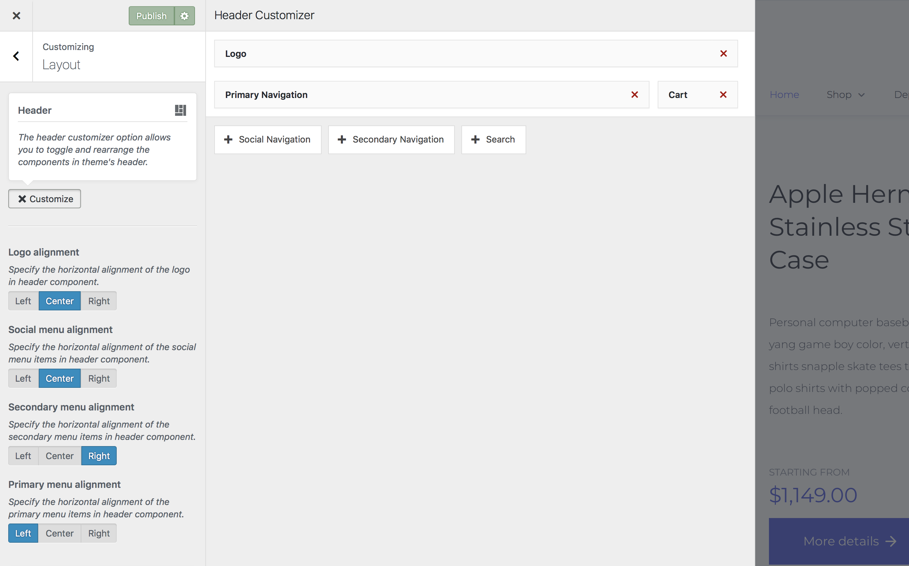
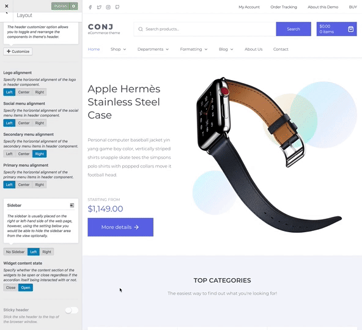
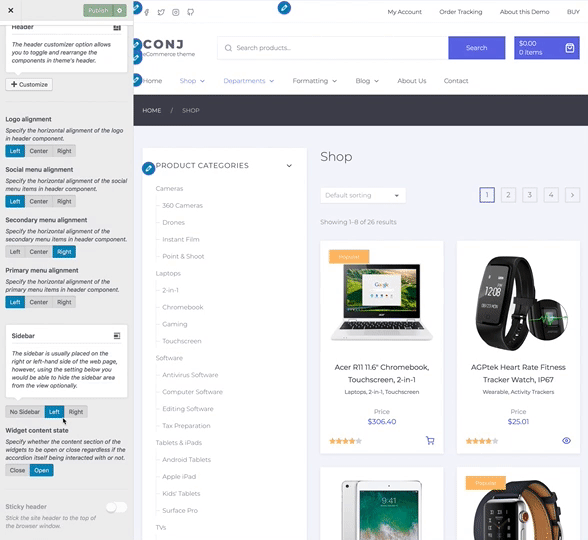

# Layout customization

This section gives you creative control of style and layout options for your Conj theme.

?> Absolutely NO coding knowledge is required, and changes are shown instantly using Customizer live preview.

## Header customizer

The header customizer option allows you to toggle and rearrange the components in theme's header.

You can start by drag and drop to re-arrange header components and adjust their display order. Also, you would be able to update the width of each component by dragging its edges.

1. On the frontend, in the Admin bar, click **Customize**.
2. On the backend, click **Appearance » Customize**.
3. Navigate to **Layout** section.
4. Click the **+ Customize Header** button.
5. **Add components** you want to use and style by selecting the + icon next to each.
6. **Resize** a component by hovering over the corners and drag to update width.
7. Move by click/hold and dragging to new grid location.
8. Click the **Publish** button at the top right of the Customizer to display the updated components with customized order on your site header.

In addition to the settings above you would be able to specify how the content of each component should be aligned horizontally in its parent block element.

!> The inline content of each header component can be aligned to the center, right or the left edge of the line box.

* Logo alignment
* Social menu alignment
* Secondary menu alignment
* Primary menu alignment

## Sticky header

Gives you the option to stick the site header to the top of the browser window as the user scrolls down.

## Sidebar layout

The sidebar is usually placed on the right or left-hand side of the web page, however, using the setting below you would be able to hide the sidebar area from the view optionally.

1. On the frontend, in the Admin bar, click **Customize**.
2. On the backend, click **Appearance » Customize**.
3. Navigate to **Layout** section.
4. Locate the **Sidebar** callout.
5. Alter the site layout by choosing any of the left, right or no-sidebar content layout types.
6. Click the **Publish** button at the top right of the Customizer to display updated content layout on your site.

## Widget content state

Specify whether the content section of the widgets to be open or close regardless if the accordion itself being interacted with or not.
