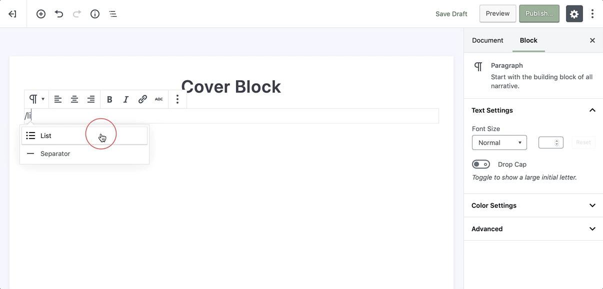
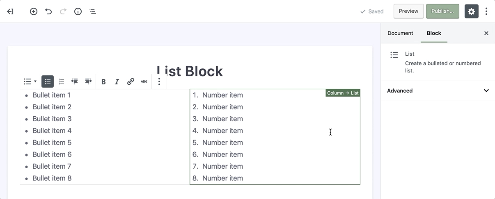

# List Block

List block allows you to create a bulleted or numbered list and thanks to the new [editor](wordpress-editor) of the WordPress organizing content into lists has just gotten easier.

To add a list, click on the [Add Block](adding-block) button and select the **List** block. Alternatively, you can start typing `/list` in a new paragraph block, then press enter.

!> Detailed instructions on adding blocks can be found [here](adding-block).

## Block Toolbar

Every block has its own block-specific controls that allow you to manipulate the block directly in the editor. 

* Change block type
* Bullet (unordered) list
* Numbered (ordered) list
* Outdent
* Indent
* Bold
* Italic
* Hyperlink
* Strikethrough
* More Options

## Advanced

The advanced tab lets you add a CSS class to your block, allowing you to write custom CSS and apply styles to the block as you see fit.
