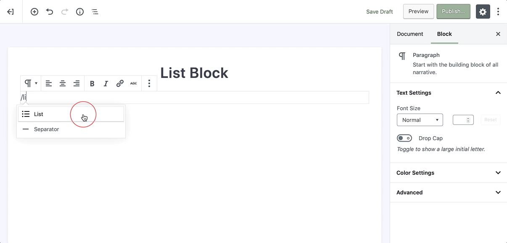

# List Block

List block allows you to create a bulleted or numbered list and thanks to the new [editor](wordpress-editor) of the WordPress organizing content into lists has just gotten easier.

To add a list, click on the [Add Block](adding-block) button and select the **List** block. Alternatively, you can start typing `/list` in a new paragraph block, then press enter.

