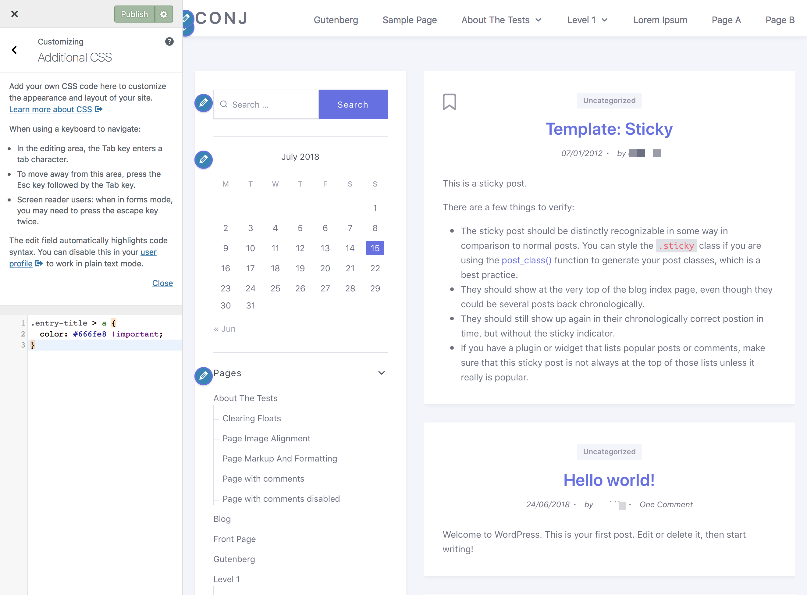

# Making CSS Edits

Starting with WordPress 4.7, you can now add custom CSS to your own theme directly from the Customizer. Just choose the Additional CSS tab when customizing your current theme to get started. The **Additional CSS** editor allows you to customize the appearance of your theme without the need to create a child theme or worry about theme updates overwriting your customizations.

This is super-easy and you would be able to see your changes with a live preview instantly.

1. On the frontend, in the Admin bar, **Customize**.
2. On the backend, click **Appearance » Customize**.
3. Navigate to **Additional CSS** section.
4. As soon as you add a **valid CSS rule**, you will be able to see it applied on your website’s live preview pane.
5. Click on the **Publish** button to save the changes.

## Previewing and Saving

When editing CSS rules in the **Additional CSS** section, your changes will automatically be applied to the preview window, but they won’t actually be saved until you click the **Publish** button.

## What If I Change Themes?

**CSS is theme-specific**, any custom CSS added using the theme Customizer is only available with that particular theme. If you would like to use it with other themes, then you will need to copy and paste it into your new theme using the same method.

## How Can I Enter File Paths?

The CSS you enter at **Additional CSS** section is stored in the database. If a custom CSS rule contains a `url` attribute, the relative path to a file in your WordPress installation may need to change. In most cases, if you are pointing to any directory within the `wp-content` folder, the relative path should start with `wp-content`.

## Additional Links

* [WordPress and CSS](https://codex.wordpress.org/CSS#WordPress_and_CSS)
* [CSS Troubleshooting](https://codex.wordpress.org/CSS_Troubleshooting)
* [CSS Fixing Browser Bugs](https://codex.wordpress.org/CSS_Fixing_Browser_Bugs)
