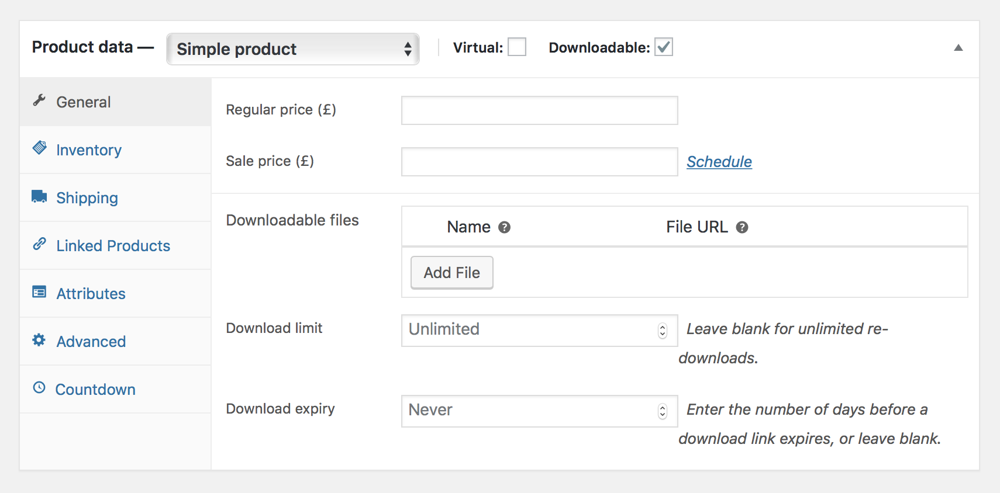
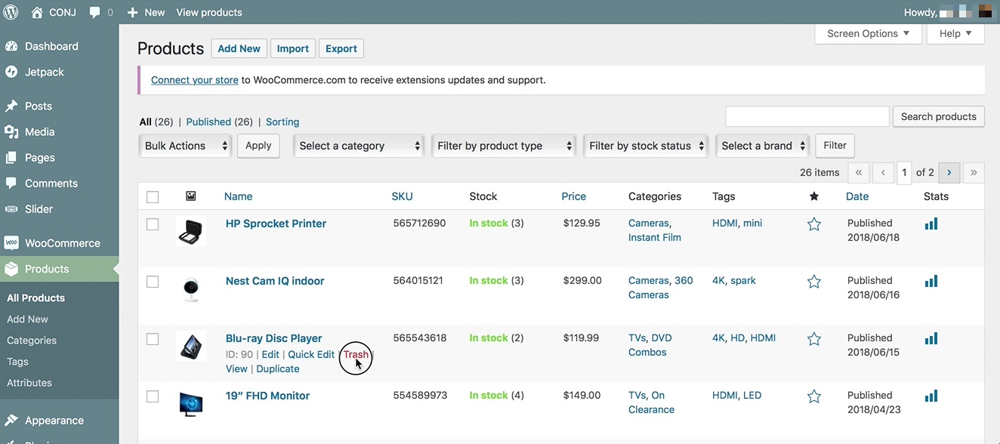

# Adding And Managing Products

In the process of building your webshop, you will reach a point when you will need to add some products. This should be one of the main activities in your checklist after you perform the basic configuration of your store or after you installed and activated the [Conj - eCommerce WordPress Theme](https://themeforest.net/item/conj-ecommerce-wordpress-theme/21935639?ref=mypreview).

## Product Categories

Product **categories** and **tags** work in much the same way as normal categories and tags you have when writing posts in WordPress. They can be created, edited, and selected at any time. This can be done when you first create a product or editing it.

## Product Types

There are several sorts of products that you can add to your online shop using WooCommerce. When adding a product, the first thing to decide is what type of product it is:

* **Simple**
 *This is a single physical product that has no variations.*
* **Virtual**
 *An example of this would be a service, such as hourly consulting.*
* **Downloadable**
 *This is both virtual and downloadable, such as an ebook or a music file.*
* **Grouped**
 *A collection of products that are related but can be purchased separately. An example would be different models of the iMac from Apple.*
* **External or Affiliate**
 *A product your will add to your store but buyers will be sent to another site to purchase it. Affiliates work well or products you may make a commission on.*
* **Variable**
 *Some products will have different variations and multiple images. For example a t-shirt, that comes in different sizes and colors, with different prices.*

?> Other types are often added by extensions. For example, [WooCommerce Subscriptions](https://woocommerce.com/products/woocommerce-subscriptions/) adds new product types as does [WooCommerce Bookings](http://woocommerce.com/products/woocommerce-memberships/).

## Adding a Simple Product

Adding a Simple product is similar to writing a post in WordPress.

Follow the steps below to publish your first WooCommerce product:

1. Login to the your WordPress Dashboard.
2. Click the **Products** tab.
3. Click the **Add New** sub-tab.
4. Enter a product **Title** and **Description**.
5. Navigate to the **Product Data** panel, and select downloadable (digital) or virtual (service) if applicable.
6. Optionally, upload a featured image for your product.
7. When you are ready, click **Publish**.

## Adding a Virtual Product

When adding a simple product, you can optionally check the **Virtual** checkbox in the product type panel. This removes unnecessary fields, such as dimensions.

!> Note that virtual products don’t require shipping — an order with virtual products won’t calculate shipping costs.

## Adding a Downloadable Product

When adding a simple product, you can check the downloadable box in the product type panel. This adds two new fields:

* **File path** — Path or URL to your downloadable file.
* **Download limit** – Limit on number of times the customer can download file. *Left blank for unlimited downloads.*

For maximum flexibility, downloadable products also incur a shipping cost as an example if you were offering both a packaged and a downloadable version of a product, this would be ideal.

?> You can also check the **Virtual** checkbox if the downloadable product is not shippable.

## Adding a Grouped Product

When creating your **Grouped Product**, you will see that the General tab no longer exists. That’s because you are creating a grouped product that will have several simple products added to it. So in reality, it’s not an actual single product to purchase.

You need to go down to **Linked Products** tab and add the products to this group using the **Grouped products** field.

## Adding a External Or Affiliate Product

When you create this product, you will be sending your customers to an external site to purchase it, so both **Inventory** and **Shipping** have been removed. Then, under the **General** tab, you will find settings for the URL or link to send customers to make the purchase.

## Adding a Variable Product

Variable products are arguably the most complex of product types. They let you define variations of a single product where each variation may have a different SKU, price or stock level.

See [Variable Product](http://docs.woocommerce.com/?p=281) for a guide on creating a product with variations.

## Product Data

The **Product Data** meta box is where the majority of important data is added for your products.

### General

* **SKU** – Stock keep unit (SKU) tracks products. Must be unique and should be formatted so it does not match any post IDs.
* **Price**
  * **Regular Price** – Item’s normal/regular price.
  * **Sale Price** – Item’s discounted price that can then be scheduled for certain date ranges.
* **Inventory** – The inventory section allows you to manage stock for the product individually and define whether to allow back orders and more.
* **Enable Stock Management** – must be selected in [Products Inventory Settings](https://docs.woocommerce.com/document/configuring-woocommerce-settings/#inventory-options); otherwise, only the ‘Manage stock?’ option is visible in the Product Data Inventory box.

### Shipping

* **Weight** – Weight of the item.
* **Dimensions** – Length, width and height for the item.
* **Shipping Class** – Shipping classes are used by certain shipping methods to group similar products.
* **Linked Products section** – Using up-sells and cross-sells, you can cross promote your products.
  * **Up-sells** – These are products that you may wish to encourage users to upgrade, based on the product they are currently viewing.
  * **Cross-sells** – Products that are displayed with the cart and related to the user’s cart contents.
  * **Grouping** – Used to make a product part of a grouped product.

### Attributes

On the Attributes tab, you can assign details to a product. You will see a select box containing global attribute sets you created (e.g., platform). More at: [Managing Product Categories, Tags and Attributes](http://docs.woocommerce.com/?p=1062).

### Advanced

* **Purchase note** – Enter an optional note to send the customer after they purchase the product.
* **Menu order** – Custom ordering position for this item.
* **Enable Reviews** – Enable/Disable customers reviews for this item.

## Product Short Description

Add an excerpt. This typically appears next to product imagery on the listing page, and the long description appears in the Product Description tab.

?> Video embeds (oembed) may be used, as of WooCommerce version **3.1x**.

## Catalog Visibility

In the **Publish** panel, you can set catalog visibility for your product.

* **Catalog and search** – Visible everywhere, shop pages, category pages, & search results.
* **Catalog** – Visible in shop pages & category pages, but not search results.
* **Search** – Visible in search results, but not in the shop page or category pages.
* **Hidden** – Only visible on the single product page – not on any other pages.

## Duplicating a Product

To save time, it’s possible to use a product and duplicate it to create similar products with variations and other qualities.

Navigate to **Products** » **All Products** and look through the list for a product you wish to replicate, then click **Duplicate**.

## Deleting a Product

Follow the steps below to delete a product:

1. Login to the your WordPress Dashboard.
2. Click the **Products** tab.
3. Click the **All Products** sub-tab.
4. Find the product you wish to delete.
5. **Hover** in the area under the product name and click **Trash**.

## Mark a Product As Featured

Follow the steps below to mark a product as featured:

1. Login to the your WordPress Dashboard.
2. Click the **Products** tab.
3. Click the **All Products** sub-tab.
4. Select the Star in the featured column. *Alternatively, select **Quick Edit** and then the **Featured** option.*

## Additional Links

* [Set Up Products](https://docs.woocommerce.com/document/managing-products)
* [Variable Product](http://docs.woocommerce.com/?p=281)
* [WooCommerce Subscriptions](https://woocommerce.com/products/woocommerce-subscriptions/)
* [WooCommerce Bookings](http://woocommerce.com/products/woocommerce-memberships/)
* [Managing Product Categories, Tags and Attributes](http://docs.woocommerce.com/?p=1062)
* [Products Inventory Settings](https://docs.woocommerce.com/document/configuring-woocommerce-settings/#inventory-options)
