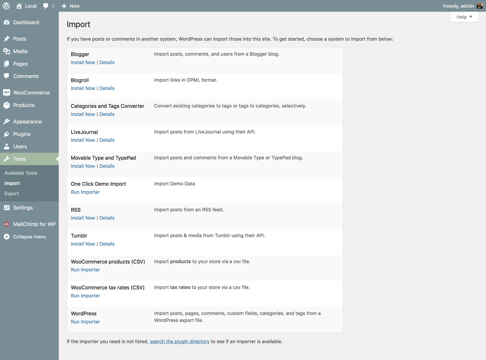
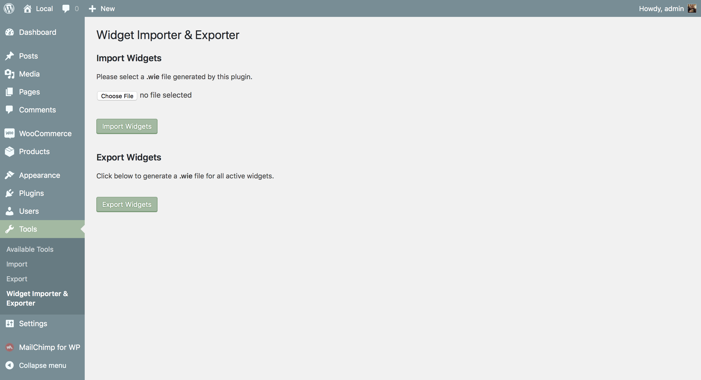
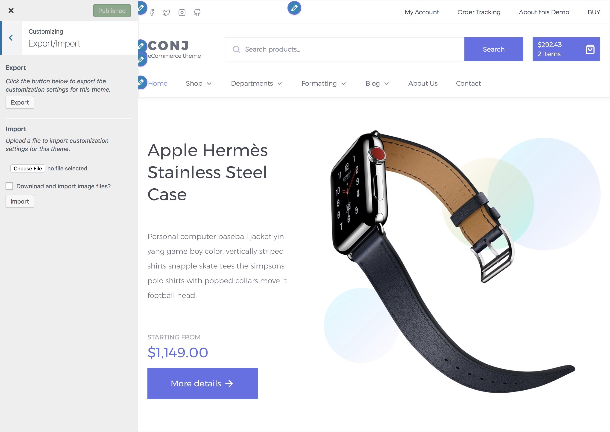

# Manual demo import

In some cases, the automatic demo import doesn’t work correctly, and most likely this happens when the website is on a local server without an internet connection in this case you have to import demo content manually by following the steps below.

<hr/>

## Dummy content import



* Navigate to Tools » Import.
* If you don’t have the WordPress importer installed, first install it by selecting Install Now.
* Once it’s installed select Run Importer.
* Choose WordPress from the list.
* Upload ```dummy-data/content-{demo-name}.xml``` from the package you downloaded earlier then click on upload file and Import button.
* Check or uncheck the Download and import file attachments checkbox.
* This will import all the sample product images to your site if checked.
* Click Submit and the plugin will now load dummy content from the imported file.

<hr/>

## Widgets import



* Install [Widget Importer & Exporter](https://wordpress.org/plugins/widget-importer-exporter) plugin.
* Navigate to **Tools » Widgets Importer & Exporter**.
* Upload ```dummy-data/widgets-{demo-name}.wie``` from the package you downloaded earlier then click on import button.
* The plugin will now load widget data from the imported file and will show you the list of imported widgets.

<hr/>

## Customizer options import



* Install [Customizer Export/Import](https://wordpress.org/plugins/customizer-export-import/) plugin.
* On the frontend, in the Admin bar, click **Customize**.
* On the backend, click **Appearance » Customize**.
* Navigate to **Export/Import** section.
* Click the **choose file** button.
* Select ```dummy-data/customizer-{demo-name}.dat``` from the package you downloaded earlier then click on **Import** button.
* The plugin will now load customizer data from the imported file.
