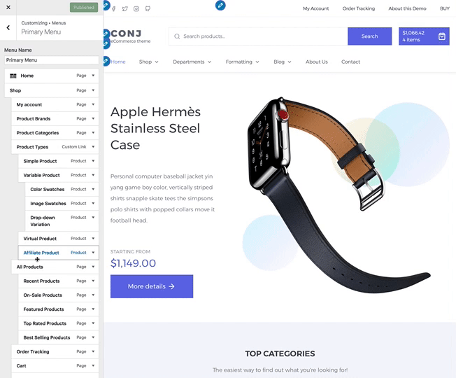
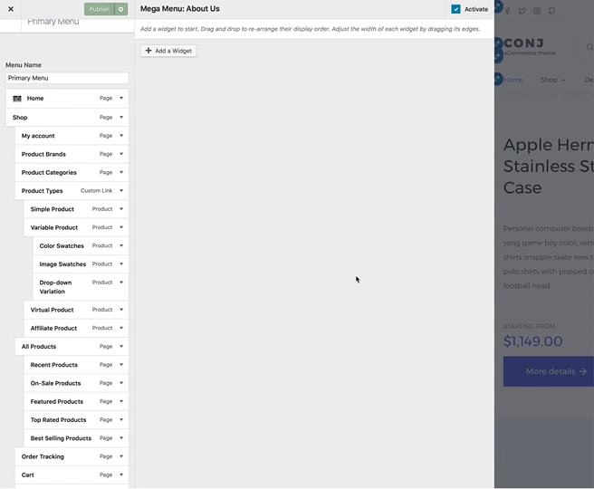

# Mega-Menu

Mega-menu settings can be found under the **Customizer** window which makes it easy and straightforward to use.

!> Note that mega menus only works in the **Primary Menu** location, which by default is the main navigation under site logo.

## Creating a new menu

* On the frontend, in the Admin bar, click **Customize**.
* On the backend, click **Appearance** » **Customize**.
* Navigate to **Menus** panel.
* Click the **Add a Menu** button.
* Name your new site menu.
* Click the **Create Menu** button.

## Adding menu items

Click the **Add Items** button and select items you would like to add to the site menu.

## Initializing a mega menu

!> When the **Enable** checkbox is checked, the mega menus are shown on your site and preview is available.

* Click on the **arrow icon** in the top right-hand corner of the menu item to expand it.
* Click the **Mega Menu** button to open a new side panel where you can manage the selected menu item(s).

## Adding widgets to mega menu

Click the **Add a Widget** button to search and select a new widget from the list to add.

?> [Text Widget plugin](https://codex.wordpress.org/WordPress_Widgets#Adding_Code_to_the_Text_Widget) enables you to embed any standard WooCommerce shortcodes to the menu item and display them as a result.
