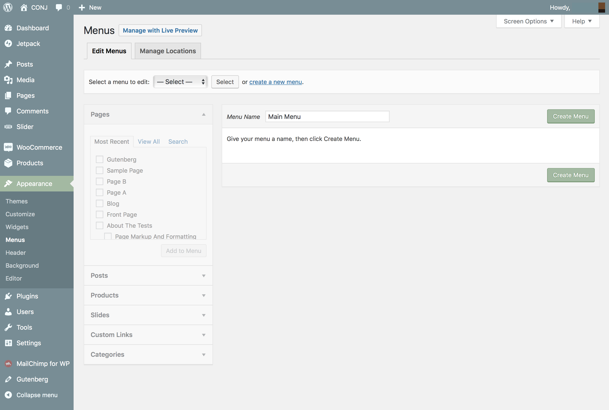
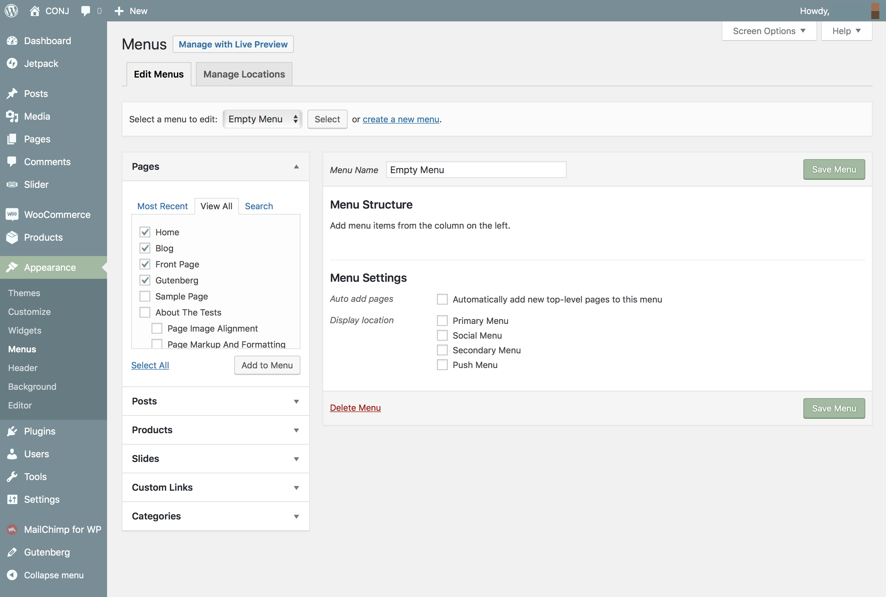
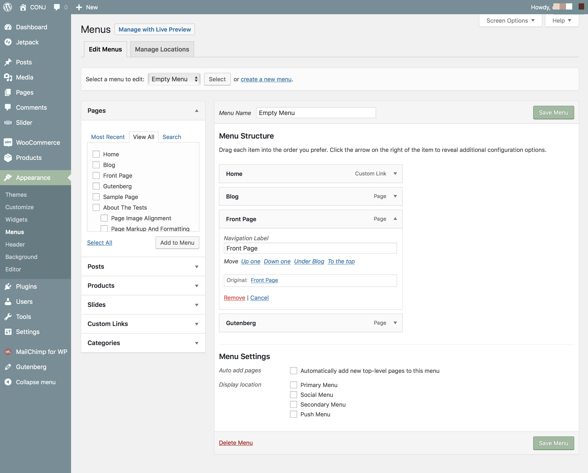
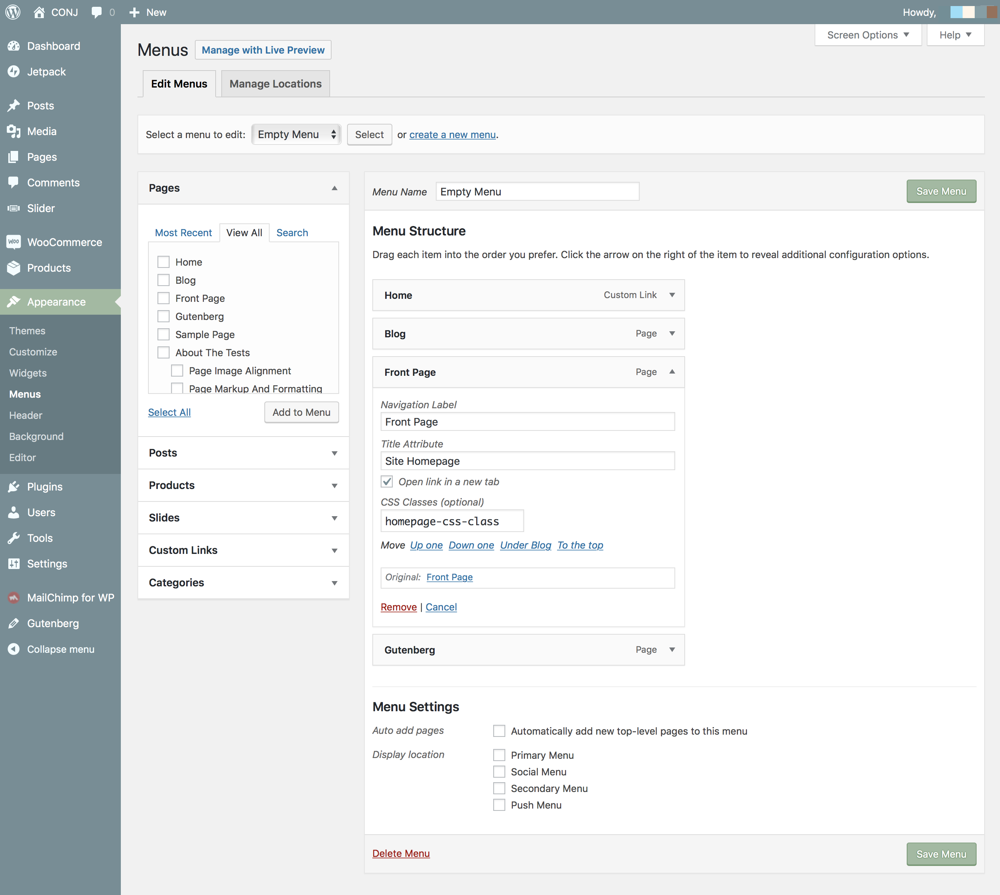

# How To Set Up Your Menus

WordPress comes with easy to use menu functionality, which lets you quickly create any menus and place them in your menu areas or even in a widgetized area with the mega-menus widget.

## Defining a Menu

You need to define a menu before adding any items to it.

1. Login to the your WordPress Dashboard.
2. From the **Appearance** menu on the left-hand side of the Dashboard, select the **Menus** option to bring up the **Menu Editor**.
3. Select **Create a new menu** at the top of the page.
4. Enter a name for your new menu in the **Menu Name** box.
5. Click the **Create Menu** button.

## Adding Items To a Menu

You can add different link types into your menu, these are split between panes left of the menu you’re currently editing.

1. Locate the pane entitled **Pages**.
2. Within this pane, select the **View All** link to bring up a list of all the currently published Pages on your site.
3. Select the **Pages** that you want to add by clicking the checkbox next to each **Page’s** title.
4. Click the **Add to Menu** button located at the bottom of this pane to add your selection(s) to the menu that you created in the previous step.
5. Click the **Save Menu** button once you’ve added all the menu items you want.

?> The **Screen Options** allow you to choose which items you can use to add to a menu. Certain items, like Tags are hidden by default.

## Deleting a Menu Item

1. Locate the menu item that you want to remove in the menu editor window
2. Click on the **arrow icon** in the top right-hand corner of the menu item/box to expand it.
3. Click on the **Remove** link. The menu item/box will be immediately removed.
4. Click the **Save Menu** button to save your changes.

## Customizing Menu Items

?> Some of the following items might be hidden by default. Use **Screen Options** to show the required fields.

### Navigation Label

This field specifies the title of the item on your custom menu. This is what your visitors will see when they visit your site/blog.

### Original

A link to the original source of the menu item (e.g. a link to view the post or page).

### Title Attribute 

This field specifies the Alternative *(Alt)* text for the menu item. This text will be displayed when a user’s mouse hovers over a menu item.

### Link Target 

Select **Same window or tab** or **New window or tab** from the pulldown.

### CSS Classes 

Optional **CSS Classes** for this menu item.

1. Click on the **arrow icon** in the top right-hand corner of the menu item/box to expand it.
2. Enter the values for the required fields that you want to assign to the item.
3. Click the **Save Menu** button to save your changes.
