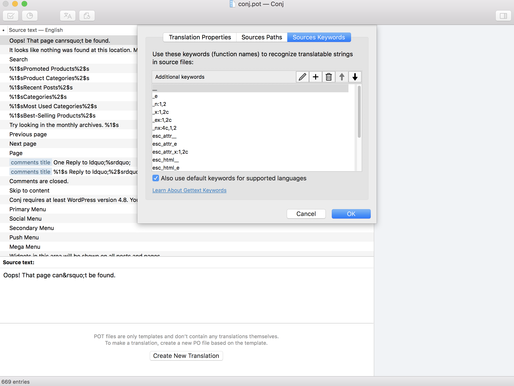

# Poedit Sources Keywords List

[Poedit](https://poedit.net) needs to know what PHP functions it must look for and get information from. In fact, [Poedit](https://poedit.net) knows by itself what to look for in a `.php` file, but since WordPress uses its own wrapper functions to make the development process easier, this pre-programmed knowledge is no longer applicable. 

Therefore, we need to let [Poedit](https://poedit.net) know what functions to look for and how to handle them. When translating any WordPress theme, you need to make sure to include all keywords that might be used while developing the theme in your translation editor software.

The complete list of the functions that the [Poedit](https://poedit.net) needs to know about are outlined below:

```php
__
_e
_n
_x
_ex
_nx
esc_attr__
esc_attr_e
esc_attr_x
esc_html__
esc_html_e
esc_html_x
_n_noop
_nx_noop
translate_nooped_plural()
```

Follow the steps below to enter the list of source keywords:



1. If you don't have the [Poedit](https://poedit.net) software installed on your local computer, go ahead and download Poedit now.
2. Open [Poedit](https://poedit.net) software.
3. Navigate to **Catalog** » **Properties**.
4. Click on the **Sources Keywords** tab.

## Additional Links

* [Poedit](https://poedit.net)
