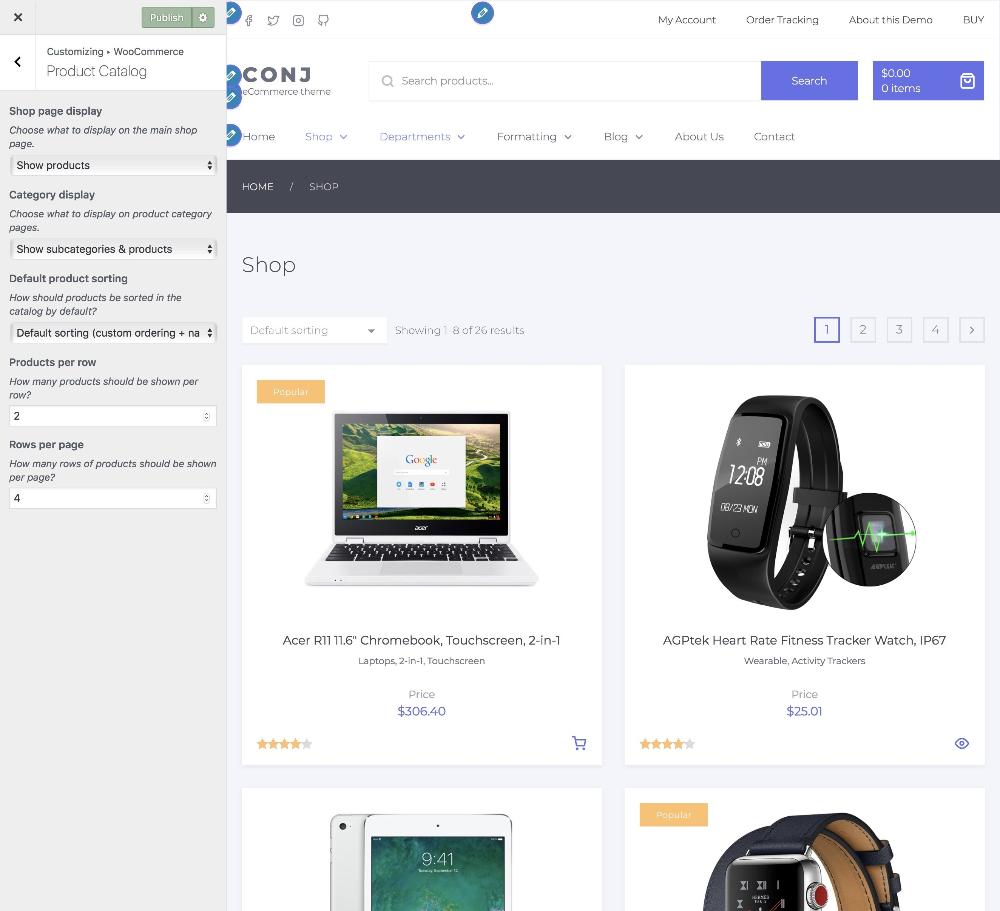
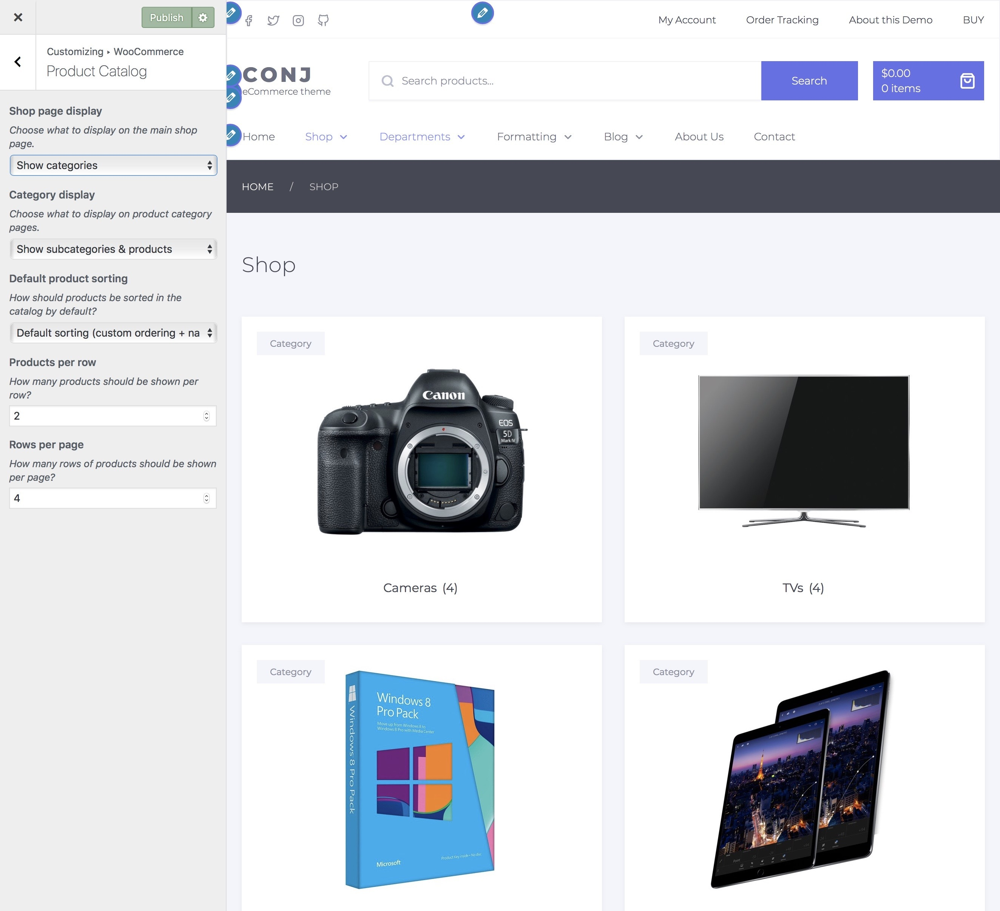
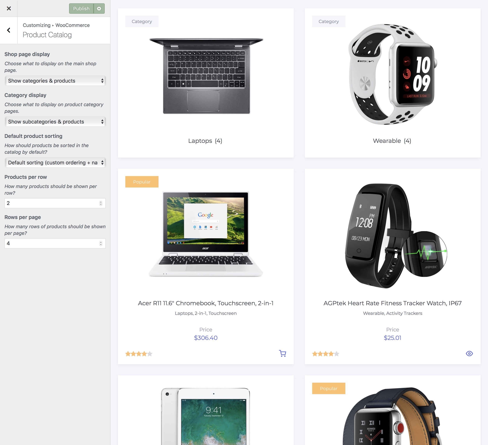
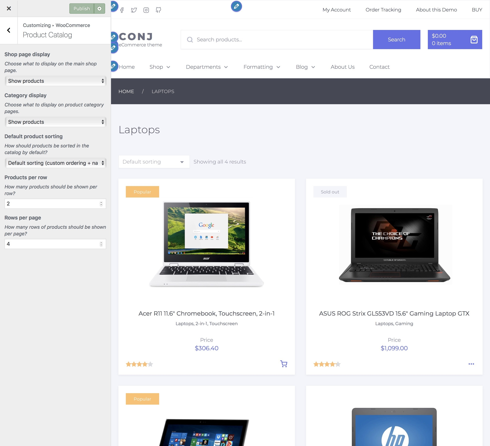
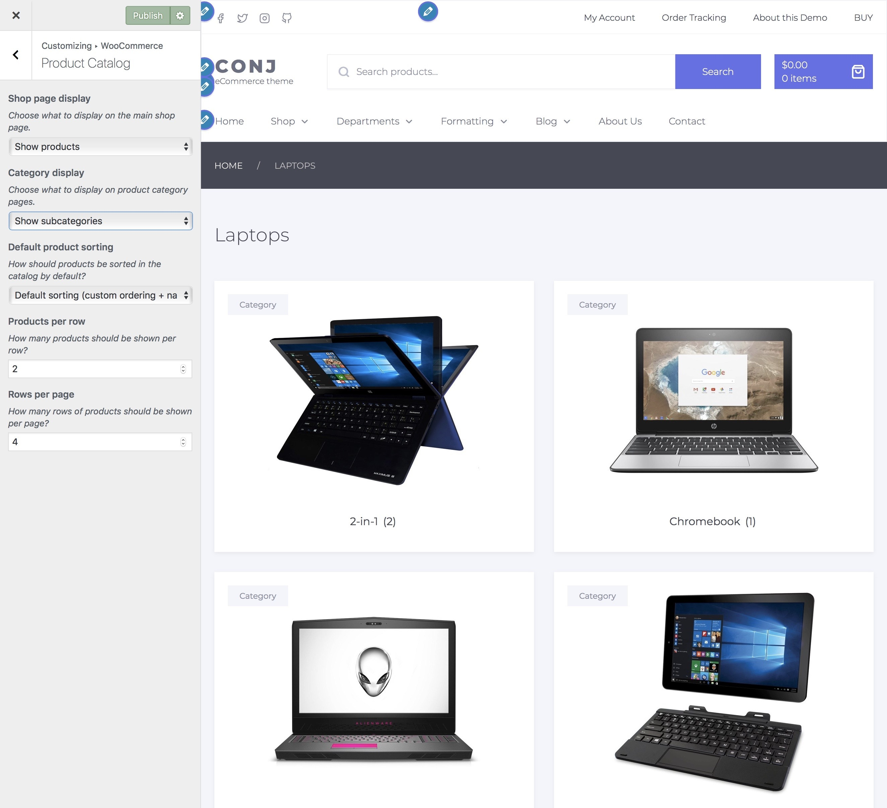
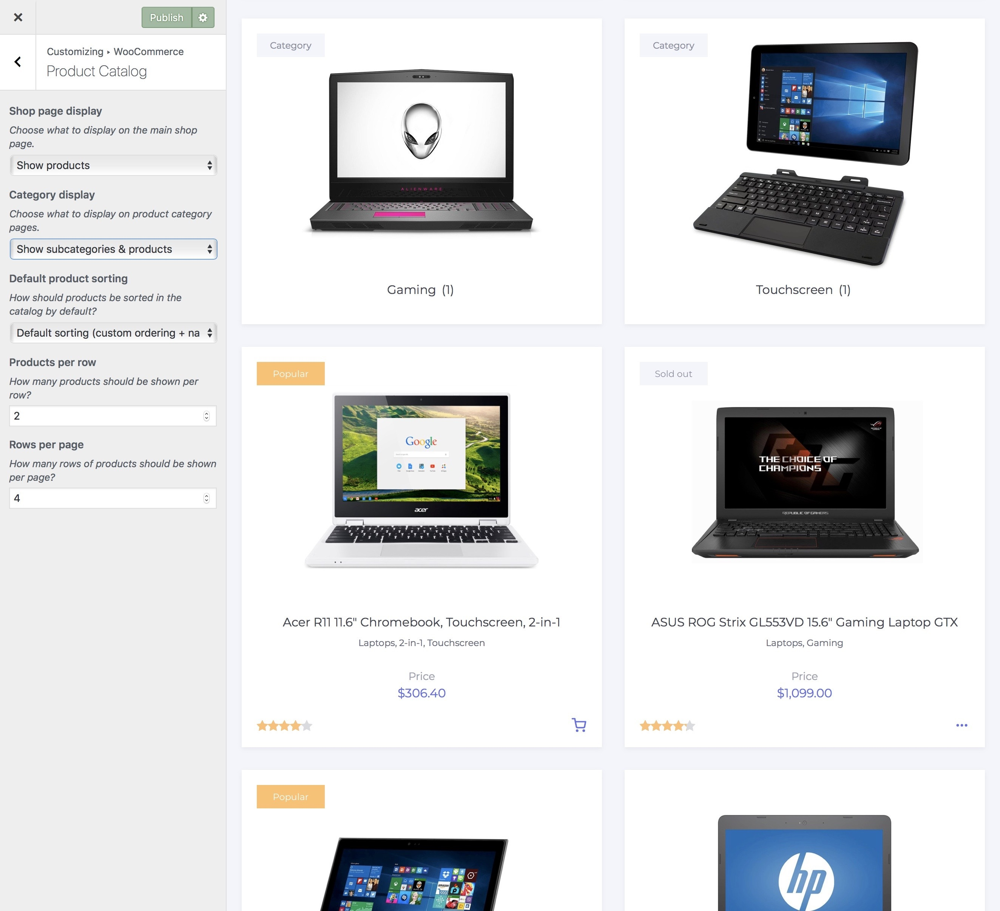
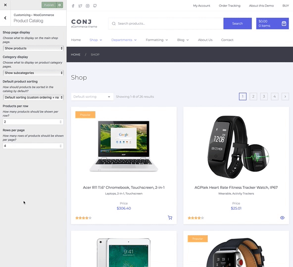

# Product catalog

Basically, product catalog section allows you to choose:

* What to display on the shop page.
* What to display on category pages.
* How to sort products in a category page.
* How many products to show in a single row.
* How many rows of products to display on a page.

1. On the frontend, in the Admin bar, click Customize.
2. On the backend, click Appearance » Customize.
3. Navigate to WooCommerce » Product Catalog section.

## Shop page display

Choose what to display on the main shop page.

* **Show products** ⤵  
  
* **Show categories** ⤵  
  
* **Show categories and products** ⤵  

## Category display

Choose what to display on product category pages.

!> There will be no difference in appearance If you have only a few products or no subcategories to display in your store.

* **Show products** ⤵  
  
* **Show subcategories** ⤵  
  
* **Show subcategories and products** ⤵  

## Product sorting

Default product sorting control allows you to tweak the order in which products are viewed on shop and category pages.

You would be able to select one of the following options from the drop-down menu:

* **Popularity** — by sales.
* **Average rating** — by customers.
* **Most recent** — newest products added to shop.
* **Price ascending** — lowest to highest.
* **Price descending** — highest to lowest.

## Products per row

Specify how many products should be shown per row. ⤵

## Rows per page

Specify how many rows of products should be shown per page. ⤵

