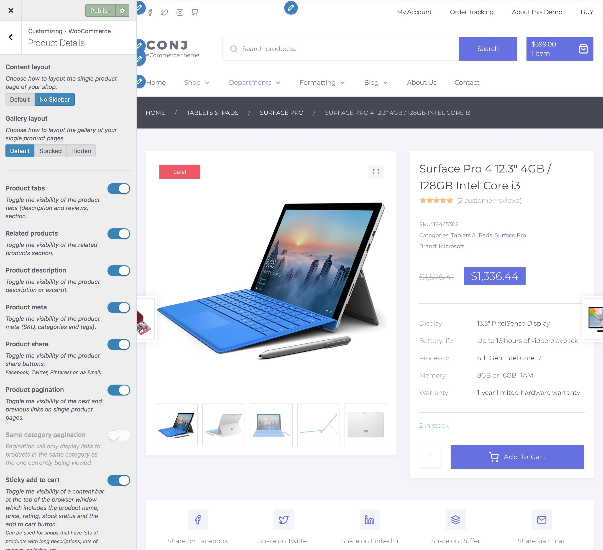
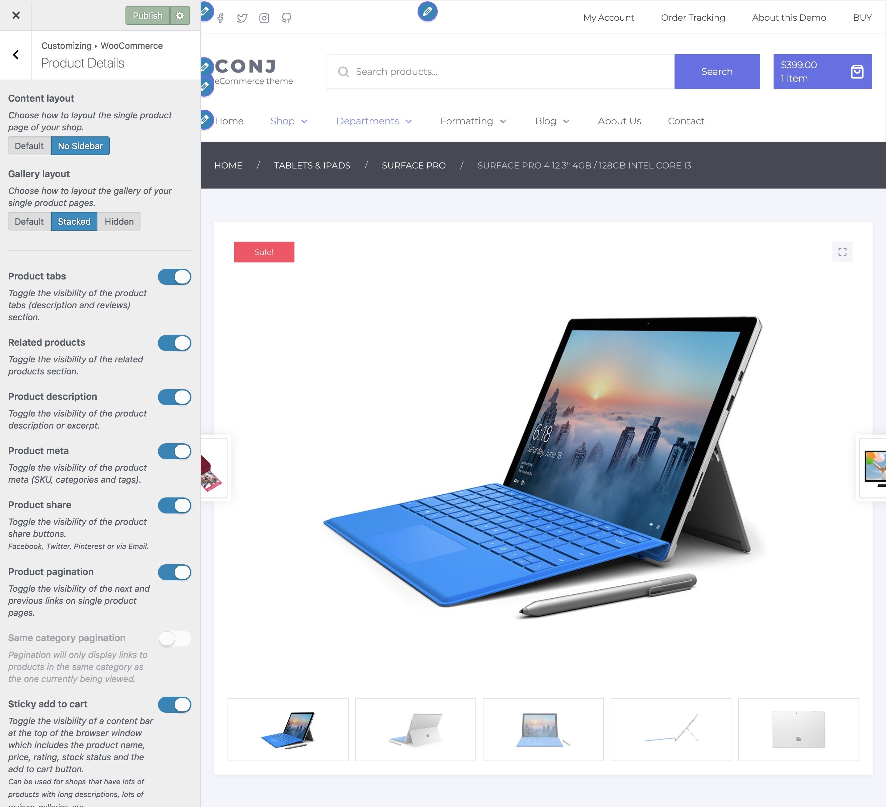
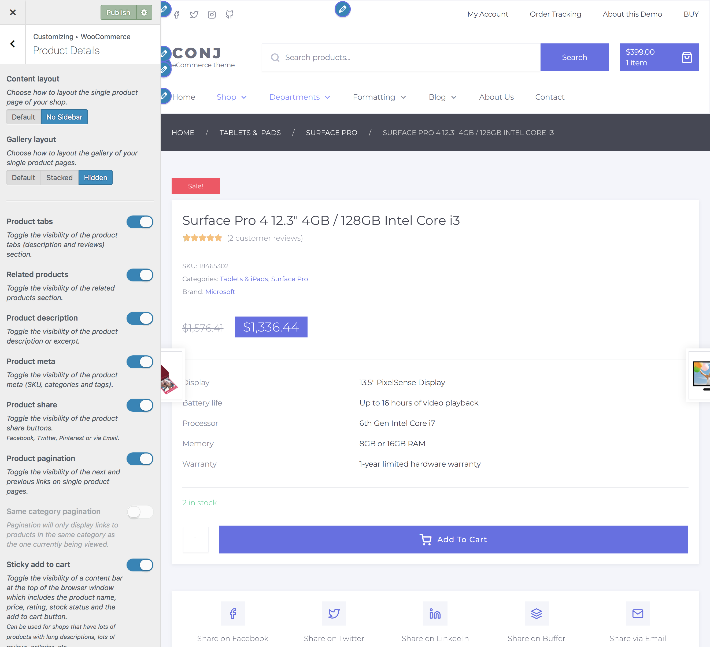
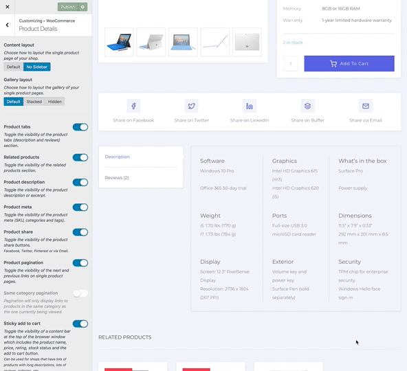
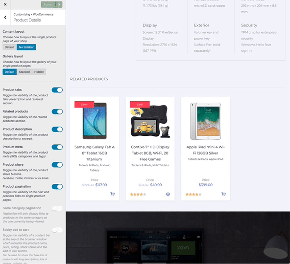
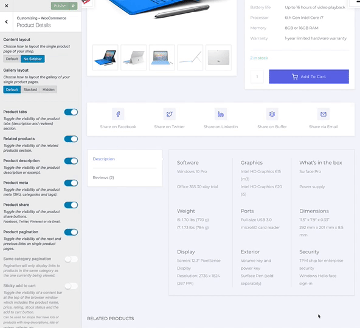
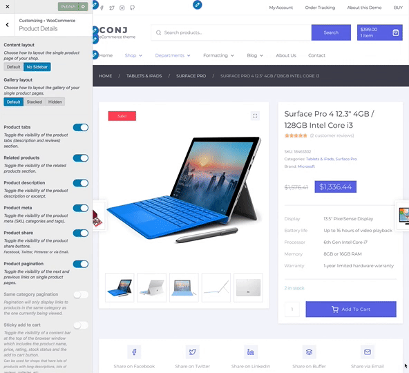

# Product details

Settings included in this section allow you to change the layout and customize every element of the product single view page.

1. On the frontend, in the Admin bar, click **Customize**.
2. On the backend, click **Appearance » Customize**.
3. Navigate to **WooCommerce » Product Details** section.

## Content layout

Choose how to layout the single product page of your shop to display default sidebar area or not. ⤵

## Gallery layout

Choose how to layout the gallery of your single product pages.

* **Default** — Gallery is on left, product details is on right. ⤵  
  
* **Stacked** — Product gallery is above and product details is below. ⤵  
  
* **Hidden** — Product gallery is hidden and product details is full-width. ⤵  

## Product tabs

Toggle the visibility of the product tabs (description and reviews) section. ⤵

## Related products

Toggle the visibility of the related products section. ⤵

## Product description

Toggle the visibility of the product description or excerpt. ⤵

## Product meta

Toggle the visibility of the product meta (SKU, categories and tags). ⤵

## Product share

Toggle the visibility of the product share buttons. ⤵

?> Facebook, Twitter, Buffer, Pinterest or via Email.

## Product pagination

Toggle the visibility of the next and previous links/slides on single product pages. ⤵

?> You can also modify pagination query to only display links to products in the same category as the one currently being viewed.

## Sticky add to cart

Toggle the visibility of a content bar at the top of the browser window which includes the product name, price, rating, stock status and the add to cart button. ⤵

?> Can be used for shops that have lots of products with long descriptions, lots of reviews, galleries, etc.

