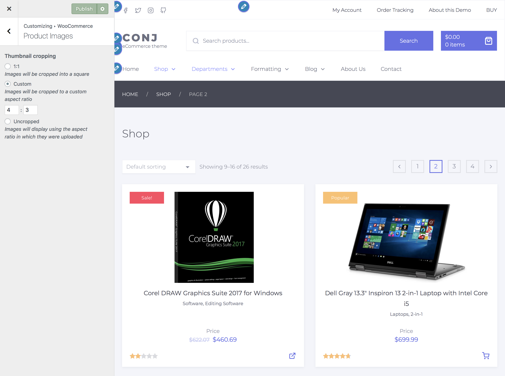

# Product images

Since [WooCommerce 3.3](https://woocommerce.wordpress.com/2017/12/09/wc-3-3-will-look-great-on-all-the-themes), users can now control the width and height of their main images, as well as the cropping with visual cues as to what the photos might look like on the frontend.

1. On the frontend, in the Admin bar, click **Customize**.
2. On the backend, click **Appearance » Customize**.
3. Navigate to **WooCommerce » Product Images** section.

## Image types

* **Catalog images** — Medium sized image used in a product loops.<br/>
*(e.g., shop page, product category pages, related products, up-sells, cross-sells, etc.)*
* **Product thumbnails** — The smallest image, a thumbnail, commonly used underneath the single product image, the cart, and widgets.
* **Single product image** — The largest image on the individual product details page.

!> Note that product image settings in WooCommerce Customizer do not apply to single product image dimensions.

## Resize and crop



1. On the frontend, in the Admin bar, click **Customize**.
2. On the backend, click **Appearance » Customize**.
3. Navigate to **WooCommerce » Product Images** section.
  - **1:1** — Images will be cropped into a square.
  - **Custom** — Images will be cropped to a custom aspect ratio.
  - **Uncropped** — Images will display using the aspect ratio in which they were uploaded.
  
!> If you are using **WooCommerce 3.3.X** or above 	__regenerating product thumbnails by__ installing and configuring any 3rd party plugin is no longer needed and all changes in product catalog or product image sizes triggers WooCommerce to auto-size and auto-update thumbnail and product catalog images for you.

## Blurry product images

When your product images are blurry two things could be happening.

* **One**, your image size settings, may not be adequate (too small) for theme. This can cause problems as the theme wants an image at ```318 x 318 pixels```, but you are giving it one at ```200 x 200 pixels```.
* **Two**, the original images you uploaded are not high-resolution enough. Even if your image settings are right, the original image source is too small. The only thing you can do in this case is re-upload appropriately sized images, to begin with.
